# spring-sample-project

AIによるコード生成確認用のプロジェクトです。

## 概要

[Spring Boot](https://spring.io/projects/spring-boot)をベースにしたサンプルコードです。

ドメインバリデーションやコード管理、業務日付管理を行うため一部で[Nablarch](https://nablarch.github.io/docs/5u21/doc/)のライブラリを組み込んで使用しています。
これらの機能はゼロから作るのではなく、Nablarchが提供している高品質な成果物を再利用することにしました。

## 開発の準備

1. プロジェクトをVSCodeで開いた後、コマンドパレットを開き`開発コンテナー:コンテナでリビルドして再度開く`を選択します。
2. 起動が完了するのを待ちます  
3. 起動が完了したら、以下のコマンドを実行してください
   ```
   $ java -version
   ```
   openjdk version "17.0.14" 2025-01-21 LTS と表示されればOKです。
   ```
   $ mvn -v
   ```
   Apache Maven 3.9.9 (～) と表示されればOKです。
4. 以下のコマンドで動作確認を行ってください。
   ```
   $ mvn test -f api/pom.xml
   ```
   BUILD SUCCESS と表示されればOKです。

## 構成

以下のMavenプロジェクトから構成されています。

- `parent`
- `common`
- `web`
- `api`
- `batch`

`parent`は他のすべてのMavenプロジェクトの親となっています。
`common`は共通的に使用できるものが格納されており、`web`、`api`、`batch`から依存されています。

各Mavenプロジェクトの関係性を図に表すと次の通りです。



また、`web`は一部の機能で`api`のエンドポイントを参照しているものがあります。
`web`を動作させる際は`api`も起動しておいてください。

## 操作方法

### DBの洗い替え

DBのデータを初期状態に戻したい場合は以下のコマンドを実行してください。

```bash
$ mvn -P gsp generate-resources -f common/pom.xml
```

### APIの起動方法

Spring Boot Maven Pluginを使用して起動します。

```bash
$ mvn spring-boot:run -f api/pom.xml
```

次のURLで起動します。※ルートURLにはエンドポイントがなく、ブラウザで開いても何も表示されないのでご注意ください

- http://localhost:8090

`curl`コマンドでの動作確認例を記載します。

```bash
curl http://localhost:8090/clients
```

## 参考情報

このサンプルでは次に示す[Springアプリ開発ノウハウ集](https://fintan-contents.github.io/spring-crib-notes/latest/html/index.html)のノウハウを使用しています。

- [二重送信防止](https://fintan-contents.github.io/spring-crib-notes/latest/html/web/double-submission/index.html)
- [SpringからNablarchの機能を利用する際のノウハウ](https://fintan-contents.github.io/spring-crib-notes/latest/html/nablarch/index.html)
 
