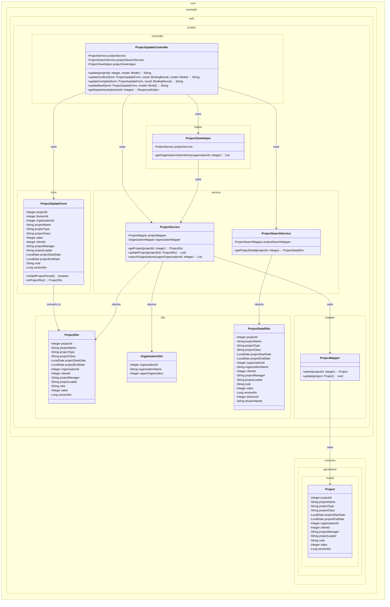
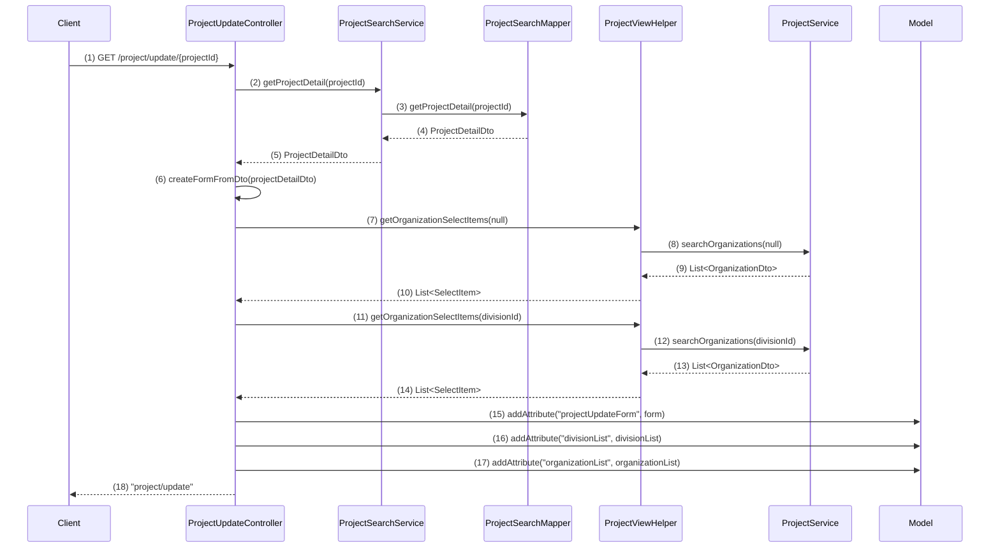
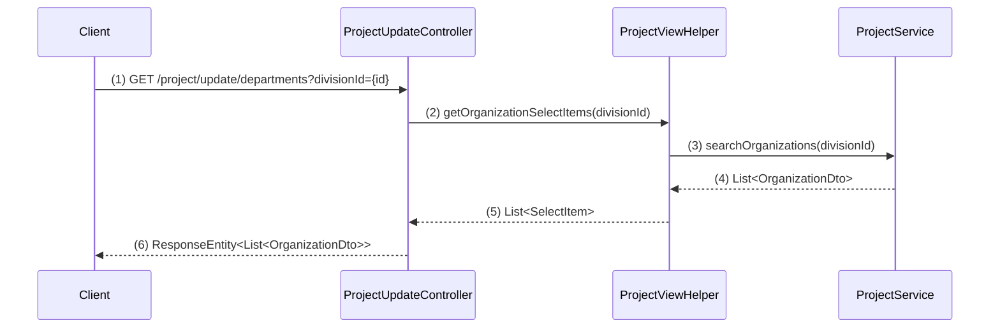
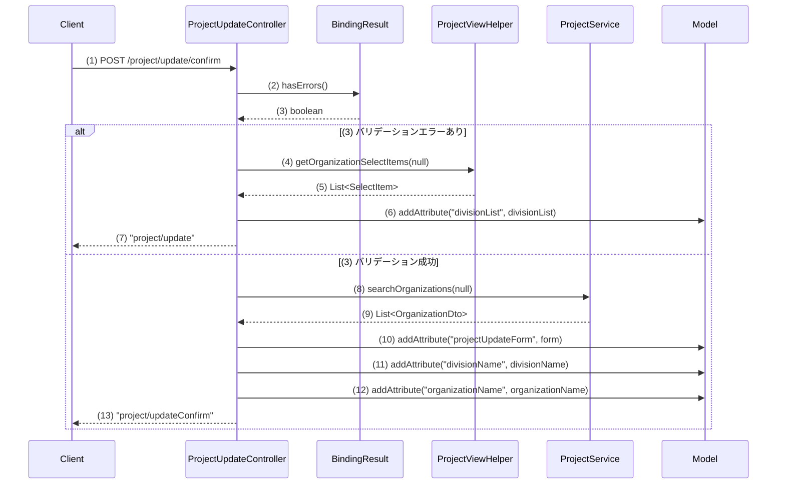
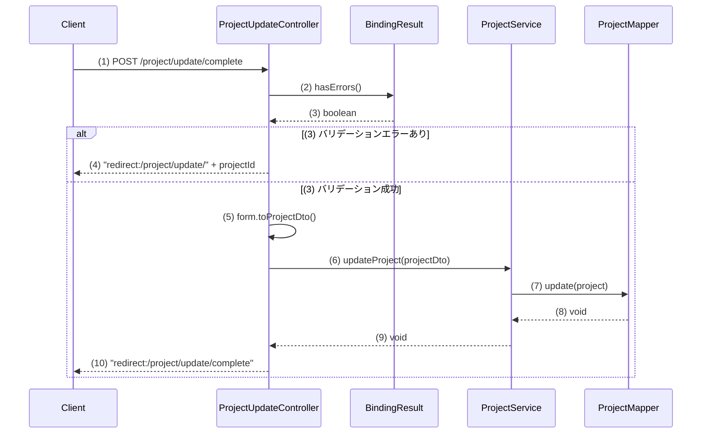
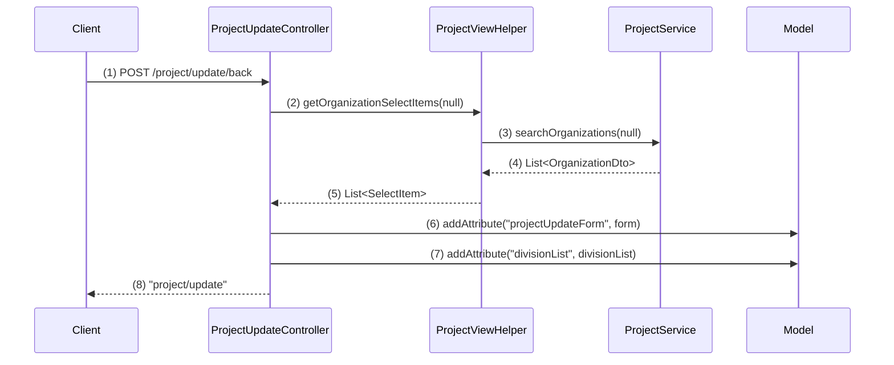

# プロジェクト更新機能の実装計画

## 1. 概要

プロジェクト更新機能は、既存のプロジェクト情報を編集・更新する機能です。プロジェクト詳細画面から遷移し、プロジェクト情報の更新画面→確認画面→完了画面の3ステップで構成されます。PRGパターンを採用し、二重送信防止とバリデーション機能を提供します。

## 2. クラス図

## 3. シーケンス図

### 初期表示イベント

### 部門リスト取得イベント（Ajax）

### 確認イベント

### 確定イベント

### 戻るイベント

## GOAL

### GOAL 1: プロジェクト更新画面の基本表示

#### 完了条件
- プロジェクト詳細画面からプロジェクト更新画面へのリンクが機能する
- プロジェクト更新画面のHTMLが正しく表示される
- 静的なフォーム要素（入力欄、ボタン等）が配置されている
- フォームバインディングはこの時点では不要

#### ステップ 1: プロジェクト詳細画面の更新リンク実装

- **編集対象ファイル:** index.html
- **編集対象のメソッド:** HTMLの更新ボタン部分
- **目的:** プロジェクト詳細画面から更新画面への適切な遷移リンクを設定し、プロジェクトIDが正しく渡されるようにする
- **内容:**
  - Thymeleafの`th:href`属性を使用して`@{/project/update/{projectId}(projectId=${project.projectId})}`を設定
  - 現時点ではThymeleafのバインディング属性は不要（この段階では静的表示のみ）
- **活用するクラス・メソッド:**
  - Thymeleafの`@{}`URL式記法
  - プロジェクト詳細画面に設定済みの`project`モデルオブジェクト
- **ポイント:** プロジェクトIDパラメータが正しく渡されることを確認

### GOAL 2: プロジェクト更新コントローラーの作成と画面遷移

## ステップ 1: ProjectUpdateControllerクラスの作成

- **編集対象ファイル:** `web/src/main/java/com/example/web/project/controller/ProjectUpdateController.java`（新規作成）
- **編集対象のメソッド:** クラス全体の新規作成
- **目的:** プロジェクト更新機能を担当するコントローラーを作成し、基本的な画面遷移を実装する
- **内容:**
  - `@Controller`アノテーションを付与したクラスを新規作成
  - `@RequestMapping("/project/update")`でベースパスを設定
- **活用するクラス・メソッド:**
- **ポイント:** 
  - 既存の`ProjectController`を参考にアノテーションの付け方を統一する
  - controller-class.instructions.mdの「基本規約」と「標準的なメソッド構成」に従う

## ステップ 2: 更新画面表示メソッドの実装

- **編集対象ファイル:** `ProjectUpdateController.java`
- **編集対象のメソッド:** `update()`メソッドの新規作成
- **目的:** プロジェクトIDを受け取り、更新画面を表示する基本的なメソッドを実装する
- **内容:**
  - `@GetMapping("/{projectId}")`アノテーションを付与
  - 戻り値として`"project/update/index"`を返す
- **活用するクラス・メソッド:**
- **ポイント:** 

## ステップ 3: 確認画面表示メソッドの実装

- **編集対象ファイル:** `ProjectUpdateController.java`
- **編集対象のメソッド:** `updateConfirm()`メソッドの新規作成
- **目的:** 更新画面からPOSTされたデータを受け取り、確認画面を表示する基本的な画面遷移を実装する
- **内容:**
  - `@PostMapping("/confirm")`アノテーションを付与
  - この段階ではバリデーション処理は実装せず、そのまま確認画面へ遷移
  - 戻り値として`"project/update/confirm"`を返す
- **活用するクラス・メソッド:**
- **ポイント:** 
  - controller-class.instructions.mdの「複数ボタン対応方針」に従い、今後のボタン分岐に備える
  - バリデーション機能は後のGOALで実装するため、この段階では画面遷移のみ

## ステップ 4: 完了画面表示メソッドの実装

- **編集対象ファイル:** `ProjectUpdateController.java`
- **編集対象のメソッド:** `updateComplete()`メソッドの新規作成
- **目的:** 確認画面からの登録処理後に完了画面を表示する基本的な画面遷移を実装する
- **内容:**
  - `@PostMapping(path = "/complete", params = "execute")`アノテーションを付与
  - この段階では実際のDB更新処理は実装せず、完了画面へリダイレクト
  - 戻り値として`"redirect:/project/update/complete"`を返す
- **活用するクラス・メソッド:**
  - 既存の`ProjectController`の`register()`メソッドのアノテーション設定を参考にする
- **ポイント:** 
  - PRGパターンを採用し、完了後はリダイレクトする
  - params属性を使用して「確定」ボタンからのPOSTを識別

## ステップ 5: 戻り処理メソッドの実装

- **編集対象ファイル:** `ProjectUpdateController.java`
- **編集対象のメソッド:** `updateBack()`メソッドの新規作成
- **目的:** 確認画面から更新画面に戻る処理を実装する
- **内容:**
  - `@PostMapping(path = "/complete", params = "back")`アノテーションを付与
  - 戻り値として`"project/update/index"`を返す
- **活用するクラス・メソッド:**
  - 既存の`ProjectController`の`back()`メソッドを参考にする
- **ポイント:** 
  - controller-class.instructions.mdの「複数ボタン対応方針」に従い、params属性でボタンを分岐
  - 入力値の保持は次のGOALで詳細実装するため、この段階では基本的な遷移のみ

## ステップ 6: 完了画面GETメソッドの実装

- **編集対象ファイル:** `ProjectUpdateController.java`
- **編集対象のメソッド:** `complete()`メソッドの新規作成
- **目的:** 完了画面を直接表示するためのGETメソッドを実装する
- **内容:**
  - `@GetMapping("/complete")`アノテーションを付与
  - 引数なし
  - 戻り値として`"project/update/complete"`を返す
- **活用するクラス・メソッド:**
  - 既存の`ProjectController`の`complete()`メソッドを参考にする
- **ポイント:** 
  - リダイレクト後の完了画面表示用
  - シンプルな画面表示メソッド

## ステップ 7: プロジェクト更新画面HTMLテンプレートの修正

- **編集対象ファイル:** index.html
- **編集対象のメソッド:** formタグのaction属性とThymeleaf属性の追加
- **目的:** 更新画面のフォームをコントローラーと正しく連携させる
- **内容:**
  - formタグの`action`属性を`th:action="@{/project/update/confirm}"`に変更
  - 現在の`action="./confirm.html"`は静的プレビュー用として保持
  - 戻るリンクの`href`属性を適切なURL（プロジェクト詳細画面への遷移）に修正
- **活用するクラス・メソッド:**
  - Thymeleafの`@{}`URL式記法
  - html.instructions.mdの「エラーの表示」規約
- **ポイント:** 
  - 静的HTMLとして基本的な表示ができることを確認
  - フォーム送信が正しく動作することを確認
  - この段階ではth:field等のバインディング属性は不要

## ステップ 8: プロジェクト更新確認画面HTMLテンプレートの修正

- **編集対象ファイル:** confirm.html
- **編集対象のメソッド:** formタグのaction属性の修正
- **目的:** 確認画面のフォームをコントローラーと正しく連携させる
- **内容:**
  - formタグの`action`属性を`th:action="@{/project/update/complete}"`に変更
  - 現在の`action="./complete.html"`は静的プレビュー用として保持
  - 「戻る」ボタンと「更新」ボタンのname属性が正しく設定されていることを確認
- **活用するクラス・メソッド:**
  - Thymeleafの`@{}`URL式記法
  - html.instructions.mdの「エラーの表示」規約
- **ポイント:** 
  - ボタンのname属性（back、execute）がcontroller-class.instructions.mdの「複数ボタン対応方針」に適合していることを確認
  - 静的HTMLとしても動作することを保持

## ステップ 9: プロジェクト詳細画面の更新リンク修正

- **編集対象ファイル:** プロジェクト詳細画面のHTMLテンプレート
- **編集対象のメソッド:** 更新ボタンのリンク設定
- **目的:** プロジェクト詳細画面から更新画面への適切な遷移リンクを設定し、プロジェクトIDが正しく渡されるようにする
- **内容:**
  - 更新ボタンのhref属性を`th:href="@{/project/update/{projectId}(projectId=${project.projectId})}"`に設定
  - 静的プレビュー用のhref属性も併記
- **活用するクラス・メソッド:**
  - Thymeleafの`@{}`URL式記法
  - プロジェクト詳細画面に設定済みの`project`モデルオブジェクト
- **ポイント:** 
  - プロジェクトIDパラメータが正しく渡されることを確認
  - 現時点ではThymeleafのバインディング属性は不要（この段階では静的表示のみ）

### GOAL 3: プロジェクト更新フォームの作成
- **完了条件**:
  - `ProjectUpdateForm`クラスが作成されている
  - 全ての必要なフィールドが定義されている
  - フォームとHTMLのバインディングが正しく動作する
  - 画面での入力値がフォームオブジェクトに正しく設定される

### GOAL 4: プロジェクト更新データの初期表示
- **完了条件**:
  - プロジェクトIDを元に既存プロジェクトデータを取得する
  - 取得したデータが更新画面の各フィールドに正しく表示される
  - 事業部・部門のプルダウンにデータが設定される
  - 顧客名が正しく表示される

### GOAL 5: 部門リスト動的取得機能
- **完了条件**:
  - 事業部選択時に対応する部門リストが非同期で取得される
  - JavaScriptによる部門プルダウンの動的更新が動作する
  - 既存の部門選択状態が適切に維持される

### GOAL 6: 顧客検索連携機能
- **完了条件**:
  - 顧客選択ボタンから顧客検索画面がポップアップで開く
  - 選択した顧客情報が更新画面に反映される
  - 顧客名の表示が正しく更新される

### GOAL 7: プロジェクト更新の単項目バリデーション
- **完了条件**:
  - 全フィールドの必須チェックが動作する
  - ドメインバリデーション（文字数、型等）が動作する
  - バリデーションエラー時に適切なエラーメッセージが表示される
  - エラー時に入力値が保持される

### GOAL 8: プロジェクト更新の相関バリデーション
- **完了条件**:
  - プロジェクト開始日≦終了日のチェックが動作する
  - 相関バリデーションエラー時に適切なエラーメッセージが表示される
  - `ProjectUpdateForm`に`@AssertTrue`メソッドが実装されている

### GOAL 9: プロジェクト更新確認画面のデータ表示
- **完了条件**:
  - 更新画面からの入力データが確認画面に正しく表示される
  - コード値が対応する名称に変換されて表示される
  - 日付や金額が適切にフォーマットされて表示される
  - hiddenフィールドで全データが保持される

### GOAL 10: 確認画面からの戻り機能
- **完了条件**:
  - 確認画面の「戻る」ボタンで更新画面に戻れる
  - 戻り時に入力した値が全て復元される
  - 事業部・部門の選択状態が正しく復元される
  - 顧客選択状態が正しく復元される

### GOAL 11: トランザクショントークンの実装
- **完了条件**:
  - 二重送信防止のトランザクショントークンが実装されている
  - 確認画面表示時にトークンが開始される
  - 更新実行時にトークンチェックが動作する
  - 不正なトークンでのアクセス時に適切にエラーハンドリングされる

### GOAL 12: プロジェクト更新のデータベース処理
- **完了条件**:
  - 確認画面での「確定」ボタンでプロジェクトデータが更新される
  - バージョン番号の楽観的排他制御が動作する
  - 更新成功時に完了画面にリダイレクトされる
  - 更新エラー時に適切なエラーハンドリングが行われる

### GOAL 13: プロジェクト更新完了画面の実装
- **完了条件**:
  - 更新完了画面が正しく表示される
  - 完了メッセージが表示される
  - 一覧画面等への適切なナビゲーションが提供される
