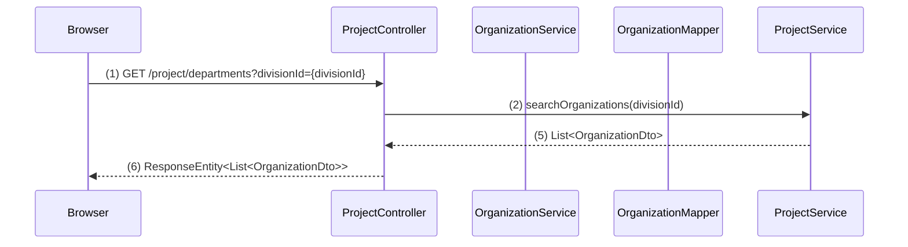
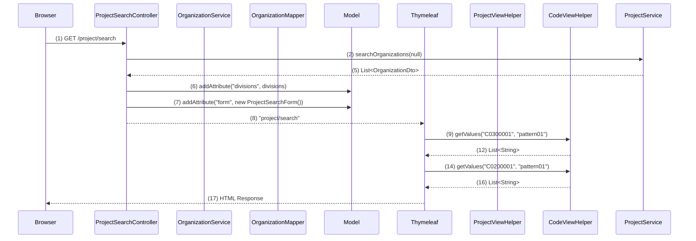
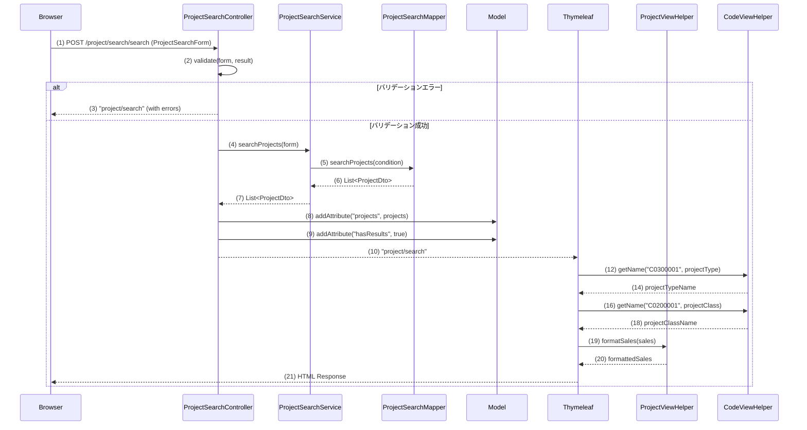
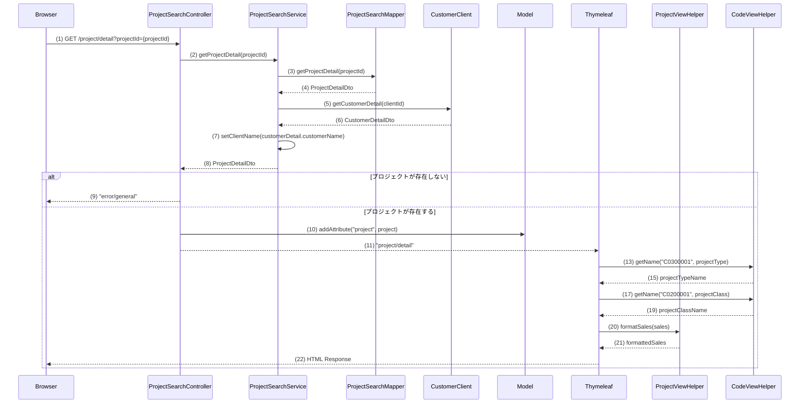

## 1. 概要

WA10202は、プロジェクトの検索と詳細表示を行う機能です。
- **WA1020201（プロジェクト検索画面）**: 検索条件を入力してプロジェクトを一覧表示
- **WA1020202（プロジェクト詳細画面）**: 選択されたプロジェクトの詳細情報を表示

主な機能：
- 事業部・部門の階層選択
- プロジェクト種別・分類での絞り込み
- 売上高・日付範囲での検索
- ページング機能
- プロジェクト詳細表示

## 2. クラス図

```mermaid
classDiagram
    namespace com.example.web.project.controller {
        class ProjectController {
            +departments(divisionId: Integer): ResponseEntity<List<OrganizationDto>>
        }
        
        class ProjectSearchController {
            +search(model: Model): String
            +searchProjects(form: ProjectSearchForm, result: BindingResult, model: Model): String
            +detail(projectId: Integer, model: Model): String
        }
    }

    namespace com.example.web.project.service {
        class ProjectSearchService {
            +searchProjects(form: ProjectSearchForm): List<ProjectDto>
            +getProjectDetail(projectId: Integer): ProjectDetailDto
        }
        
        class ProjectService {
            +searchOrganizations(): List<OrganizationDto>
        }
    }

    namespace com.example.web.project.mapper {
        class ProjectSearchMapper {
            +searchProjects(condition: ProjectSearchCondition): List<ProjectDto>
            +getProjectDetail(projectId: Integer): ProjectDetailDto
        }
        
        class OrganizationMapper {
            +findDivisions(): List<OrganizationDto>
            +findDepartmentsByDivision(divisionId: Integer): List<OrganizationDto>
        }
    }

    namespace com.example.web.project.form {
        class ProjectSearchForm {
            +Integer divisionId
            +Integer organizationId
            +List<String> projectType
            +List<String> projectClass
            +Integer salesFrom
            +Integer salesTo
            +LocalDate projectStartDateFrom
            +LocalDate projectStartDateTo
            +LocalDate projectEndDateFrom
            +LocalDate projectEndDateTo
            +String projectName
        }
    }

    namespace com.example.web.project.dto {
        class ProjectDto {
            +Integer projectId
            +String projectName
            +String projectType
            +String projectClass
            +String projectManager
            +Integer sales
            +LocalDate projectStartDate
            +LocalDate projectEndDate
            +String divisionName
            +String organizationName
        }
        
        class ProjectDetailDto {
            +Integer projectId
            +String projectName
            +String projectType
            +String projectClass
            +String projectManager
            +String projectLeader
            +Integer sales
            +LocalDate projectStartDate
            +LocalDate projectEndDate
            +String divisionName
            +String organizationName
            +Integer clientId
            +String clientName
            +String note
        }
        
        class OrganizationDto {
            +Integer organizationId
            +String organizationName
        }
    }

    namespace com.example.web.project.helper {
        class ProjectViewHelper {
            +getProjectTypeOptions(): List<String>
            +getProjectClassOptions(): List<String>
            +convertProjectTypeName(projectType: String): String
            +convertProjectClassName(projectClass: String): String
            +formatSales(sales: Integer): String
        }
    }

    namespace com.example.web.common.client {
        class CustomerClient {
            +getCustomerDetail(clientId: Integer): CustomerDetailDto
        }
    }

    namespace com.example.web.common.helper {
        class CodeViewHelper {
            +getName(codeId: String, value: String): String
            +getValues(codeId: String, pattern: String): List<String>
        }
    }

    ProjectController --> OrganizationService : uses
    ProjectSearchController --> ProjectSearchService : uses
    ProjectSearchController --> OrganizationService : uses
    ProjectSearchService --> ProjectSearchMapper : uses
    ProjectSearchService --> CustomerClient : uses
    OrganizationService --> OrganizationMapper : uses
    ProjectSearchMapper --> ProjectDto : returns
    ProjectSearchMapper --> ProjectDetailDto : returns
    OrganizationMapper --> OrganizationDto : returns
```

## 3. シーケンス図

### 部門リスト取得イベント (ProjectController)

### 初期表示イベント (ProjectSearchController)

### 一覧検索イベント (ProjectSearchController)

### プロジェクト詳細表示イベント (ProjectSearchController)

## ゴール

### GOAL1: プロジェクト検索画面の基本レイアウトとルーティング設定
- **完了条件**: 
  - `/project/search` にアクセスして検索条件入力フォームが表示される
  - 事業部・部門のプルダウン、各種入力項目、検索ボタンが配置されている
  - 検索結果一覧領域（空のテーブル）が表示される

### ステップ 1: ProjectSearchControllerクラスの作成

- **編集対象ファイル:** `web/src/main/java/com/example/web/project/controller/ProjectSearchController.java`（新規作成）
- **目的:** プロジェクト検索画面の初期表示を担当するコントローラーを作成する
- **内容:** 
  - `@Controller`アノテーションを付与したクラスを作成
  - `@RequestMapping("/project/search")`でベースパスを設定
  - 初期表示メソッド`index()`を作成し、`@GetMapping`で`/project/search`にマッピング
  - メソッドでは新しい`ProjectSearchForm`のインスタンスをModelに設定
  - 戻り値として`"project/search/index"`を返す
- **ポイント:** 
  - 現在`ProjectController`は登録機能用なので、検索機能は別コントローラーで実装
  - フォームオブジェクトの初期化を忘れずに行う

### ステップ 2: ProjectSearchFormクラスの作成

- **編集対象ファイル:** `web/src/main/java/com/example/web/project/form/ProjectSearchForm.java`（新規作成）
- **目的:** 検索条件の入力値を保持するフォームクラスを作成する
- **内容:**
  - JavaBeansパターンに従ったクラスを作成
  - プロパティ：`Integer divisionId`、`Integer organizationId`、`List<String> projectType`、`List<String> projectClass`、`Integer salesFrom`、`Integer salesTo`、`LocalDate projectStartDateFrom`、`LocalDate projectStartDateTo`、`LocalDate projectEndDateFrom`、`LocalDate projectEndDateTo`、`String projectName`
  - 各プロパティに適切なgetter/setterメソッドを実装
  - 現時点ではバリデーションアノテーションは不要（GOAL5で実装予定）
- **ポイント:** 
  - 複数選択項目（PJ種別、PJ分類）は`List<String>`型で定義
  - 日付項目は`LocalDate`型を使用
  - `DomainBean.java`を参考にプロパティ名を決定

### ステップ 3: プロジェクト検索画面HTMLテンプレートの修正

- **編集対象ファイル:** index.html
- **目的:** 既存の静的HTMLテンプレートをThymeleafテンプレートに変換する
- **内容:**
  - `<form>`タグに`th:object="${projectSearchForm}"`を追加
  - 事業部プルダウンの選択肢を現時点では空のオプションのみ表示（GOAL3で実装予定）
  - 部門プルダウンも同様に空のオプションのみ表示
  - PJ種別・PJ分類のチェックボックスは現時点では固定値で表示（GOAL2で実装予定）
  - 検索結果一覧テーブルは空の状態で表示（GOAL7で実装予定）
- **ポイント:** 
  - `html.instructions.md`に従ってエラー表示領域を準備
  - 必須項目には`*`を追加
  - 検索結果一覧領域は`th:block`で囲んで後で条件分岐可能にする

### ステップ 4: メニューからの遷移設定確認

- **編集対象ファイル:** menu.html
- **目的:** 既存のメニューからプロジェクト検索画面へのリンクが正しく設定されているか確認する
- **内容:**
  - 「プロジェクト検索」リンクが`th:href="@{/project/search}"`に設定されているか確認
  - リンク先が正しくProjectSearchControllerのindexメソッドに対応しているか確認
- **ポイント:** 
  - 既に`menu.html`で設定済みのため、確認のみ実施

### GOAL2: コード値マスタ連携（PJ種別・PJ分類のチェックボックス表示）
### **完了条件**
- PJ種別チェックボックスにC0300001のコード値が表示される
- PJ分類チェックボックスにC0200001のコード値が表示される
- 各コード値の名称が正しく表示される

### **ステップ 1: プロジェクト検索画面のPJ種別チェックボックスの実装**

- **編集対象ファイル:** index.html
- **目的:** 既存の静的なPJ種別チェックボックスをThymeleafテンプレートを使って動的に生成するように修正する
- **内容:**
  - 既存のPJ種別チェックボックスを削除
  - `th:each="codeValue : ${@codeViewHelper.getValues('C0300001','pattern01')}"`を使用してコード値をループ
  - 各チェックボックスに`th:field="*{projectType}"`を設定
  - 各チェックボックスに`th:value="${codeValue}"`を設定
  - 各label要素に`th:text="${@codeViewHelper.getName('C0300001',codeValue)}"`を設定
  - label要素の`for`属性に`th:for="${#ids.prev('projectType')}"`を設定
  - エラー表示用の`invalid-feedback`クラスを持つspan要素を追加
- **活用するクラス・メソッド:**
  - `com.example.web.common.helper.CodeViewHelper#getValues(String codeId, String pattern): List<String>`
  - `com.example.web.common.helper.CodeViewHelper#getName(String codeId, String value): String`
- **ポイント:** 
  - 仕様書のコードID（C0300001）とパターン（pattern01）を正確に実装
  - チェックボックスの複数選択が可能になるように`th:field="*{projectType}"`を設定

### **ステップ 2: プロジェクト検索画面のPJ分類チェックボックスの実装**

- **編集対象ファイル:** index.html
- **目的:** 既存の静的なPJ分類チェックボックスをThymeleafテンプレートを使って動的に生成するように修正する
- **内容:**
  - 既存のPJ分類チェックボックスを削除
  - `th:each="codeValue : ${@codeViewHelper.getValues('C0200001','pattern01')}"`を使用してコード値をループ
  - 各チェックボックスに`th:field="*{projectClass}"`を設定
  - 各チェックボックスに`th:value="${codeValue}"`を設定
  - 各label要素に`th:text="${@codeViewHelper.getName('C0200001',codeValue)}"`を設定
  - label要素の`for`属性に`th:for="${#ids.prev('projectClass')}"`を設定
  - エラー表示用の`invalid-feedback`クラスを持つspan要素を追加
- **活用するクラス・メソッド:**
  - `com.example.web.common.helper.CodeViewHelper#getValues(String codeId, String pattern): List<String>`
  - `com.example.web.common.helper.CodeViewHelper#getName(String codeId, String value): String`
- **ポイント:** 
  - 仕様書のコードID（C0200001）とパターン（pattern01）を正確に実装
  - チェックボックスの複数選択が可能になるように`th:field="*{projectClass}"`を設定

### GOAL3: 事業部プルダウンの初期表示とデータ取得
### 完了条件
- 画面表示時に事業部プルダウンに上位組織IDがNULLの組織データが表示される
- 組織テーブルからのデータ取得がログで確認できる
- プルダウンの先頭にブランクオプションが表示される
- 部門プルダウンは初期状態で非活性または空の状態になっている

### ステップ 1: ProjectSearchControllerでの事業部一覧取得機能の実装

- **編集対象ファイル:** ProjectSearchController.java
- **編集対象のメソッド:** `@ModelAttribute`メソッド（新規作成）
- **目的:** プロジェクト検索画面で事業部プルダウンに表示するデータを取得する
- **内容:**
  - `@ModelAttribute("divisions")`アノテーションを付与した`getDivisions()`メソッドを新規作成
  - メソッド内で[`ProjectService#searchOrganizations(Integer upperOrganizationId)`](web/src/main/java/com/example/web/project/service/ProjectService.java)を呼び出し
  - 引数には`null`を渡して上位組織IDがNULLの組織（事業部）を取得
  - 戻り値として`List<OrganizationDto>`を返却
  - `@Autowired`で[`ProjectService`](web/src/main/java/com/example/web/project/service/ProjectService.java)をDI
- **活用するクラス・メソッド:**
  - `ProjectService#searchOrganizations(Integer upperOrganizationId): List<OrganizationDto>`
  - `OrganizationDto`
- **ポイント:** 
  - 既存の`ProjectService`と`OrganizationMapper`を活用
  - `@ModelAttribute`により全ての画面表示時に事業部一覧が自動的にModelに設定される

### ステップ 2: プロジェクト検索画面の事業部プルダウンの修正

- **編集対象ファイル:** index.html
- **編集対象のメソッド:** 事業部プルダウンのselect要素
- **目的:** 静的に表示されている事業部プルダウンをThymeleafテンプレートで動的に生成する
- **内容:**
  - 事業部プルダウンの`<select>`要素に`id="divisionId"`と`th:field="*{divisionId}"`を設定
  - 既存の静的な`<option>`要素を削除
  - 先頭にブランクオプション`<option value="">選択してください</option>`を追加
  - `th:each="division : ${divisions}"`を使用して事業部一覧をループ
  - 各`<option>`要素に`th:value="${division.organizationId}"`と`th:text="${division.organizationName}"`を設定
  - エラー表示用の`th:errorclass="is-invalid"`とエラーメッセージ表示用の``要素を追加
- **活用するクラス・メソッド:**
  - Thymeleafテンプレートエンジンの`th:each`、`th:field`、`th:value`、`th:text`属性
  - `OrganizationDto#getOrganizationId()`
  - `OrganizationDto#getOrganizationName()`
- **ポイント:** 
  - html.instructions.mdの規約に従ってエラー表示を実装
  - 必須項目のマーク`*`は仕様に従って設定

### ステップ 3: プロジェクト検索画面の部門プルダウンの初期状態設定

- **編集対象ファイル:** index.html
- **編集対象のメソッド:** 部門プルダウンのselect要素
- **目的:** 初期表示時は部門プルダウンを空の状態にし、事業部選択後にのみ部門一覧が表示されるようにする
- **内容:**
  - 部門プルダウンの`<select>`要素に`id="organizationId"`と`th:field="*{organizationId}"`を設定
  - 初期状態では空白オプション（「選択してください」）のみを表示
  - `disabled`属性を初期状態で設定し、事業部選択後にJavaScriptで有効化する準備
  - エラー表示用の`th:errorclass="is-invalid"`とエラーメッセージ表示用の``要素を追加
- **活用するクラス・メソッド:**
  - HTML標準のselect要素とoption要素
  - Thymeleafの`th:field`属性
- **ポイント:** 
  - GOAL4で実装予定の動的部門取得機能との連携を考慮
  - 事業部未選択時は部門プルダウンが空になる仕様に対応

### GOAL4: 事業部選択時の部門リスト動的更新機能
### **完了条件**
- 事業部プルダウンで選択変更時に、自動的に`/project/departments`エンドポイントにAjaxリクエストが送信される
- 選択された事業部IDに対応する部門一覧が非同期で取得される
- 部門プルダウンの内容が動的に更新され、取得した部門がオプションとして表示される
- 部門プルダウンの先頭には「選択してください」のブランクオプションが表示される
- 事業部を未選択（ブランク）にした場合、部門プルダウンが空の状態になる
- ネットワークエラー時にはコンソールにエラーログが出力され、ユーザーにアラートが表示される

### **ステップ 1: プロジェクト検索画面HTMLでのJavaScript読み込み設定**

- **編集対象ファイル:** `src/main/resources/templates/project/search/index.html`
- **編集対象のメソッド:** head要素内のscript要素
- **目的:** 作成したJavaScriptファイルを画面で読み込み、動的部門取得機能を有効化する
- **内容:**
  - src/main/resources/static/js/project/create.js の読み込みを追加
- **活用するクラス・メソッド:**
  - HTML標準のscript要素
- **ポイント:** 
  - html.instructions.mdの規約に従い、jsファイルの参照はhead要素内に含める

### **ステップ 2: 事業部・部門プルダウンのID属性設定確認**

- **編集対象ファイル:** `src/main/resources/templates/project/search/index.html`
- **編集対象のメソッド:** 事業部・部門プルダウンのselect要素
- **目的:** JavaScriptから事業部・部門プルダウンを参照できるようにID属性が正しく設定されているか確認し、必要に応じて修正する
- **内容:**
  - 事業部プルダウンのselect要素に`id="divisionId"`が設定されているか確認
  - 部門プルダウンのselect要素に`id="organizationId"`が設定されているか確認
  - 既存のth:field属性やname属性は維持
  - ID属性が未設定の場合は追加
- **活用するクラス・メソッド:**
  - HTML標準のid属性
- **ポイント:** 
  - GOAL3で既に設定済みの可能性が高いため、確認を中心とした作業
  - 既存の動作を崩さないよう、追加のみでIDを設定

### GOAL5: 検索条件の単項目バリデーション機能
### **完了条件**
- 各項目のドメインバリデーションが動作する（日付形式、金額形式など）
- バリデーションエラー時に適切なエラーメッセージが表示される
- エラー発生時に後続処理が停止することが確認できる
- 検索フォーム送信時にバリデーションが実行され、エラーがある場合は検索画面に戻る

### **ステップ 1: ProjectSearchFormクラスへのバリデーションアノテーション追加**

- **編集対象ファイル:** ProjectSearchForm.java
- **編集対象のメソッド:** 各プロパティのフィールド定義
- **目的:** 検索条件の各項目に適切なドメインバリデーションを設定し、入力値の形式チェックを行う
- **内容:**
  - `divisionId`と`organizationId`に`@Domain("organizationId")`アノテーションを追加
  - `projectType`と`projectClass`に`@Domain("codeValue")`アノテーションを追加
  - `salesFrom`と`salesTo`に`@Domain("amountOfMoney")`アノテーションを追加
  - `projectStartDateFrom`、`projectStartDateTo`、`projectEndDateFrom`、`projectEndDateTo`に`@DateTimeFormat(pattern = "uuuu-MM-dd")`アノテーションを追加
  - `projectName`に`@Domain("projectName")`アノテーションを追加
  - 必要なimport文を追加：`nablarch.core.validation.ee.Domain`、`org.springframework.format.annotation.DateTimeFormat`
- **活用するクラス・メソッド:**
  - `DomainBean.java`で定義されているドメイン定義
  - Nablarchのバリデーション機能（`@Domain`アノテーション）
  - Spring Frameworkの日付形式変換機能（`@DateTimeFormat`アノテーション）
- **ポイント:**
  - 検索条件のため、すべての項目を`@Required`にはしない（任意入力）
  - form-class.instructions.mdの規約に従ってバリデーションアノテーションを設定
  - 日付項目は入力フォーマットを統一するため`@DateTimeFormat`を使用

### **ステップ 2: ProjectSearchControllerクラスの作成と検索メソッドの実装**

- **編集対象ファイル:** ProjectSearchController.java
- **編集対象のメソッド:** 新規メソッド追加
- **目的:** 検索フォーム送信時のバリデーション処理とエラーハンドリングを実装する
- **内容:**
  - `@PostMapping("/search")`アノテーションを付与した`searchProjects()`メソッドを新規作成
  - メソッドの引数に`@Validated ProjectSearchForm form`と`BindingResult bindingResult`を追加
  - `@OnRejectError(path = "project/search/index")`アノテーションを追加してバリデーションエラー時の遷移先を指定
  - メソッド内では現時点ではバリデーション成功時に検索画面に戻る処理のみ実装（GOAL7で検索処理を追加予定）
  - 戻り値として`"project/search/index"`を返却
  - 必要なimport文を追加：`org.springframework.validation.annotation.Validated`、`org.springframework.validation.BindingResult`、`com.example.web.common.errorhandling.OnRejectError`
- **活用するクラス・メソッド:**
  - Spring Validationの`@Validated`アノテーション
  - `BindingResult`によるバリデーション結果の取得
  - プロジェクト固有の`@OnRejectError`アノテーション
- **ポイント:**
  - controller-class.instructions.mdの規約に従ってバリデーション処理を実装
  - 現時点では検索処理は実装せず、バリデーション機能のみに集中
  - バリデーションエラー時はSpringが自動的にエラー画面に遷移する

### **ステップ 3: プロジェクト検索画面HTMLのバリデーションエラー表示の実装**

- **編集対象ファイル:** index.html
- **編集対象のメソッド:** 各入力項目のHTML要素
- **目的:** バリデーションエラーが発生した場合に、適切なエラーメッセージを各項目に表示する
- **内容:**
  - フォーム上部にグローバルエラー表示用の``を追加
  - 事業部プルダウンに`th:errorclass="is-invalid"`を追加し、直下に``を追加
  - 部門プルダウンに`th:errorclass="is-invalid"`を追加し、直下に``を追加
  - プロジェクト名入力欄に`th:errorclass="is-invalid"`を追加し、直下に``を追加
  - PJ種別チェックボックスのエラー表示を既存の`invalid-feedback`クラスのspan要素に`th:if="${#fields.hasErrors('projectType')}" th:errors="*{projectType}"`を追加
  - PJ分類チェックボックスのエラー表示を既存の`invalid-feedback`クラスのspan要素に`th:if="${#fields.hasErrors('projectClass')}" th:errors="*{projectClass}"`を追加
  - 売上高FROM・TO入力欄にそれぞれ`th:errorclass="is-invalid"`とエラーメッセージ表示を追加
  - 日付入力欄（開始日FROM・TO、終了日FROM・TO）にそれぞれ`th:errorclass="is-invalid"`とエラーメッセージ表示を追加
  - フォームのaction属性を`th:action="@{/project/search/search}"`に設定
- **活用するクラス・メソッド:**
  - Thymeleafの`#fields.hasErrors()`ヘルパーメソッド
  - Thymeleafの`th:errors`属性
  - Bootstrapの`is-invalid`および`invalid-feedback`クラス
- **ポイント:**
  - html.instructions.mdの規約に従ってエラー表示を実装
  - 単項目精査エラーは該当項目に`is-invalid`クラスを付与し、直下にエラーメッセージを表示
  - 特定項目に紐づかないエラーはフォーム上部にグローバルエラーとして表示

### GOAL6: 検索条件の相関バリデーション機能
- **完了条件**:
  - 売上高FROM-TO、開始日FROM-TO、終了日FROM-TOの大小関係チェックが動作する
  - 相関バリデーションエラー時に適切なエラーメッセージが表示される
  - エラー発生時に検索処理が実行されないことが確認できる

### GOAL7: プロジェクト検索処理とデータ表示
- **完了条件**:
  - 検索ボタン押下時にプロジェクトテーブルから条件に応じたデータが取得される
  - 検索結果が一覧テーブルに表示される（事業部・部門・PJ種別・PJ分類・PM・売上高・開始日・終了日）
  - 検索結果なしの場合は適切なメッセージが表示される
  - 検索処理の実行とデータ取得がログで確認できる

### GOAL8: 検索結果の表示形式とソート機能
- **完了条件**:
  - 売上高が3桁区切りのカンマ形式で表示される
  - 日付がyyyy/MM/dd形式で表示される
  - プロジェクトID昇順でソートされて表示される
  - PJ種別・PJ分類がコード値名称で表示される

### GOAL9: ページング機能
- **完了条件**:
  - 検索結果が複数ページに分割表示される
  - ページネーションリンク（<<、<、ページ番号、>、>>）が動作する
  - ページ遷移時に適切なデータが表示される

### GOAL10: プロジェクト詳細画面の基本表示
- **完了条件**:
  - PJ名リンクをクリックすると `/project/detail` に遷移する
  - プロジェクトIDがパラメータとして渡される
  - 詳細画面で事業部・部門・PJ名・PJ種別・PJ分類・売上高・顧客・PM・PL・開始日・終了日・備考が表示される
  - 前画面から引き継いだプロジェクトIDがログで確認できる

### GOAL11: プロジェクト詳細画面のデータ取得と表示
- **完了条件**:
  - プロジェクトIDに基づいてプロジェクト情報が取得される
  - 組織テーブルとの結合で事業部・部門名が表示される
  - 存在しないプロジェクトIDの場合は汎用エラー画面が表示される

### GOAL12: 顧客管理システムAPI連携
- **完了条件**:
  - 顧客IDをパラメータとして顧客詳細取得APIが実行される
  - 取得した顧客名が詳細画面に表示される
  - API連携エラー時の適切なエラーハンドリングが動作する

### GOAL13: 詳細画面からの画面遷移機能
- **完了条件**:
  - 「戻る」ボタンで検索画面に戻り、検索条件と検索結果が保持される
  - 「更新」ボタンでプロジェクト更新画面に遷移する
  - 各画面遷移時にパラメータが適切に渡される
