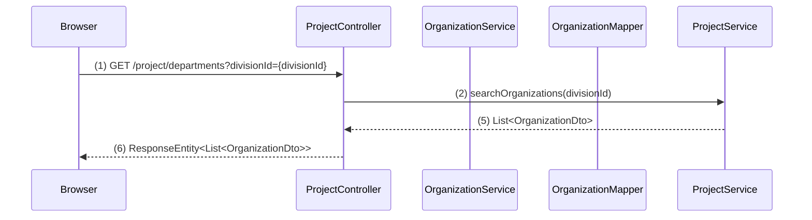
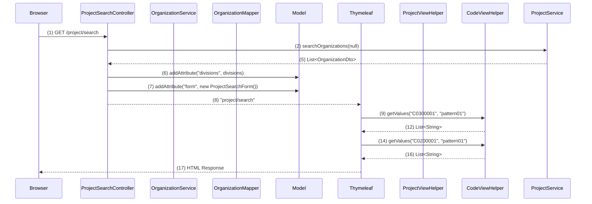
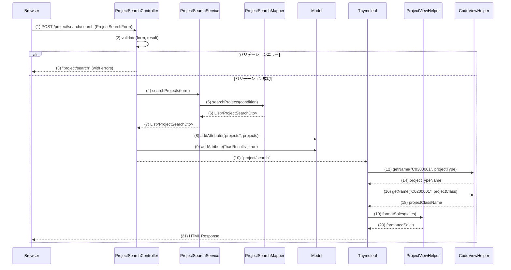
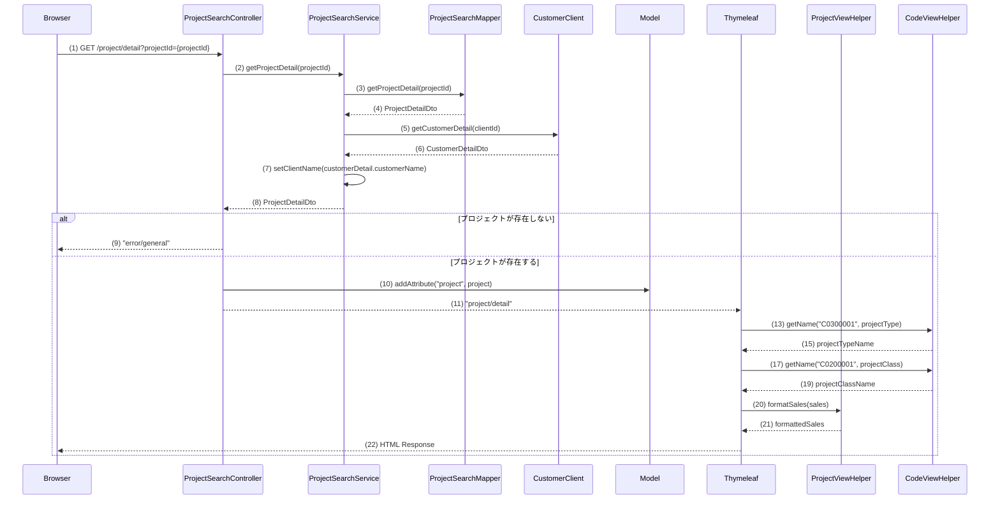

## 1. 概要

WA10202は、プロジェクトの検索と詳細表示を行う機能です。
- **WA1020201（プロジェクト検索画面）**: 検索条件を入力してプロジェクトを一覧表示
- **WA1020202（プロジェクト詳細画面）**: 選択されたプロジェクトの詳細情報を表示

主な機能：
- 事業部・部門の階層選択
- プロジェクト種別・分類での絞り込み
- 売上高・日付範囲での検索
- ページング機能
- プロジェクト詳細表示

## 2. クラス図

```mermaid
classDiagram
    namespace com.example.web.project.controller {
        class ProjectController {
            +departments(divisionId: Integer): ResponseEntity<List<OrganizationDto>>
        }
        
        class ProjectSearchController {
            +search(model: Model): String
            +searchProjects(form: ProjectSearchForm, result: BindingResult, model: Model): String
            +detail(projectId: Integer, model: Model): String
        }
    }

    namespace com.example.web.project.service {
        class ProjectSearchService {
            +searchProjects(form: ProjectSearchForm): List<ProjectSearchDto>
            +getProjectDetail(projectId: Integer): ProjectDetailDto
        }
        
        class ProjectService {
            +searchOrganizations(): List<OrganizationDto>
        }
    }

    namespace com.example.web.project.mapper {
        class ProjectSearchMapper {
            +searchProjects(condition: ProjectSearchCondition): List<ProjectSearchDto>
            +getProjectDetail(projectId: Integer): ProjectDetailDto
        }
        
        class OrganizationMapper {
            +findDivisions(): List<OrganizationDto>
            +findDepartmentsByDivision(divisionId: Integer): List<OrganizationDto>
        }
    }

    namespace com.example.web.project.form {
        class ProjectSearchForm {
            +Integer divisionId
            +Integer organizationId
            +List<String> projectType
            +List<String> projectClass
            +Integer salesFrom
            +Integer salesTo
            +LocalDate projectStartDateFrom
            +LocalDate projectStartDateTo
            +LocalDate projectEndDateFrom
            +LocalDate projectEndDateTo
            +String projectName
        }
    }

    namespace com.example.web.project.dto {
        class ProjectSearchDto {
            +Integer projectId
            +String projectName
            +String projectType
            +String projectClass
            +String projectManager
            +Integer sales
            +LocalDate projectStartDate
            +LocalDate projectEndDate
            +String divisionName
            +String organizationName
        }
        
        class ProjectDetailDto {
            +Integer projectId
            +String projectName
            +String projectType
            +String projectClass
            +String projectManager
            +String projectLeader
            +Integer sales
            +LocalDate projectStartDate
            +LocalDate projectEndDate
            +String divisionName
            +String organizationName
            +Integer clientId
            +String clientName
            +String note
        }
        
        class OrganizationDto {
            +Integer organizationId
            +String organizationName
        }
    }

    namespace com.example.web.project.helper {
        class ProjectViewHelper {
            +getProjectTypeOptions(): List<String>
            +getProjectClassOptions(): List<String>
            +convertProjectTypeName(projectType: String): String
            +convertProjectClassName(projectClass: String): String
            +formatSales(sales: Integer): String
        }
    }

    namespace com.example.web.common.client {
        class CustomerClient {
            +getCustomerDetail(clientId: Integer): CustomerDetailDto
        }
    }

    namespace com.example.web.common.helper {
        class CodeViewHelper {
            +getName(codeId: String, value: String): String
            +getValues(codeId: String, pattern: String): List<String>
        }
    }

    ProjectController --> OrganizationService : uses
    ProjectSearchController --> ProjectSearchService : uses
    ProjectSearchController --> OrganizationService : uses
    ProjectSearchService --> ProjectSearchMapper : uses
    ProjectSearchService --> CustomerClient : uses
    OrganizationService --> OrganizationMapper : uses
    ProjectSearchMapper --> ProjectSearchDto : returns
    ProjectSearchMapper --> ProjectDetailDto : returns
    OrganizationMapper --> OrganizationDto : returns
```

## 3. シーケンス図

### 部門リスト取得イベント (ProjectController)

### 初期表示イベント (ProjectSearchController)

### 一覧検索イベント (ProjectSearchController)

### プロジェクト詳細表示イベント (ProjectSearchController)

## ゴール

### GOAL1: プロジェクト検索画面の基本レイアウトとルーティング設定
- **完了条件**: 
  - `/project/search` にアクセスして検索条件入力フォームが表示される
  - 事業部・部門のプルダウン、各種入力項目、検索ボタンが配置されている
  - 検索結果一覧領域（空のテーブル）が表示される

### ステップ 1: ProjectSearchControllerクラスの作成

- **編集対象ファイル:** `web/src/main/java/com/example/web/project/controller/ProjectSearchController.java`（新規作成）
- **目的:** プロジェクト検索画面の初期表示を担当するコントローラーを作成する
- **内容:** 
  - `@Controller`アノテーションを付与したクラスを作成
  - `@RequestMapping("/project/search")`でベースパスを設定
  - 初期表示メソッド`index()`を作成し、`@GetMapping`で`/project/search`にマッピング
  - メソッドでは新しい`ProjectSearchForm`のインスタンスをModelに設定
  - 戻り値として`"project/search/index"`を返す
- **ポイント:** 
  - 現在`ProjectController`は登録機能用なので、検索機能は別コントローラーで実装
  - フォームオブジェクトの初期化を忘れずに行う

### ステップ 2: ProjectSearchFormクラスの作成

- **編集対象ファイル:** `web/src/main/java/com/example/web/project/form/ProjectSearchForm.java`（新規作成）
- **目的:** 検索条件の入力値を保持するフォームクラスを作成する
- **内容:**
  - JavaBeansパターンに従ったクラスを作成
  - プロパティ：`Integer divisionId`、`Integer organizationId`、`List<String> projectType`、`List<String> projectClass`、`Integer salesFrom`、`Integer salesTo`、`LocalDate projectStartDateFrom`、`LocalDate projectStartDateTo`、`LocalDate projectEndDateFrom`、`LocalDate projectEndDateTo`、`String projectName`
  - 各プロパティに適切なgetter/setterメソッドを実装
  - 現時点ではバリデーションアノテーションは不要（GOAL5で実装予定）
- **ポイント:** 
  - 複数選択項目（PJ種別、PJ分類）は`List<String>`型で定義
  - 日付項目は`LocalDate`型を使用
  - `DomainBean.java`を参考にプロパティ名を決定

### ステップ 3: プロジェクト検索画面HTMLテンプレートの修正

- **編集対象ファイル:** index.html
- **目的:** 既存の静的HTMLテンプレートをThymeleafテンプレートに変換する
- **内容:**
  - `<form>`タグに`th:object="${projectSearchForm}"`を追加
  - 事業部プルダウンの選択肢を現時点では空のオプションのみ表示（GOAL3で実装予定）
  - 部門プルダウンも同様に空のオプションのみ表示
  - PJ種別・PJ分類のチェックボックスは現時点では固定値で表示（GOAL2で実装予定）
  - 検索結果一覧テーブルは空の状態で表示（GOAL7で実装予定）
- **ポイント:** 
  - `html.instructions.md`に従ってエラー表示領域を準備
  - 必須項目には`*`を追加
  - 検索結果一覧領域は`th:block`で囲んで後で条件分岐可能にする

### ステップ 4: メニューからの遷移設定確認

- **編集対象ファイル:** menu.html
- **目的:** 既存のメニューからプロジェクト検索画面へのリンクが正しく設定されているか確認する
- **内容:**
  - 「プロジェクト検索」リンクが`th:href="@{/project/search}"`に設定されているか確認
  - リンク先が正しくProjectSearchControllerのindexメソッドに対応しているか確認
- **ポイント:** 
  - 既に`menu.html`で設定済みのため、確認のみ実施

### GOAL2: コード値マスタ連携（PJ種別・PJ分類のチェックボックス表示）
### **完了条件**
- PJ種別チェックボックスにC0300001のコード値が表示される
- PJ分類チェックボックスにC0200001のコード値が表示される
- 各コード値の名称が正しく表示される

### **ステップ 1: プロジェクト検索画面のPJ種別チェックボックスの実装**

- **編集対象ファイル:** index.html
- **目的:** 既存の静的なPJ種別チェックボックスをThymeleafテンプレートを使って動的に生成するように修正する
- **内容:**
  - 既存のPJ種別チェックボックスを削除
  - `th:each="codeValue : ${@codeViewHelper.getValues('C0300001','pattern01')}"`を使用してコード値をループ
  - 各チェックボックスに`th:field="*{projectType}"`を設定
  - 各チェックボックスに`th:value="${codeValue}"`を設定
  - 各label要素に`th:text="${@codeViewHelper.getName('C0300001',codeValue)}"`を設定
  - label要素の`for`属性に`th:for="${#ids.prev('projectType')}"`を設定
  - エラー表示用の`invalid-feedback`クラスを持つspan要素を追加
- **活用するクラス・メソッド:**
  - `com.example.web.common.helper.CodeViewHelper#getValues(String codeId, String pattern): List<String>`
  - `com.example.web.common.helper.CodeViewHelper#getName(String codeId, String value): String`
- **ポイント:** 
  - 仕様書のコードID（C0300001）とパターン（pattern01）を正確に実装
  - チェックボックスの複数選択が可能になるように`th:field="*{projectType}"`を設定

### **ステップ 2: プロジェクト検索画面のPJ分類チェックボックスの実装**

- **編集対象ファイル:** index.html
- **目的:** 既存の静的なPJ分類チェックボックスをThymeleafテンプレートを使って動的に生成するように修正する
- **内容:**
  - 既存のPJ分類チェックボックスを削除
  - `th:each="codeValue : ${@codeViewHelper.getValues('C0200001','pattern01')}"`を使用してコード値をループ
  - 各チェックボックスに`th:field="*{projectClass}"`を設定
  - 各チェックボックスに`th:value="${codeValue}"`を設定
  - 各label要素に`th:text="${@codeViewHelper.getName('C0200001',codeValue)}"`を設定
  - label要素の`for`属性に`th:for="${#ids.prev('projectClass')}"`を設定
  - エラー表示用の`invalid-feedback`クラスを持つspan要素を追加
- **活用するクラス・メソッド:**
  - `com.example.web.common.helper.CodeViewHelper#getValues(String codeId, String pattern): List<String>`
  - `com.example.web.common.helper.CodeViewHelper#getName(String codeId, String value): String`
- **ポイント:** 
  - 仕様書のコードID（C0200001）とパターン（pattern01）を正確に実装
  - チェックボックスの複数選択が可能になるように`th:field="*{projectClass}"`を設定

### GOAL3: 事業部プルダウンの初期表示とデータ取得
### 完了条件
- 画面表示時に事業部プルダウンに上位組織IDがNULLの組織データが表示される
- 組織テーブルからのデータ取得がログで確認できる
- プルダウンの先頭にブランクオプションが表示される
- 部門プルダウンは初期状態で非活性または空の状態になっている

### ステップ 1: ProjectSearchControllerでの事業部一覧取得機能の実装

- **編集対象ファイル:** ProjectSearchController.java
- **編集対象のメソッド:** `@ModelAttribute`メソッド（新規作成）
- **目的:** プロジェクト検索画面で事業部プルダウンに表示するデータを取得する
- **内容:**
  - `@ModelAttribute("divisions")`アノテーションを付与した`getDivisions()`メソッドを新規作成
  - メソッド内で[`ProjectService#searchOrganizations(Integer upperOrganizationId)`](web/src/main/java/com/example/web/project/service/ProjectService.java)を呼び出し
  - 引数には`null`を渡して上位組織IDがNULLの組織（事業部）を取得
  - 戻り値として`List<OrganizationDto>`を返却
  - `@Autowired`で[`ProjectService`](web/src/main/java/com/example/web/project/service/ProjectService.java)をDI
- **活用するクラス・メソッド:**
  - `ProjectService#searchOrganizations(Integer upperOrganizationId): List<OrganizationDto>`
  - `OrganizationDto`
- **ポイント:** 
  - 既存の`ProjectService`と`OrganizationMapper`を活用
  - `@ModelAttribute`により全ての画面表示時に事業部一覧が自動的にModelに設定される

### ステップ 2: プロジェクト検索画面の事業部プルダウンの修正

- **編集対象ファイル:** index.html
- **編集対象のメソッド:** 事業部プルダウンのselect要素
- **目的:** 静的に表示されている事業部プルダウンをThymeleafテンプレートで動的に生成する
- **内容:**
  - 事業部プルダウンの`<select>`要素に`id="divisionId"`と`th:field="*{divisionId}"`を設定
  - 既存の静的な`<option>`要素を削除
  - 先頭にブランクオプション`<option value="">選択してください</option>`を追加
  - `th:each="division : ${divisions}"`を使用して事業部一覧をループ
  - 各`<option>`要素に`th:value="${division.organizationId}"`と`th:text="${division.organizationName}"`を設定
  - エラー表示用の`th:errorclass="is-invalid"`とエラーメッセージ表示用の``要素を追加
- **活用するクラス・メソッド:**
  - Thymeleafテンプレートエンジンの`th:each`、`th:field`、`th:value`、`th:text`属性
  - `OrganizationDto#getOrganizationId()`
  - `OrganizationDto#getOrganizationName()`
- **ポイント:** 
  - html.instructions.mdの規約に従ってエラー表示を実装
  - 必須項目のマーク`*`は仕様に従って設定

### ステップ 3: プロジェクト検索画面の部門プルダウンの初期状態設定

- **編集対象ファイル:** index.html
- **編集対象のメソッド:** 部門プルダウンのselect要素
- **目的:** 初期表示時は部門プルダウンを空の状態にし、事業部選択後にのみ部門一覧が表示されるようにする
- **内容:**
  - 部門プルダウンの`<select>`要素に`id="organizationId"`と`th:field="*{organizationId}"`を設定
  - 初期状態では空白オプション（「選択してください」）のみを表示
  - `disabled`属性を初期状態で設定し、事業部選択後にJavaScriptで有効化する準備
  - エラー表示用の`th:errorclass="is-invalid"`とエラーメッセージ表示用の``要素を追加
- **活用するクラス・メソッド:**
  - HTML標準のselect要素とoption要素
  - Thymeleafの`th:field`属性
- **ポイント:** 
  - GOAL4で実装予定の動的部門取得機能との連携を考慮
  - 事業部未選択時は部門プルダウンが空になる仕様に対応

### GOAL4: 事業部選択時の部門リスト動的更新機能
### **完了条件**
- 事業部プルダウンで選択変更時に、自動的に`/project/departments`エンドポイントにAjaxリクエストが送信される
- 選択された事業部IDに対応する部門一覧が非同期で取得される
- 部門プルダウンの内容が動的に更新され、取得した部門がオプションとして表示される
- 部門プルダウンの先頭には「選択してください」のブランクオプションが表示される
- 事業部を未選択（ブランク）にした場合、部門プルダウンが空の状態になる
- ネットワークエラー時にはコンソールにエラーログが出力され、ユーザーにアラートが表示される

### **ステップ 1: プロジェクト検索画面HTMLでのJavaScript読み込み設定**

- **編集対象ファイル:** `src/main/resources/templates/project/search/index.html`
- **編集対象のメソッド:** head要素内のscript要素
- **目的:** 作成したJavaScriptファイルを画面で読み込み、動的部門取得機能を有効化する
- **内容:**
  - src/main/resources/static/js/project/create.js の読み込みを追加
- **活用するクラス・メソッド:**
  - HTML標準のscript要素
- **ポイント:** 
  - html.instructions.mdの規約に従い、jsファイルの参照はhead要素内に含める

### **ステップ 2: 事業部・部門プルダウンのID属性設定確認**

- **編集対象ファイル:** `src/main/resources/templates/project/search/index.html`
- **編集対象のメソッド:** 事業部・部門プルダウンのselect要素
- **目的:** JavaScriptから事業部・部門プルダウンを参照できるようにID属性が正しく設定されているか確認し、必要に応じて修正する
- **内容:**
  - 事業部プルダウンのselect要素に`id="divisionId"`が設定されているか確認
  - 部門プルダウンのselect要素に`id="organizationId"`が設定されているか確認
  - 既存のth:field属性やname属性は維持
  - ID属性が未設定の場合は追加
- **活用するクラス・メソッド:**
  - HTML標準のid属性
- **ポイント:** 
  - GOAL3で既に設定済みの可能性が高いため、確認を中心とした作業
  - 既存の動作を崩さないよう、追加のみでIDを設定

### GOAL5: 検索条件の単項目バリデーション機能
### **完了条件**
- 各項目のドメインバリデーションが動作する（日付形式、金額形式など）
- バリデーションエラー時に適切なエラーメッセージが表示される
- エラー発生時に後続処理が停止することが確認できる
- 検索フォーム送信時にバリデーションが実行され、エラーがある場合は検索画面に戻る

### **ステップ 1: ProjectSearchFormクラスへのバリデーションアノテーション追加**

- **編集対象ファイル:** ProjectSearchForm.java
- **編集対象のメソッド:** 各プロパティのフィールド定義
- **目的:** 検索条件の各項目に適切なドメインバリデーションを設定し、入力値の形式チェックを行う
- **内容:**
  - `divisionId`と`organizationId`に`@Domain("organizationId")`アノテーションを追加
  - `projectType`と`projectClass`に`@Domain("codeValue")`アノテーションを追加
  - `salesFrom`と`salesTo`に`@Domain("amountOfMoney")`アノテーションを追加
  - `projectStartDateFrom`、`projectStartDateTo`、`projectEndDateFrom`、`projectEndDateTo`に`@DateTimeFormat(pattern = "uuuu-MM-dd")`アノテーションを追加
  - `projectName`に`@Domain("projectName")`アノテーションを追加
  - 必要なimport文を追加：`nablarch.core.validation.ee.Domain`、`org.springframework.format.annotation.DateTimeFormat`
- **活用するクラス・メソッド:**
  - `DomainBean.java`で定義されているドメイン定義
  - Nablarchのバリデーション機能（`@Domain`アノテーション）
  - Spring Frameworkの日付形式変換機能（`@DateTimeFormat`アノテーション）
- **ポイント:**
  - 検索条件のため、すべての項目を`@Required`にはしない（任意入力）
  - form-class.instructions.mdの規約に従ってバリデーションアノテーションを設定
  - 日付項目は入力フォーマットを統一するため`@DateTimeFormat`を使用

### **ステップ 2: ProjectSearchControllerクラスの作成と検索メソッドの実装**

- **編集対象ファイル:** ProjectSearchController.java
- **編集対象のメソッド:** 新規メソッド追加
- **目的:** 検索フォーム送信時のバリデーション処理とエラーハンドリングを実装する
- **内容:**
  - `@PostMapping("/search")`アノテーションを付与した`searchProjects()`メソッドを新規作成
  - メソッドの引数に`@Validated ProjectSearchForm form`と`BindingResult bindingResult`を追加
  - `@OnRejectError(path = "project/search/index")`アノテーションを追加してバリデーションエラー時の遷移先を指定
  - メソッド内では現時点ではバリデーション成功時に検索画面に戻る処理のみ実装（GOAL7で検索処理を追加予定）
  - 戻り値として`"project/search/index"`を返却
  - 必要なimport文を追加：`org.springframework.validation.annotation.Validated`、`org.springframework.validation.BindingResult`、`com.example.web.common.errorhandling.OnRejectError`
- **活用するクラス・メソッド:**
  - Spring Validationの`@Validated`アノテーション
  - `BindingResult`によるバリデーション結果の取得
  - プロジェクト固有の`@OnRejectError`アノテーション
- **ポイント:**
  - controller-class.instructions.mdの規約に従ってバリデーション処理を実装
  - 現時点では検索処理は実装せず、バリデーション機能のみに集中
  - バリデーションエラー時はSpringが自動的にエラー画面に遷移する

### **ステップ 3: プロジェクト検索画面HTMLのバリデーションエラー表示の実装**

- **編集対象ファイル:** index.html
- **編集対象のメソッド:** 各入力項目のHTML要素
- **目的:** バリデーションエラーが発生した場合に、適切なエラーメッセージを各項目に表示する
- **内容:**
  - フォーム上部にグローバルエラー表示用の``を追加
  - 事業部プルダウンに`th:errorclass="is-invalid"`を追加し、直下に``を追加
  - 部門プルダウンに`th:errorclass="is-invalid"`を追加し、直下に``を追加
  - プロジェクト名入力欄に`th:errorclass="is-invalid"`を追加し、直下に``を追加
  - PJ種別チェックボックスのエラー表示を既存の`invalid-feedback`クラスのspan要素に`th:if="${#fields.hasErrors('projectType')}" th:errors="*{projectType}"`を追加
  - PJ分類チェックボックスのエラー表示を既存の`invalid-feedback`クラスのspan要素に`th:if="${#fields.hasErrors('projectClass')}" th:errors="*{projectClass}"`を追加
  - 売上高FROM・TO入力欄にそれぞれ`th:errorclass="is-invalid"`とエラーメッセージ表示を追加
  - 日付入力欄（開始日FROM・TO、終了日FROM・TO）にそれぞれ`th:errorclass="is-invalid"`とエラーメッセージ表示を追加
  - フォームのaction属性を`th:action="@{/project/search/search}"`に設定
- **活用するクラス・メソッド:**
  - Thymeleafの`#fields.hasErrors()`ヘルパーメソッド
  - Thymeleafの`th:errors`属性
  - Bootstrapの`is-invalid`および`invalid-feedback`クラス
- **ポイント:**
  - html.instructions.mdの規約に従ってエラー表示を実装
  - 単項目精査エラーは該当項目に`is-invalid`クラスを付与し、直下にエラーメッセージを表示
  - 特定項目に紐づかないエラーはフォーム上部にグローバルエラーとして表示

### GOAL6: 検索条件の相関バリデーション機能
### **完了条件**
- 売上高FROM-TO、開始日FROM-TO、終了日FROM-TOの大小関係チェックが動作する
- 相関バリデーションエラー時に適切なエラーメッセージが表示される
- エラー発生時に検索処理が実行されないことが確認できる
- 売上高FROMが売上高TOより大きい場合にバリデーションエラーが表示される
- 開始日FROMが開始日TOより大きい場合にバリデーションエラーが表示される
- 終了日FROMが終了日TOより大きい場合にバリデーションエラーが表示される

### ステップ 1: ProjectSearchFormクラスでの相関バリデーションメソッドの実装

- **編集対象ファイル:** ProjectSearchForm.java
- **編集対象のメソッド:** 新規メソッド追加
- **目的:** プロジェクト作成フォームで実装されている期間整合性チェックと同様の仕組みを使って、検索条件の相関バリデーションを実装する
- **内容:**
  - 売上高の大小関係チェック用メソッド`isValidSalesRange()`を新規作成
    - `@AssertTrue(message = "{validator.salesRangeCheck.message.ProjectSearchForm}")`アノテーションを付与
    - `salesFrom`と`salesTo`が両方nullでない場合、`salesFrom <= salesTo`をチェック
    - 片方がnullまたは両方nullの場合はtrueを返却
  - プロジェクト開始日の大小関係チェック用メソッド`isValidProjectStartDateRange()`を新規作成
    - `@AssertTrue(message = "{validator.projectStartDateRangeCheck.message.ProjectSearchForm}")`アノテーションを付与
    - `projectStartDateFrom`と`projectStartDateTo`が両方nullでない場合、FROM≦TOをチェック
    - 片方がnullまたは両方nullの場合はtrueを返却
  - プロジェクト終了日の大小関係チェック用メソッド`isValidProjectEndDateRange()`を新規作成
    - `@AssertTrue(message = "{validator.projectEndDateRangeCheck.message.ProjectSearchForm}")`アノテーションを付与
    - `projectEndDateFrom`と`projectEndDateTo`が両方nullでない場合、FROM≦TOをチェック
    - 片方がnullまたは両方nullの場合はtrueを返却
  - 必要なimport文を追加：`jakarta.validation.constraints.AssertTrue`
- **活用するクラス・メソッド:**
  - `ProjectCreateForm#isValidProjectPeriod()`メソッドの実装パターンを参考
  - Bean Validationの`@AssertTrue`アノテーション
  - `LocalDate#isEqual()`および`LocalDate#isBefore()`メソッド
- **ポイント:** 
  - form-class.instructions.mdの規約に従ってバリデーションアノテーションを設定
  - 検索条件なので、null値は許可し、両方に値が入っている場合のみバリデーションを実行
  - ProjectCreateForm.javaの期間整合性チェックと同じパターンで実装

### ステップ 2: バリデーションエラーメッセージの定義

- **編集対象ファイル:** messages.properties
- **編集対象のメソッド:** メッセージ定義の追加
- **目的:** 相関バリデーションエラー時に表示するメッセージを定義し、ユーザーに分かりやすいエラー内容を伝える
- **内容:**
  - 売上高範囲チェック用メッセージ`validator.salesRangeCheck.message.ProjectSearchForm=売上高FROMは売上高TO以下で入力してください。`を追加
  - 開始日範囲チェック用メッセージ`validator.projectStartDateRangeCheck.message.ProjectSearchForm=開始日FROMは開始日TO以下で入力してください。`を追加
  - 終了日範囲チェック用メッセージ`validator.projectEndDateRangeCheck.message.ProjectSearchForm=終了日FROMは終了日TO以下で入力してください。`を追加
- **活用するクラス・メソッド:**
  - Spring Frameworkのメッセージリソース機能
  - 既存の`validator.periodConsistencyCheck.message.ProjectCreateForm`メッセージの記述パターンを参考
- **ポイント:** 
  - プロジェクト登録フォームのメッセージと統一性を保つ
  - ユーザーが理解しやすい日本語でメッセージを記述
  - メッセージキーの命名規則に従って設定

### ステップ 3: プロジェクト検索画面HTMLでの相関バリデーションエラー表示の実装

- **編集対象ファイル:** index.html
- **目的:** 相関バリデーションエラーが発生した場合に、各項目の下部にエラーメッセージを表示する
- **内容:**
  - 各項目の表示領域の下に相関バリデーションエラーの表示を追加
  - 売上高範囲エラー用の``を追加
  - 開始日範囲エラー用の``を追加
  - 終了日範囲エラー用の``を追加
- **活用するクラス・メソッド:**
  - Thymeleafの`#fields.hasErrors()`ヘルパーメソッド
  - Thymeleafの`th:errors`属性
  - Bootstrapの`invalid-feedback`および`d-block`クラス
- **ポイント:**
  - html.instructions.mdの規約に従ってエラー表示を実装
  - 複数の相関バリデーションエラーが同時に発生する可能性があるため、それぞれ個別に表示

### GOAL7: プロジェクト検索処理とデータ表示
GOAL7のプロジェクト検索処理とデータ表示について、詳細な実装計画を作成いたします。

### GOAL7: プロジェクト検索処理とデータ表示
- **完了条件**: 
  - 検索ボタン押下時にプロジェクトテーブルから条件に応じたデータが取得される
  - 検索結果が一覧テーブルに表示される（事業部・部門・PJ種別・PJ分類・PM・売上高・開始日・終了日）
  - 検索結果なしの場合は適切なメッセージが表示される
  - 検索処理の実行とデータ取得がログで確認できる

#### ステップ 1: ProjectSearchServiceクラスの作成

- **編集対象ファイル:** `web/src/main/java/com/example/web/project/service/ProjectSearchService.java`（新規作成）
- **目的:** プロジェクト検索のビジネスロジックを担当するサービスクラスを作成し、検索条件をもとにプロジェクト一覧を取得する機能を実装する
- **内容:**
  - `@Service`アノテーションを付与したクラスを作成
  - `ProjectSearchMapper`を`@Autowired`でDI
  - `searchProjects(ProjectSearchForm form)`メソッドを新規作成
    - 引数で受け取った`ProjectSearchForm`の内容を検索条件に変換
    - `ProjectSearchMapper#searchProjects(ProjectSearchCondition condition)`を呼び出し
    - 戻り値として`List<ProjectSearchDto>`を返却
    - 検索条件が未入力の場合でも全件検索が実行されるように実装
  - 必要なimport文を追加：`org.springframework.stereotype.Service`、`org.springframework.beans.factory.annotation.Autowired`
- **活用するクラス・メソッド:**
  - 新規作成予定の`ProjectSearchMapper#searchProjects()`メソッド
  - 新規作成予定の`ProjectSearchCondition`クラス
  - 新規作成予定の`ProjectSearchDto`クラス
- **ポイント:** 
  - フォームの値をそのままMapperに渡すのではなく、検索条件専用のConditionクラスに変換
  - 検索条件の前処理（null値の処理など）はここで実施

#### ステップ 2: ProjectSearchConditionクラスの作成

- **編集対象ファイル:** `web/src/main/java/com/example/web/project/dto/ProjectSearchCondition.java`（新規作成）
- **目的:** MyBatis Mapperに渡す検索条件を保持するDTOクラスを作成する
- **内容:**
  - JavaBeansパターンに従ったクラスを作成
  - プロパティ：`Integer divisionId`、`Integer organizationId`、`List<String> projectType`、`List<String> projectClass`、`Integer salesFrom`、`Integer salesTo`、`LocalDate projectStartDateFrom`、`LocalDate projectStartDateTo`、`LocalDate projectEndDateFrom`、`LocalDate projectEndDateTo`、`String projectName`
  - 各プロパティに適切なgetter/setterメソッドを実装
  - `ProjectSearchForm`から`ProjectSearchCondition`への変換メソッドは`ProjectSearchService`で実装
- **活用するクラス・メソッド:**
  - `ProjectSearchForm`クラスのプロパティ構造を参考
  - JavaBeansパターンの実装
- **ポイント:**
  - フォーム用とMapper用で別クラスにすることで、それぞれの責務を明確に分離
  - MyBatisの動的SQLで使いやすい形にプロパティを設計

#### ステップ 3: ProjectSearchDtoクラスの作成

- **編集対象ファイル:** ProjectSearchDto.java（新規作成）
- **目的:** 検索結果のプロジェクト情報を保持するDTOクラスを作成する
- **内容:**
  - JavaBeansパターンに従ったクラスを作成
  - プロパティ：`Integer projectId`、`String projectName`、`String projectType`、`String projectClass`、`String projectManager`、`Integer sales`、`LocalDate projectStartDate`、`LocalDate projectEndDate`、`String divisionName`、`String organizationName`
  - 各プロパティに適切なgetter/setterメソッドを実装
  - JavaDocコメントを各プロパティに追加
- **活用するクラス・メソッド:**
  - データベーススキーマの`PROJECT`テーブルと`ORGANIZATION`テーブルの構造を参考
  - 既存の`OrganizationDto`クラスの実装パターンを参考
- **ポイント:**
  - 画面表示に必要な項目のみを含める（詳細画面用は別途`ProjectDetailDto`を使用）
  - 組織名は結合して取得するため、`divisionName`と`organizationName`を含める

#### ステップ 4: ProjectSearchMapperインターフェースの作成

- **編集対象ファイル:** `web/src/main/java/com/example/web/project/mapper/ProjectSearchMapper.java`（新規作成）
- **目的:** プロジェクト検索用のデータアクセス層を作成し、検索条件をもとにデータベースからプロジェクト一覧を取得する
- **内容:**
  - `@Mapper`アノテーションを付与したインターフェースを作成
  - `searchProjects(ProjectSearchCondition condition)`メソッドを定義
    - 引数：`ProjectSearchCondition condition`
    - 戻り値：`List<ProjectSearchDto>`
    - MyBatisのXMLファイルと連携してSQL実行
  - 必要なimport文を追加：`org.apache.ibatis.annotations.Mapper`
- **活用するクラス・メソッド:**
  - 既存の`OrganizationMapper`の実装パターンを参考
  - MyBatisのアノテーション機能
- **ポイント:**
  - SQLの実装は次のステップでXMLファイルに記述
  - 既存のMapperクラスと同様の命名規則とパッケージ構成に従う

#### ステップ 5: ProjectSearchMapper.xmlファイルの作成

- **編集対象ファイル:** `web/src/main/resources/com/example/web/project/mapper/ProjectSearchMapper.xml`（新規作成）
- **目的:** プロジェクト検索のSQL文を定義し、動的な検索条件に対応したクエリを実装する
- **内容:**
  - MyBatis XMLマッピングファイルの基本構造を作成
  - `searchProjects`クエリを定義
    - `PROJECT`テーブルを基点として`ORGANIZATION`テーブルと結合
    - 事業部情報取得のため、部門の上位組織との再帰結合を実装
    - 動的WHERE句でnull値の条件は除外
    - プロジェクト名は部分一致検索（LIKE '%値%'）
    - プロジェクト種別・分類は複数選択対応（IN句）
    - 売上高・日付範囲は FROM-TO の範囲検索
    - ORDER BY でプロジェクトID昇順にソート
  - resultMapを定義してDTOのプロパティとカラムをマッピング
- **活用するクラス・メソッド:**
  - データベーススキーマの`PROJECT`テーブルと`ORGANIZATION`テーブルの構造
  - 既存のMapperXMLファイルの記述パターンを参考
  - MyBatisの動的SQL機能（`<if>`、`<where>`、`<foreach>`タグ）
- **ポイント:**
  - 仕様書の検索条件（WA1020201の2.6.3）に従ってWHERE句を構築
  - 部門と事業部の両方の名称を取得するため、組織テーブルの自己結合を実装
  - 性能を考慮したインデックスの効く検索条件にする

#### ステップ 6: ProjectSearchControllerでの検索処理実装

- **編集対象ファイル:** ProjectSearchController.java
- **編集対象のメソッド:** `searchProjects()`メソッド
- **目的:** 既存のバリデーション機能に加えて、実際の検索処理とモデルへのデータ設定を実装する
- **内容:**
  - `ProjectSearchService`を`@Autowired`でDI
  - `searchProjects()`メソッド内でバリデーション成功後の処理を追加
    - `ProjectSearchService#searchProjects(form)`を呼び出し
    - 検索結果の`List<ProjectSearchDto>`を取得
    - 検索結果をModelに設定：`model.addAttribute("projects", projects)`
    - 検索結果の有無をModelに設定：`model.addAttribute("hasResults", !projects.isEmpty())`
    - 検索実行フラグをModelに設定：`model.addAttribute("searchExecuted", true)`
  - 戻り値は引き続き`"project/search/index"`を返却
  - 必要なimport文を追加
- **活用するクラス・メソッド:**
  - 新規作成の`ProjectSearchService#searchProjects(ProjectSearchForm form)`メソッド
  - Spring MVCの`Model`インターフェース
  - 既存のバリデーション処理を維持
- **ポイント:**
  - バリデーション処理は既存のGOAL5・GOAL6の実装を維持
  - 検索結果の有無によって画面表示を制御するためのフラグをModelに設定
  - エラーハンドリングは次のステップで実装

#### ステップ 7: プロジェクト検索画面での検索結果表示の実装

- **編集対象ファイル:** `web/src/main/resources/templates/project/search/index.html`
- **編集対象のメソッド:** 検索結果一覧テーブル部分
- **目的:** 検索実行後に検索結果一覧を動的に表示し、検索結果なしの場合は適切なメッセージを表示する
- **内容:**
  - 検索結果表示領域を条件分岐で制御：`th:if="${searchExecuted}"`
  - 検索結果ありの場合：`th:if="${hasResults}"`
    - `th:each="project : ${projects}"`で検索結果をループ
    - 各カラムに適切なデータを表示：`th:text="${project.projectName}"`など
    - プロジェクト名はリンクとして表示（詳細画面遷移用、GOAL10で実装予定）
    - 事業部名、部門名、プロジェクト種別、プロジェクト分類、PM、売上高、開始日、終了日を表示
  - 検索結果なしの場合：`th:if="${!hasResults}"`
    - 「検索条件に該当するプロジェクトが見つかりませんでした。」メッセージを表示
  - 検索未実行の場合は何も表示しない
- **活用するクラス・メソッド:**
  - Thymeleafの`th:if`、`th:each`、`th:text`属性
  - `ProjectSearchDto`のgetter メソッド
  - 売上高・日付の表示形式はそのまま出力（GOAL8で整形予定）
- **ポイント:**
  - 初期表示時は検索結果領域を非表示にする
  - 検索実行後は常に結果領域を表示し、結果の有無によってメッセージを切り替え
  - PJ種別・PJ分類はコード値のまま表示（GOAL8でコード名称表示に変更予定）

#### ステップ 8: messages.propertiesにメッセージ定義追加

- **編集対象ファイル:** messages.properties
- **編集対象のメソッド:** メッセージ定義の追加
- **目的:** 検索結果なしの場合に表示するメッセージを定義し、多言語対応に備える
- **内容:**
  - 検索結果なしメッセージ：`errors.nothing.search.project=検索条件に該当するプロジェクトが見つかりませんでした。`
  - 必要に応じて検索処理成功時のメッセージも追加
- **活用するクラス・メソッド:**
  - 既存のメッセージ定義の命名規則を参考
  - Spring Frameworkのメッセージリソース機能
- **ポイント:**
  - 仕様書（WA1020201の2.6.3）で定義されているメッセージキーと内容を使用
  - 将来的な多言語対応を考慮したメッセージキーの命名

### GOAL8: 検索結果の表示形式とソート機能
- **完了条件**:
  - 売上高が3桁区切りのカンマ形式（例：1,000,000）で表示される
  - 日付がyyyy/MM/dd形式（例：2019/06/01）で表示される
  - プロジェクトID昇順でソートされて表示される
  - PJ種別・PJ分類がコード値名称（例：「01」→「新規開発ＰＪ」）で表示される

#### ステップ 1: ProjectViewHelperクラスへの売上高フォーマット機能追加

- **編集対象ファイル:** ProjectViewHelper.java
- **編集対象のメソッド:** 新規メソッド追加
- **目的:** シーケンス図のProjectViewHelper参照部分を実装し、売上高を3桁区切りのカンマ形式で表示する機能を追加する
- **内容:**
  - `formatSales(Integer sales)`メソッドを新規作成
    - 引数で受け取った売上高（Integer型）をカンマ区切り形式に変換
    - `NumberFormat.getNumberInstance(Locale.JAPAN)`を使用して日本語ロケールの数値形式で変換
    - null値の場合は空文字を返却
    - 戻り値はString型でカンマ区切りされた数値文字列
  - 必要なimport文を追加：`java.text.NumberFormat`、`java.util.Locale`
- **活用するクラス・メソッド:**
  - Java標準の`NumberFormat`クラス
  - 既存の`ProjectViewHelper`クラスの実装パターンを参考
- **ポイント:**
  - 既存のクラスに機能追加することで、Thymeleafテンプレートから`@projectViewHelper.formatSales(sales)`として呼び出し可能になる
  - null値の適切な処理を忘れずに実装

#### ステップ 2: ProjectViewHelperクラスへの日付フォーマット機能追加

- **編集対象ファイル:** ProjectViewHelper.java
- **編集対象のメソッド:** 新規メソッド追加
- **目的:** 日付をyyyy/MM/dd形式で表示する機能を追加し、統一された日付表示を実現する
- **内容:**
  - `formatDate(LocalDate date)`メソッドを新規作成
    - 引数で受け取った日付（LocalDate型）を「yyyy/MM/dd」形式に変換
    - `DateTimeFormatter.ofPattern("yyyy/MM/dd")`を使用してフォーマット定義
    - null値の場合は空文字を返却
    - 戻り値はString型でフォーマットされた日付文字列
  - 必要なimport文を追加：`java.time.format.DateTimeFormatter`
- **活用するクラス・メソッド:**
  - Java 8の`DateTimeFormatter`クラス
  - `LocalDate#format(DateTimeFormatter formatter)`メソッド
- **ポイント:**
  - 仕様書通りの日付表示形式を実現
  - 開始日・終了日の両方で使用可能な汎用的なメソッドとして実装

#### ステップ 3: ProjectSearchMapper.xmlファイルでのソート条件の確認と修正

- **編集対象ファイル:** ProjectSearchMapper.xml
- **編集対象のメソッド:** `searchProjects`クエリのORDER BY句
- **目的:** プロジェクトID昇順でのソート機能が正しく実装されているか確認し、必要に応じて修正する
- **内容:**
  - 既存の`searchProjects`クエリのORDER BY句を確認
  - `ORDER BY p.PROJECT_ID ASC`が正しく設定されているか検証
  - 設定されていない場合や異なるソート順になっている場合は修正
  - プロジェクトIDのカラム名は`PROJECT`テーブルの`PROJECT_ID`であることを確認
- **活用するクラス・メソッド:**
  - データベーススキーマの`PROJECT`テーブル構造
  - 既存のMyBatis XMLファイルのORDER BY句の記述パターン
- **ポイント:**
  - GOAL7で既に実装済みの可能性が高いため、確認作業が中心
  - 仕様書（WA1020201の2.2）で指定されている「プロジェクトID 昇順」に従って実装

#### ステップ 4: プロジェクト検索画面HTMLでの売上高表示の修正

- **編集対象ファイル:** index.html
- **編集対象のメソッド:** 検索結果一覧テーブルの売上高表示セル
- **目的:** 売上高をそのまま表示していた部分を、ViewHelperを使ったカンマ区切り形式表示に変更する
- **内容:**
  - 検索結果テーブルの売上高表示部分を特定
  - 既存の`th:text="${project.sales}"`を`th:text="${@projectViewHelper.formatSales(project.sales)}"`に変更
  - 表示が正しく3桁区切りのカンマ形式になることを確認
- **活用するクラス・メソッド:**
  - 新規作成の`ProjectViewHelper#formatSales(Integer sales)`メソッド
  - Thymeleafの`@projectViewHelper`記法
- **ポイント:**
  - html.instructions.mdの規約に従ってViewHelperを参照
  - 既存の検索結果表示機能を壊さないよう、売上高表示部分のみを修正

#### ステップ 5: プロジェクト検索画面HTMLでの日付表示の修正

- **編集対象ファイル:** [`web/src/main/resources/templates/project/search/index.html`](web/src/main/resources/templates/project/search/index.html)
- **編集対象のメソッド:** 検索結果一覧テーブルの開始日・終了日表示セル
- **目的:** 日付をそのまま表示していた部分を、ViewHelperを使ったyyyy/MM/dd形式表示に変更する
- **内容:**
  - 検索結果テーブルの開始日表示部分を特定
  - 既存の`th:text="${project.projectStartDate}"`を`th:text="${@projectViewHelper.formatDate(project.projectStartDate)}"`に変更
  - 検索結果テーブルの終了日表示部分を特定
  - 既存の`th:text="${project.projectEndDate}"`を`th:text="${@projectViewHelper.formatDate(project.projectEndDate)}"`に変更
- **活用するクラス・メソッド:**
  - 新規作成の`ProjectViewHelper#formatDate(LocalDate date)`メソッド
  - Thymeleafの`@projectViewHelper`記法
- **ポイント:**
  - 開始日・終了日の両方を同じフォーマットで統一
  - null値の場合でも適切に空文字が表示されることを確認

#### ステップ 6: プロジェクト検索画面HTMLでのPJ種別・PJ分類表示の修正

- **編集対象ファイル:** [`web/src/main/resources/templates/project/search/index.html`](web/src/main/resources/templates/project/search/index.html)
- **編集対象のメソッド:** 検索結果一覧テーブルのPJ種別・PJ分類表示セル
- **目的:** コード値（例：01、02）をそのまま表示していた部分を、CodeViewHelperを使ってコード名称表示に変更する
- **内容:**
  - 検索結果テーブルのPJ種別表示部分を特定
  - 既存の`th:text="${project.projectType}"`を`th:text="${@codeViewHelper.getName('C0300001', project.projectType)}"`に変更
  - 検索結果テーブルのPJ分類表示部分を特定
  - 既存の`th:text="${project.projectClass}"`を`th:text="${@codeViewHelper.getName('C0200001', project.projectClass)}"`に変更
- **活用するクラス・メソッド:**
  - 既存の[`CodeViewHelper#getName(String codeId, String value)`](web/src/main/java/com/example/web/common/helper/CodeViewHelper.java)メソッド
  - Thymeleafの`@codeViewHelper`記法
  - コードID：PJ種別（C0300001）、PJ分類（C0200001）
- **ポイント:**
  - シーケンス図のCodeViewHelper参照部分を実装
  - 検索条件入力時と同じコードIDを使用して一貫性を保つ
  - 存在しないコード値の場合でも適切に処理されることを確認

### GOAL9: ページング機能
- **完了条件**:
  - 検索結果が複数ページに分割表示される（1ページあたり20件表示）
  - ページネーションリンク（<<、<、ページ番号、>、>>）が動作する
  - ページ遷移時に検索条件が保持され、適切なデータが表示される
  - 検索条件とページ番号がURLパラメータとして渡される
  - ページング部品が正しく表示される

#### ステップ 1: ProjectSearchFormクラスにページング関連プロパティの追加

- **編集対象ファイル:** ProjectSearchForm.java
- **編集対象のメソッド:** プロパティとgetter/setterメソッドの追加
- **目的:** ページング機能で使用するページ番号を検索フォームで管理できるようにする
- **内容:**
  - `@Domain("pageNumber")`アノテーションを付与した`Integer pageNumber`プロパティを追加
  - `pageNumber`のgetter/setterメソッドを実装
  - デフォルト値として0（1ページ目）を設定する初期化処理を追加
  - 必要なimport文を追加：`nablarch.core.validation.ee.Domain`
- **活用するクラス・メソッド:**
  - DomainBean.javaで定義されている`pageNumber`ドメイン
- **ポイント:**
  - Spring Dataのページ番号は0から始まるため、デフォルト値は0に設定
  - DomainBeanのpageNumberドメインを使用してバリデーション設定

#### ステップ 2: ProjectSearchServiceクラスでのページング対応

- **編集対象ファイル:** ProjectSearchService.java
- **編集対象のメソッド:** `searchProjects(ProjectSearchForm form)`メソッド
- **目的:** 検索処理でページング機能を有効化し、Spring Dataのページング機能を活用する
- **内容:**
  - 戻り値を`List<ProjectSearchDto>`から`Page<ProjectSearchDto>`に変更
  - メソッド内でページング情報を作成：`Pageable pageable = PageRequest.of(form.getPageNumber(), 20)`
  - `ProjectSearchMapper#searchProjects(ProjectSearchCondition condition, Pageable pageable)`を呼び出し
  - 戻り値として`Page<ProjectSearchDto>`を返却
  - 必要なimport文を追加：`org.springframework.data.domain.Page`、`org.springframework.data.domain.PageRequest`、`org.springframework.data.domain.Pageable`
- **活用するクラス・メソッド:**
  - Spring Dataの`PageRequest.of(int page, int size)`メソッド
  - 新規実装予定の`ProjectSearchMapper#searchProjects(ProjectSearchCondition condition, Pageable pageable)`メソッド
- **ポイント:**
  - 1ページあたり20件表示の固定値で実装
  - Spring Dataのページング機能を活用してページング処理を簡素化

#### ステップ 3: ProjectSearchMapperインターフェースでのページング対応

- **編集対象ファイル:** ProjectSearchMapper.java
- **編集対象のメソッド:** `searchProjects`メソッドの修正
- **目的:** MyBatisでページング検索に対応し、Spring Dataのページング機能との連携を実現する
- **内容:**
  - 既存の`searchProjects(ProjectSearchCondition condition)`メソッドを`searchProjects(ProjectSearchCondition condition, Pageable pageable)`に変更
  - 戻り値を`List<ProjectSearchDto>`から`Page<ProjectSearchDto>`に変更
  - ページング情報を使用してLIMIT・OFFSETクエリを実行
  - 必要なimport文を追加：`org.springframework.data.domain.Page`、`org.springframework.data.domain.Pageable`
- **活用するクラス・メソッド:**
  - Spring Dataの`Pageable`インターフェース
  - MyBatisのページング機能
- **ポイント:**
  - MyBatisでのページング実装は次のステップのXMLファイルで具体的に実装
  - 戻り値の型変更により、呼び出し元のServiceクラスでも対応が必要

#### ステップ 4: ProjectSearchMapper.xmlファイルでのページング検索実装

- **編集対象ファイル:** ProjectSearchMapper.xml
- **編集対象のメソッド:** `searchProjects`クエリの修正
- **目的:** 実際のSQL文でページング機能を実装し、LIMIT・OFFSETを使用した分割表示を実現する
- **内容:**
  - 既存の`searchProjects`クエリにページング処理を追加
  - `LIMIT #{pageable.pageSize} OFFSET #{pageable.offset}`をクエリの末尾に追加
  - 全件数取得用のクエリ`countSearchProjects`を新規作成
    - 同じWHERE句を使用してCOUNT(*)で総件数を取得
    - SELECT句は`COUNT(*)`のみにしてJOINは最小限に最適化
  - `Page<ProjectSearchDto>`を返却するための`<select>`要素の設定を追加
- **活用するクラス・メソッド:**
  - PostgreSQLの`LIMIT`・`OFFSET`句
  - MyBatisの動的SQL機能
  - Spring Dataの`Pageable`インターフェースのプロパティ
- **ポイント:**
  - 性能を考慮してCOUNT用クエリは必要最小限のJOINに留める
  - ORDER BYはページング時も維持してデータの一貫性を保つ
  - 既存の検索条件ロジックはそのまま活用

#### ステップ 5: ProjectSearchControllerでのページング対応

- **編集対象ファイル:** ProjectSearchController.java
- **編集対象のメソッド:** `searchProjects(ProjectSearchForm form, BindingResult bindingResult, Model model)`メソッド
- **目的:** コントローラーでページング情報をModelに設定し、画面表示用のデータを準備する
- **内容:**
  - `ProjectSearchService#searchProjects(form)`の戻り値を`Page<ProjectSearchDto>`として受け取り
  - Modelに設定するデータを以下のように変更：
    - `model.addAttribute("projects", projects.getContent())`でプロジェクト一覧を設定
    - `model.addAttribute("page", projects)`でページング情報を設定
    - `model.addAttribute("hasResults", projects.hasContent())`で結果有無を設定
  - 検索条件をModelに設定：`model.addAttribute("projectSearchForm", form)`
  - 必要なimport文を追加：`org.springframework.data.domain.Page`
- **活用するクラス・メソッド:**
  - 修正後の`ProjectSearchService#searchProjects(ProjectSearchForm form)`メソッド
  - Spring Dataの`Page<T>`インターフェースのメソッド（`getContent()`、`hasContent()`など）
- **ポイント:**
  - 検索条件フォームをModelに設定することで、ページ遷移時に検索条件を保持
  - ページング情報は既存のページング部品で使用するため、`page`という名前でModelに設定

#### ステップ 6: プロジェクト検索画面HTMLでのページング部品追加

- **編集対象ファイル:** index.html
- **編集対象のメソッド:** 検索結果表示領域の修正
- **目的:** 既存のページング部品を使用して、検索結果にページネーション機能を追加する
- **内容:**
  - 検索結果テーブルの直下に、既存のページング部品を挿入
  - `

`を追加
  - ページング部品が表示される条件を設定：`th:if="${searchExecuted and page.totalPages > 1}"`
  - フォームのmethod属性を`GET`に変更してページング時のパラメータ送信に対応
  - 隠しフィールドで検索条件を保持する仕組みを追加
- **活用するクラス・メソッド:**
  - 既存のpaging.htmlテンプレート
  - `@pagingViewHelper.getPageNumbers(page)`メソッド
  - Thymeleafの`th:replace`属性
- **ポイント:**
  - ページング部品は既存のものを再利用して一貫性を保つ
  - ページ数が1ページのみの場合はページング部品を非表示にする
  - 検索条件の保持はGOAL7で実装済みのフォーム機能を活用

#### ステップ 7: ProjectSearchControllerでのGETリクエスト対応

- **編集対象ファイル:** ProjectSearchController.java
- **編集対象のメソッド:** 新規メソッド追加
- **目的:** ページネーションリンクからのGETリクエストに対応し、検索条件とページ番号を受け取って検索を実行する
- **内容:**
  - `@GetMapping("/search")`アノテーションを付与した`searchProjectsGet(ProjectSearchForm form, Model model)`メソッドを新規作成
  - メソッド内で`ProjectSearchService#searchProjects(form)`を呼び出し
  - 検索結果をModelに設定する処理は既存のPOSTメソッドと同様に実装
  - 検索実行フラグ`searchExecuted`をtrueに設定
  - 戻り値として`"project/search/index"`を返却
- **活用するクラス・メソッド:**
  - 既存の`ProjectSearchService#searchProjects(ProjectSearchForm form)`メソッド
  - 既存のPOSTメソッドの処理ロジックを参考
- **ポイント:**
  - GETとPOSTで同じ検索処理を使用するため、処理ロジックの重複を避ける実装を検討
  - URLパラメータとして検索条件とページ番号が渡されることを想定
  - バリデーションはGETリクエストでも実行する

#### ステップ 8: 共通検索処理メソッドの抽出

- **編集対象ファイル:** `web/src/main/java/com/example/web/project/controller/ProjectSearchController.java`
- **編集対象のメソッド:** 既存のPOST用`searchProjects`メソッドと新規GET用メソッド
- **目的:** POSTとGETで重複している検索処理ロジックを共通化し、保守性を向上させる
- **内容:**
  - `executeSearch(ProjectSearchForm form, Model model)`プライベートメソッドを新規作成
  - 検索実行からModelへの設定までの共通処理を移動
    - `ProjectSearchService#searchProjects(form)`の呼び出し
    - 検索結果のModel設定（projects、page、hasResults、searchExecutedの設定）
  - POSTメソッドとGETメソッドからこの共通メソッドを呼び出し
  - バリデーション処理はPOSTメソッドでのみ実行
- **活用するクラス・メソッド:**
  - 既存の`ProjectSearchService#searchProjects(ProjectSearchForm form)`メソッド
  - Spring MVCの`Model`インターフェース
- **ポイント:**
  - 検索処理の重複を排除してコードの保守性を向上
  - バリデーション処理はPOSTでのみ実行し、GETでは検索処理のみ実行
  - メソッドの責務を明確に分離して可読性を向上

この実装により、プロジェクト検索画面でページング機能が動作し、検索条件を保持しながらページ遷移ができるようになります。既存のページング部品を再利用することで、一貫したユーザーインターフェースを提供できます。

### GOAL10: プロジェクト詳細画面の基本表示
プロジェクト詳細画面の基本表示（GOAL10）の詳細実装計画を作成いたします。

### GOAL10: プロジェクト詳細画面の基本表示
- **完了条件**:
  - PJ名リンクをクリックすると `/project/detail` に遷移する
  - プロジェクトIDがパラメータとして渡される
  - 詳細画面で事業部・部門・PJ名・PJ種別・PJ分類・売上高・顧客・PM・PL・開始日・終了日・備考欄が表示される（実際のデータは次のGOALで表示するため、ここではレイアウトの表示のみ）
  - 前画面から引き継いだプロジェクトIDがログで確認できる

#### ステップ 1: 検索結果一覧のPJ名をリンク化

- **編集対象ファイル:** index.html
- **編集対象のメソッド:** 検索結果テーブルのPJ名表示セル
- **目的:** シーケンス図の「プロジェクト詳細表示イベント」の起点となる、検索画面からのリンク遷移を実装する
- **内容:**
  - 検索結果テーブルのPJ名表示部分を特定（`th:text="${project.projectName}"`の箇所）
  - PJ名をリンクに変更：`<a th:href="@{/project/detail(projectId=${project.projectId})}" th:text="${project.projectName}">○○プロジェクト</a>`
  - リンクのスタイルを適用：`class="text-decoration-none"`を追加してBootstrapのリンクスタイルを適用
  - 既存のセル構造は維持し、テキスト表示部分のみをリンクに変更
- **活用するクラス・メソッド:**
  - Thymeleafの`th:href`属性でURL生成
  - `ProjectSearchDto#getProjectId()`と`ProjectSearchDto#getProjectName()`メソッド
- **ポイント:**
  - プロジェクトIDをクエリパラメータとして渡す
  - 既存の検索結果表示機能を崩さないよう、PJ名表示部分のみを修正
  - Bootstrapのスタイルに合わせてリンクの見た目を調整

#### ステップ 2: ProjectSearchControllerに詳細画面表示メソッドの追加

- **編集対象ファイル:** ProjectSearchController.java
- **編集対象のメソッド:** 新規メソッド追加
- **目的:** シーケンス図の「プロジェクト詳細表示イベント」のコントローラー部分を実装し、プロジェクトIDを受け取って詳細画面に遷移する処理を作成する
- **内容:**
  - `@GetMapping("/detail")`アノテーションを付与した`detail(Integer projectId, Model model)`メソッドを新規作成
  - メソッドの引数で`@RequestParam Integer projectId`を受け取り
  - 現時点では受け取ったプロジェクトIDをログ出力して確認：`system.out.println("詳細表示対象プロジェクトID: {}", projectId)`
  - プロジェクトIDをModelに設定：`model.addAttribute("projectId", projectId)`
  - 戻り値として`"project/detail/index"`を返却
  - 必要なimport文を追加：`org.springframework.web.bind.annotation.RequestParam`
- **活用するクラス・メソッド:**
  - Spring MVCの`@RequestParam`アノテーション
  - Spring MVCの`Model`インターフェース
- **ポイント:**
  - 現時点では詳細データ取得は実装せず、画面遷移とパラメータ受け渡しの確認に集中
  - ログ出力によりプロジェクトIDが正しく渡されているかを検証可能にする
  - GOAL11でデータ取得処理を追加予定

#### ステップ 3: プロジェクト詳細画面の「戻る」ボタンリンク修正

- **編集対象ファイル:** index.html
- **編集対象のメソッド:** 「戻る」ボタンのリンク先修正
- **目的:** 詳細画面から検索画面への適切な遷移を実現し、GOAL13の基盤を準備する
- **内容:**
  - 既存の「戻る」ボタンのリンク先を確認：`href="../search/index.html"`
  - Thymeleafのリンク生成に変更：`th:href="@{/project/search}"`を追加
  - 静的なhref属性は開発時のプレビュー用として残す
  - ボタンのBootstrapクラス（`btn btn-primary`）が正しく適用されているかを確認
  - 「更新」ボタンについても同様にリンク先を確認（GOAL13で詳細実装予定）
- **活用するクラス・メソッド:**
  - Thymeleafの`th:href`属性
  - 既存の`ProjectSearchController#index()`メソッド
- **ポイント:**
  - 検索画面に戻った際の検索条件保持はGOAL13で実装予定
  - 現時点では基本的な画面遷移のみを確認
  - 「更新」ボタンのリンク先も併せて確認するが、詳細実装は別GOAL

### GOAL11: プロジェクト詳細画面のデータ取得と表示
- **完了条件**:
  - プロジェクトIDに基づいてプロジェクト情報が取得される
  - 組織テーブルとの結合で事業部・部門名が表示される
  - 存在しないプロジェクトIDの場合は汎用エラー画面が表示される

### GOAL12: 顧客管理システムAPI連携
- **完了条件**:
  - 顧客IDをパラメータとして顧客詳細取得APIが実行される
  - 取得した顧客名が詳細画面に表示される
  - API連携エラー時の適切なエラーハンドリングが動作する

### GOAL13: 詳細画面からの画面遷移機能
- **完了条件**:
  - 「戻る」ボタンで検索画面に戻り、検索条件と検索結果が保持される
  - 「更新」ボタンでプロジェクト更新画面に遷移する
  - 各画面遷移時にパラメータが適切に渡される
