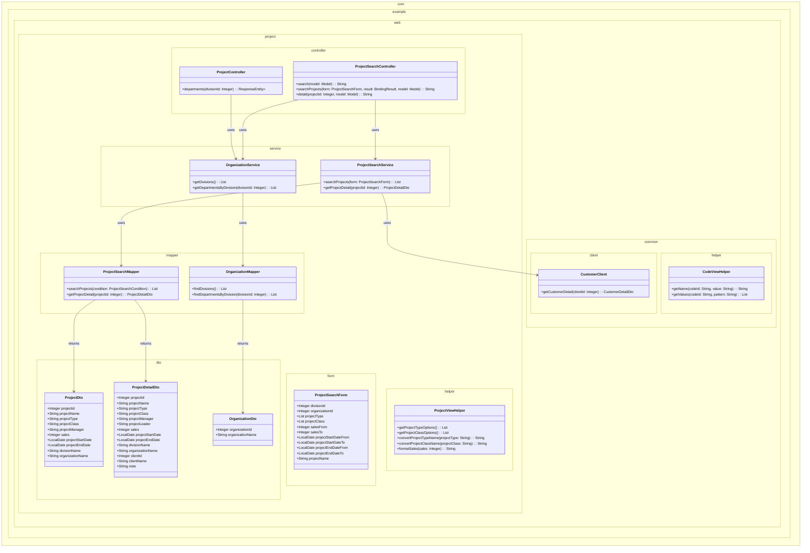
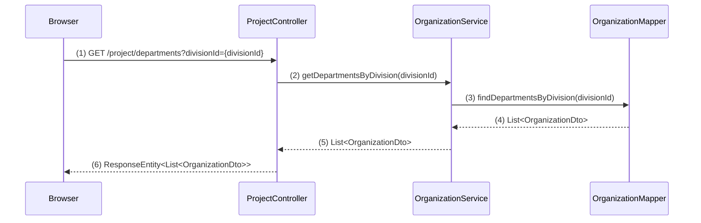
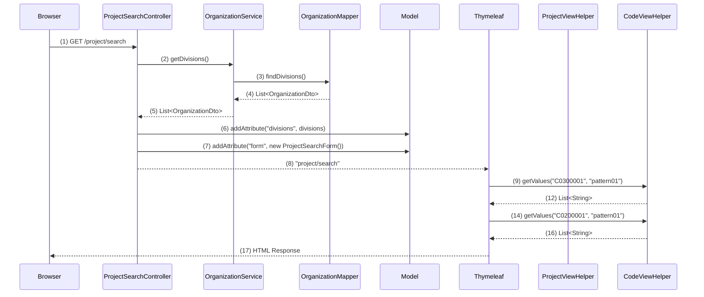
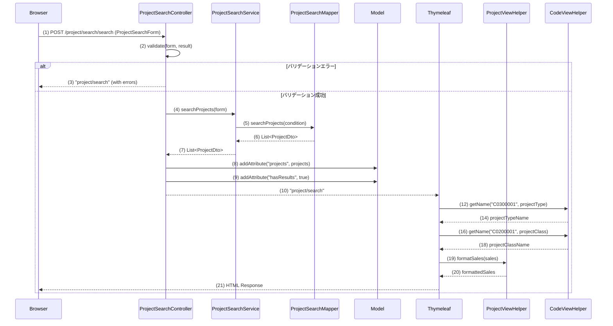
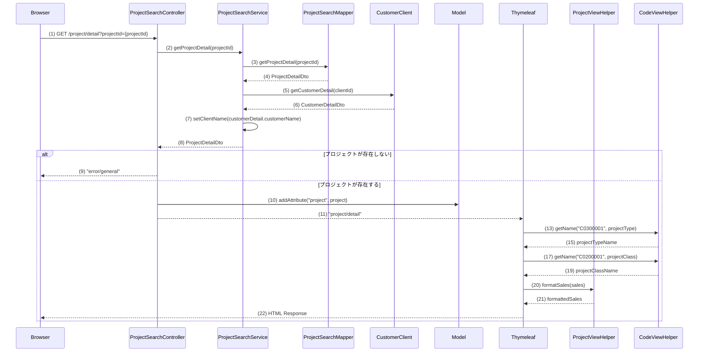

## 1. 概要

WA10202は、プロジェクトの検索と詳細表示を行う機能です。
- **WA1020201（プロジェクト検索画面）**: 検索条件を入力してプロジェクトを一覧表示
- **WA1020202（プロジェクト詳細画面）**: 選択されたプロジェクトの詳細情報を表示

主な機能：
- 事業部・部門の階層選択
- プロジェクト種別・分類での絞り込み
- 売上高・日付範囲での検索
- ページング機能
- プロジェクト詳細表示

## 2. クラス図

## 3. シーケンス図

### 部門リスト取得イベント (ProjectController)

### 初期表示イベント (ProjectSearchController)

### 一覧検索イベント (ProjectSearchController)

### プロジェクト詳細表示イベント (ProjectSearchController)

## ゴール

### GOAL1: プロジェクト検索画面の基本レイアウトとルーティング設定
- **完了条件**: 
  - `/project/search` にアクセスして検索条件入力フォームが表示される
  - 事業部・部門のプルダウン、各種入力項目、検索ボタンが配置されている
  - 検索結果一覧領域（空のテーブル）が表示される

### ステップ 1: ProjectSearchControllerクラスの作成

- **編集対象ファイル:** `web/src/main/java/com/example/web/project/controller/ProjectSearchController.java`（新規作成）
- **目的:** プロジェクト検索画面の初期表示を担当するコントローラーを作成する
- **内容:** 
  - `@Controller`アノテーションを付与したクラスを作成
  - `@RequestMapping("/project/search")`でベースパスを設定
  - 初期表示メソッド`index()`を作成し、`@GetMapping`で`/project/search`にマッピング
  - メソッドでは新しい`ProjectSearchForm`のインスタンスをModelに設定
  - 戻り値として`"project/search/index"`を返す
- **ポイント:** 
  - 現在`ProjectController`は登録機能用なので、検索機能は別コントローラーで実装
  - フォームオブジェクトの初期化を忘れずに行う

### ステップ 2: ProjectSearchFormクラスの作成

- **編集対象ファイル:** `web/src/main/java/com/example/web/project/form/ProjectSearchForm.java`（新規作成）
- **目的:** 検索条件の入力値を保持するフォームクラスを作成する
- **内容:**
  - JavaBeansパターンに従ったクラスを作成
  - プロパティ：`Integer divisionId`、`Integer organizationId`、`List<String> projectType`、`List<String> projectClass`、`Integer salesFrom`、`Integer salesTo`、`LocalDate projectStartDateFrom`、`LocalDate projectStartDateTo`、`LocalDate projectEndDateFrom`、`LocalDate projectEndDateTo`、`String projectName`
  - 各プロパティに適切なgetter/setterメソッドを実装
  - 現時点ではバリデーションアノテーションは不要（GOAL5で実装予定）
- **ポイント:** 
  - 複数選択項目（PJ種別、PJ分類）は`List<String>`型で定義
  - 日付項目は`LocalDate`型を使用
  - `DomainBean.java`を参考にプロパティ名を決定

### ステップ 3: プロジェクト検索画面HTMLテンプレートの修正

- **編集対象ファイル:** index.html
- **目的:** 既存の静的HTMLテンプレートをThymeleafテンプレートに変換する
- **内容:**
  - `<form>`タグに`th:object="${projectSearchForm}"`を追加
  - 事業部プルダウンの選択肢を現時点では空のオプションのみ表示（GOAL3で実装予定）
  - 部門プルダウンも同様に空のオプションのみ表示
  - PJ種別・PJ分類のチェックボックスは現時点では固定値で表示（GOAL2で実装予定）
  - 検索結果一覧テーブルは空の状態で表示（GOAL7で実装予定）
- **ポイント:** 
  - `html.instructions.md`に従ってエラー表示領域を準備
  - 必須項目には`*`を追加
  - 検索結果一覧領域は`th:block`で囲んで後で条件分岐可能にする

### ステップ 4: メニューからの遷移設定確認

- **編集対象ファイル:** menu.html
- **目的:** 既存のメニューからプロジェクト検索画面へのリンクが正しく設定されているか確認する
- **内容:**
  - 「プロジェクト検索」リンクが`th:href="@{/project/search}"`に設定されているか確認
  - リンク先が正しくProjectSearchControllerのindexメソッドに対応しているか確認
- **ポイント:** 
  - 既に`menu.html`で設定済みのため、確認のみ実施

### GOAL2: コード値マスタ連携（PJ種別・PJ分類のチェックボックス表示）
- **完了条件**:
  - PJ種別チェックボックスにC0300001のコード値が表示される
  - PJ分類チェックボックスにC0200001のコード値が表示される
  - 各コード値の名称が正しく表示される

### GOAL3: 事業部プルダウンの初期表示とデータ取得
- **完了条件**:
  - 画面表示時に事業部プルダウンに上位組織IDがNULLの組織データが表示される
  - 組織テーブルからのデータ取得がログで確認できる
  - プルダウンの先頭にブランクオプションが表示される
  - 部門プルダウンは初期状態で非活性または空の状態になっている

### GOAL4: 事業部選択時の部門リスト動的更新機能
- **完了条件**:
  - 事業部を選択すると非同期で `/project/departments` にリクエストが送信される
  - 選択された事業部配下の部門がプルダウンに表示される
  - 部門プルダウンの先頭にブランクオプションが表示される

### GOAL5: 検索条件の単項目バリデーション機能
- **完了条件**:
  - 各項目のドメインバリデーションが動作する（日付形式、金額形式など）
  - バリデーションエラー時に適切なエラーメッセージが表示される
  - エラー発生時に後続処理が停止することが確認できる

### GOAL6: 検索条件の相関バリデーション機能
- **完了条件**:
  - 売上高FROM-TO、開始日FROM-TO、終了日FROM-TOの大小関係チェックが動作する
  - 相関バリデーションエラー時に適切なエラーメッセージが表示される
  - エラー発生時に検索処理が実行されないことが確認できる

### GOAL7: プロジェクト検索処理とデータ表示
- **完了条件**:
  - 検索ボタン押下時にプロジェクトテーブルから条件に応じたデータが取得される
  - 検索結果が一覧テーブルに表示される（事業部・部門・PJ種別・PJ分類・PM・売上高・開始日・終了日）
  - 検索結果なしの場合は適切なメッセージが表示される
  - 検索処理の実行とデータ取得がログで確認できる

### GOAL8: 検索結果の表示形式とソート機能
- **完了条件**:
  - 売上高が3桁区切りのカンマ形式で表示される
  - 日付がyyyy/MM/dd形式で表示される
  - プロジェクトID昇順でソートされて表示される
  - PJ種別・PJ分類がコード値名称で表示される

### GOAL9: ページング機能
- **完了条件**:
  - 検索結果が複数ページに分割表示される
  - ページネーションリンク（<<、<、ページ番号、>、>>）が動作する
  - ページ遷移時に適切なデータが表示される

### GOAL10: プロジェクト詳細画面の基本表示
- **完了条件**:
  - PJ名リンクをクリックすると `/project/detail` に遷移する
  - プロジェクトIDがパラメータとして渡される
  - 詳細画面で事業部・部門・PJ名・PJ種別・PJ分類・売上高・顧客・PM・PL・開始日・終了日・備考が表示される
  - 前画面から引き継いだプロジェクトIDがログで確認できる

### GOAL11: プロジェクト詳細画面のデータ取得と表示
- **完了条件**:
  - プロジェクトIDに基づいてプロジェクト情報が取得される
  - 組織テーブルとの結合で事業部・部門名が表示される
  - 存在しないプロジェクトIDの場合は汎用エラー画面が表示される

### GOAL12: 顧客管理システムAPI連携
- **完了条件**:
  - 顧客IDをパラメータとして顧客詳細取得APIが実行される
  - 取得した顧客名が詳細画面に表示される
  - API連携エラー時の適切なエラーハンドリングが動作する

### GOAL13: 詳細画面からの画面遷移機能
- **完了条件**:
  - 「戻る」ボタンで検索画面に戻り、検索条件と検索結果が保持される
  - 「更新」ボタンでプロジェクト更新画面に遷移する
  - 各画面遷移時にパラメータが適切に渡される
