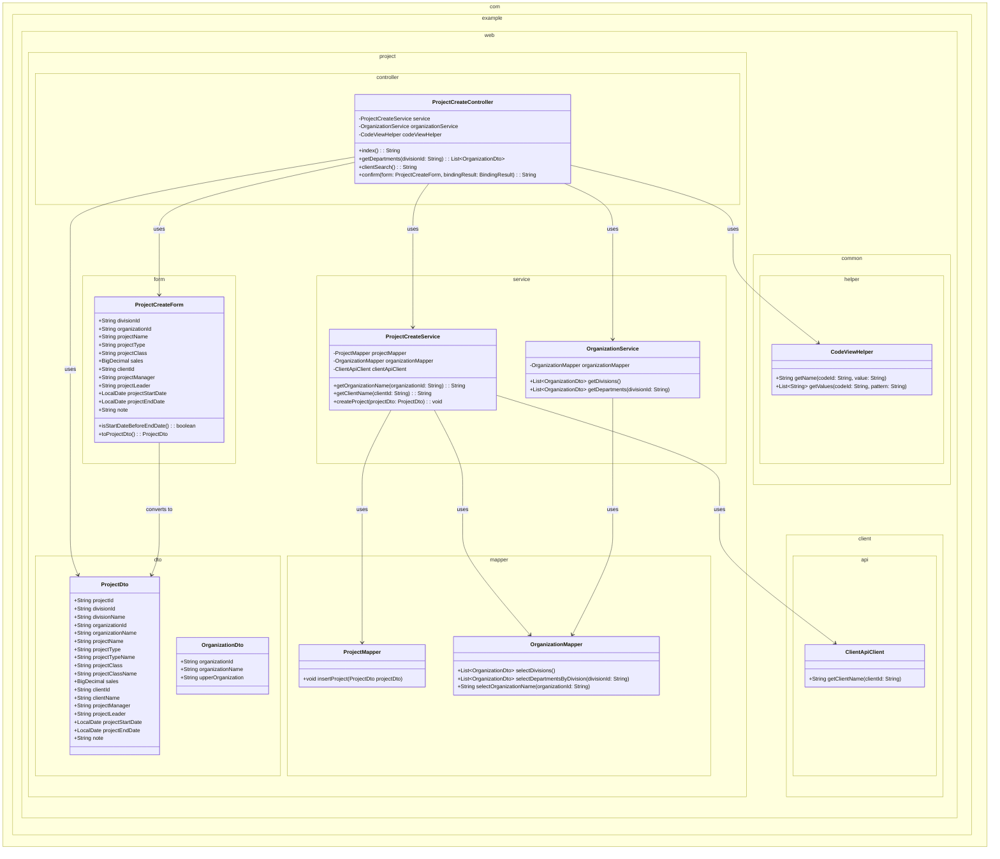
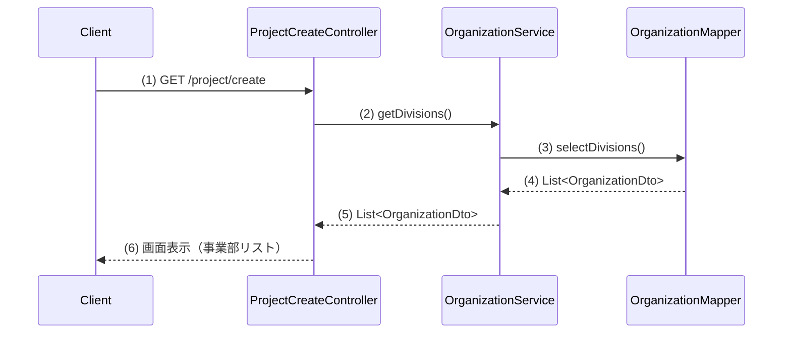
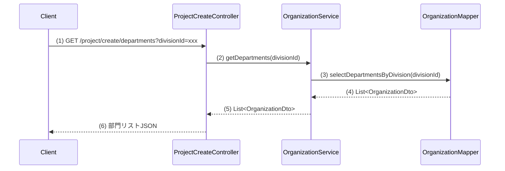
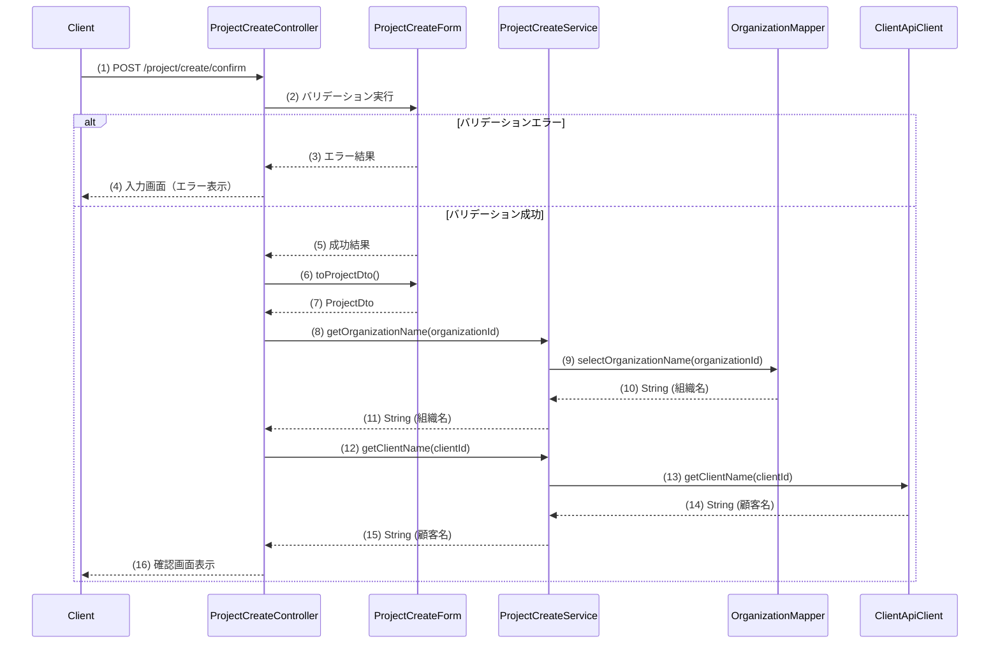

# プロジェクト登録画面の実装計画

## 1. 概要

プロジェクト登録画面(WA1020101)は、新規プロジェクトの情報を入力し登録する機能を提供します。事業部の選択に応じた部門リストの動的取得、顧客検索画面の連携、入力内容のバリデーションと確認画面への遷移などの機能を含みます。

## 2. クラス図

## 3. シーケンス図

### 初期表示イベント

### 部門リスト取得イベント

### 確認イベント

## 4. 実装計画

### 初期表示イベント

#### ステップ 1: Form クラスの作成
- **編集対象ファイル:** `src/main/java/com/example/web/project/form/ProjectCreateForm.java`（新規作成）
- **目的:** 画面の入力項目を受け取るFormクラスを作成する
- **内容:**
  - 仕様書の「2.3. 画面項目定義」に基づき、全ての入力フィールドに対応するプロパティを定義
  - 各項目に適切なバリデーションアノテーションを設定（@Required、@Domain等）
  - 日付大小関係チェックのためのisStartDateBeforeEndDate()メソッドを実装
  - ProjectDtoへの変換メソッド(toProjectDto())を実装
- **活用するクラス・メソッド:**
  - `org.springframework.util.BeanUtils#copyProperties`
- **ポイント:**
  - 日付フィールドには`@DateTimeFormat(pattern = "uuuu/MM/dd")`を設定
  - 相関チェックには`@AssertTrue`を使用

#### ステップ 2: DTO クラスの作成
- **編集対象ファイル:** `src/main/java/com/example/web/project/dto/ProjectDto.java`（新規作成）
- **目的:** サービス層との連携に使用するDTOを作成する
- **内容:**
  - Formに対応するすべてのフィールドを定義
  - 表示用に追加で必要になる名称フィールド（divisionName, organizationName, projectTypeName, projectClassName, clientName）を追加
- **ポイント:**
  - DTO内のフィールド命名は英日対応表に沿って作成

#### ステップ 3: OrganizationService の実装
- **編集対象ファイル:** `src/main/java/com/example/web/project/service/OrganizationService.java`（新規作成）
- **目的:** 組織関連のデータ取得を行うサービスクラスを作成
- **内容:**
  - 事業部一覧を取得するgetDivisions()メソッドを実装
  - 部門一覧を取得するgetDepartments(divisionId)メソッドを実装
- **活用するクラス・メソッド:**
  - OrganizationMapperのselectDivisions()メソッド
  - OrganizationMapperのselectDepartmentsByDivision(divisionId)メソッド
- **ポイント:**
  - @Serviceアノテーションを付与する

#### ステップ 4: OrganizationMapper の実装
- **編集対象ファイル:** `src/main/java/com/example/web/project/mapper/OrganizationMapper.java`（新規作成）
- **編集対象ファイル:** `src/main/resources/com/example/web/project/mapper/OrganizationMapper.xml`（新規作成）
- **目的:** 組織テーブルからのデータ取得を行うMapperを作成
- **内容:**
  - @Mapperアノテーションを付与したインターフェースを作成
  - 事業部一覧を取得するselectDivisions()メソッドを定義
  - 部門一覧を取得するselectDepartmentsByDivision(divisionId)メソッドを定義
  - 組織名を取得するselectOrganizationName(organizationId)メソッドを定義
  - XMLに各SQLを実装
- **ポイント:**
  - 事業部取得では「上位組織ID = NULL」の条件を指定
  - 部門取得では「上位組織ID = 指定された事業部ID」の条件を指定

#### ステップ 5: ProjectCreateService の実装
- **編集対象ファイル:** `src/main/java/com/example/web/project/service/ProjectCreateService.java`（新規作成）
- **目的:** プロジェクト登録に関するビジネスロジックを実装
- **内容:**
  - 組織名を取得するgetOrganizationName(organizationId)メソッドを実装
  - 顧客名を取得するgetClientName(clientId)メソッドを実装
  - プロジェクト登録処理を行うcreateProject(projectDto)メソッドを実装（確認画面からの登録処理で使用）
- **活用するクラス・メソッド:**
  - OrganizationMapperのselectOrganizationName(organizationId)メソッド
  - ClientApiClientのgetClientName(clientId)メソッド
  - ProjectMapperのinsertProject(projectDto)メソッド
- **ポイント:**
  - @Serviceアノテーションと@Transactionalアノテーションを付与する

#### ステップ 6: ClientApiClient の実装
- **編集対象ファイル:** `src/main/java/com/example/web/client/api/ClientApiClient.java`（新規作成）
- **目的:** 顧客管理システムAPIとの連携を行うクライアントを作成
- **内容:**
  - 顧客名を取得するgetClientName(clientId)メソッドを実装
- **活用するクラス・メソッド:**
  - `org.springframework.web.client.RestTemplate`
- **ポイント:**
  - @Componentアノテーションを付与する
  - APIエラーを適切に処理する例外ハンドリングを実装

### 部門リスト取得イベント

#### ステップ 7: コントローラの実装（部門リスト取得メソッド）
- **編集対象ファイル:** `src/main/java/com/example/web/project/controller/ProjectCreateController.java`（新規作成）
- **編集対象のメソッド:** `getDepartments(divisionId)`
- **目的:** 事業部選択時に部門リストを非同期で取得する
- **内容:**
  - @GetMappingアノテーションと@ResponseBodyアノテーションを使用して、JSONを返すメソッドを実装
  - OrganizationServiceのgetDepartments(divisionId)を呼び出して部門リストを取得し、JSON形式で返却
- **活用するクラス・メソッド:**
  - OrganizationServiceのgetDepartments(divisionId)メソッド
- **ポイント:**
  - @RequestParamアノテーションでdivisionIdを受け取る
  - 例外発生時の適切なエラーハンドリングを実装

### 初期表示・確認イベント

#### ステップ 8: コントローラの実装（初期表示・確認処理）
- **編集対象ファイル:** `src/main/java/com/example/web/project/controller/ProjectCreateController.java`（ステップ7で作成したファイルを編集）
- **編集対象のメソッド:** `index()`, `confirm(form, bindingResult)`
- **目的:** 初期表示と確認処理のコントローラメソッドを実装
- **内容:**
  - @Controllerアノテーションと@RequestMappingアノテーションを付与
  - 初期表示メソッド(index)を実装し、事業部リストをモデルに設定
  - 確認処理メソッド(confirm)を実装し、バリデーション、DTOへの変換、組織名・顧客名の設定を行う
- **活用するクラス・メソッド:**
  - OrganizationServiceのgetDivisions()メソッド
  - ProjectCreateServiceのgetOrganizationName(organizationId)メソッド
  - ProjectCreateServiceのgetClientName(clientId)メソッド
  - ProjectCreateFormのtoProjectDto()メソッド
  - CodeViewHelperのgetName(codeId, value)メソッド
- **ポイント:**
  - 二重送信防止のため@TransactionTokenCheckを使用
  - バリデーションエラー時は入力画面に戻るよう@OnRejectErrorを使用
  - バリデーション成功時は確認画面へ遷移
  - コード値の名称表示にはCodeViewHelperを使用

#### ステップ 9: Thymeleafテンプレートの作成（入力画面）
- **編集対象ファイル:** `src/main/resources/templates/project/create/index.html`（新規作成）
- **目的:** プロジェクト登録画面のHTMLテンプレートを作成
- **内容:**
  - 仕様書の画面項目定義に基づいて入力フォームを作成
  - 事業部プルダウン、部門プルダウン、プロジェクト種別プルダウン、プロジェクト分類ラジオボタンを実装
  - 顧客検索ボタン、確認ボタンを実装
  - 非同期部門リスト取得のためのJavaScript実装
- **活用するクラス・メソッド:**
  - CodeViewHelperのgetValues(codeId, pattern)メソッド
  - CodeViewHelperのgetName(codeId, value)メソッド
- **ポイント:**
  - th:field属性を使用してFormとフィールドをバインド
  - エラーメッセージ表示のためのth:errors属性を使用
  - th:with属性を使用して変数を定義
  - クライアントサイド検証も実装

#### ステップ 10: Thymeleafテンプレートの作成（確認画面）
- **編集対象ファイル:** `src/main/resources/templates/project/create/confirm.html`（新規作成）
- **目的:** プロジェクト登録確認画面のHTMLテンプレートを作成
- **内容:**
  - 入力された内容を表示するためのHTMLテンプレートを作成
  - 戻るボタン、登録ボタンを実装
- **ポイント:**
  - 入力フォームの値をhiddenフィールドとして保持
  - トランザクショントークンの設定
  - 日付のフォーマット表示

### 顧客検索イベント

#### ステップ 11: コントローラの実装（顧客検索連携）
- **編集対象ファイル:** `src/main/java/com/example/web/project/controller/ProjectCreateController.java`（ステップ8で編集したファイルを編集）
- **編集対象のメソッド:** `clientSearch()`
- **目的:** 顧客検索画面連携のコントローラメソッドを実装
- **内容:**
  - 顧客検索画面を表示するためのメソッドを実装
- **ポイント:**
  - ポップアップ表示用のレイアウトを指定
  - 選択された顧客情報を親画面に反映するJavaScriptを実装

## ポイント

1. 実装時の全体的な注意点：
   - アーキテクチャガイドに従い、各レイヤーの役割と責務を明確に分ける
   - バリデーションは単項目チェックと相関チェックの両方を実装
   - コード値の表示にはCodeViewHelperを活用
   - 非同期通信でのエラーハンドリングを適切に実装

2. 技術的な詳細：
   - Spring MVCのフォームバインディングとバリデーション機能を活用
   - Thymeleafのフォーム連携機能を使用して入力値の保持と検証エラー表示を実装
   - 二重送信防止には@TransactionTokenCheckを使用
   - クライアントサイドとサーバーサイドの両方でバリデーションを実装

3. セキュリティ対策：
   - CSRFトークン対策を実装
   - 入力値の適切なサニタイズ処理を行う
   - セッションタイムアウト時の適切なハンドリングを実装

この実装計画に従って段階的に開発を進めることで、効率的かつ安全なプロジェクト登録機能を実現できます。