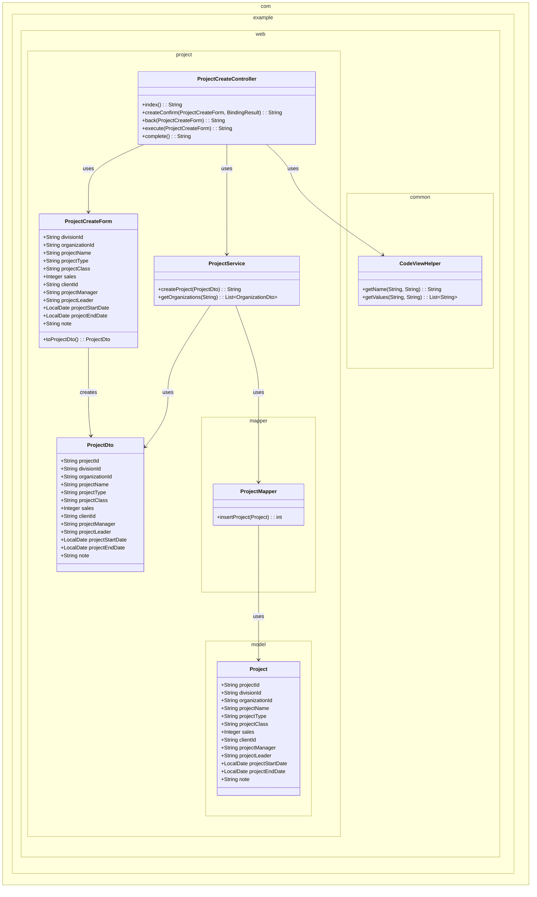
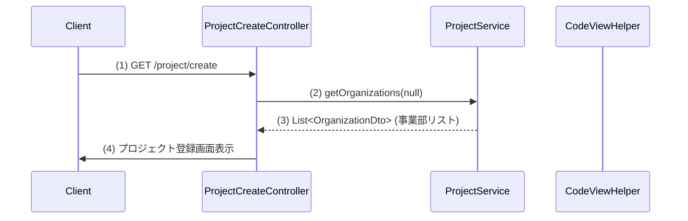
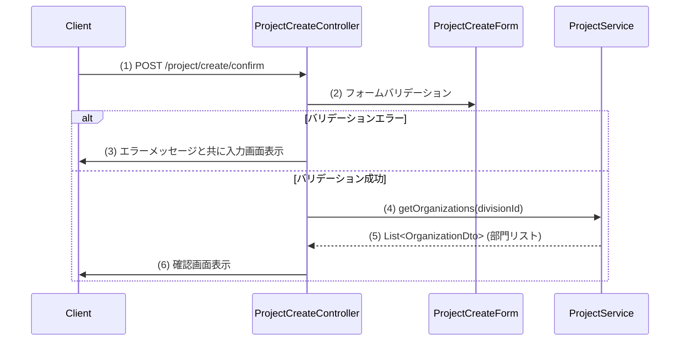
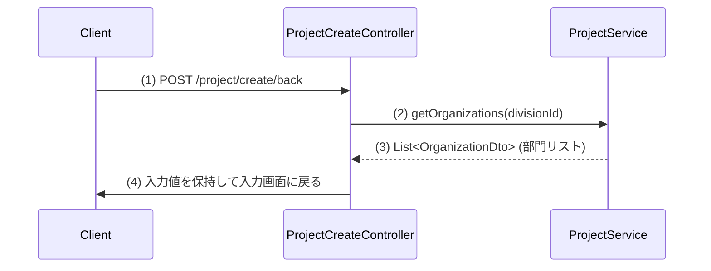
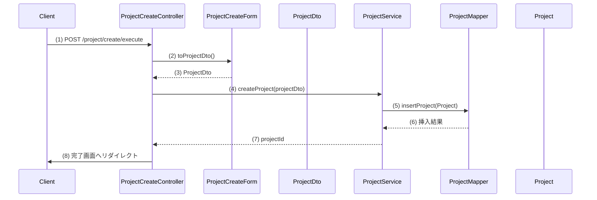
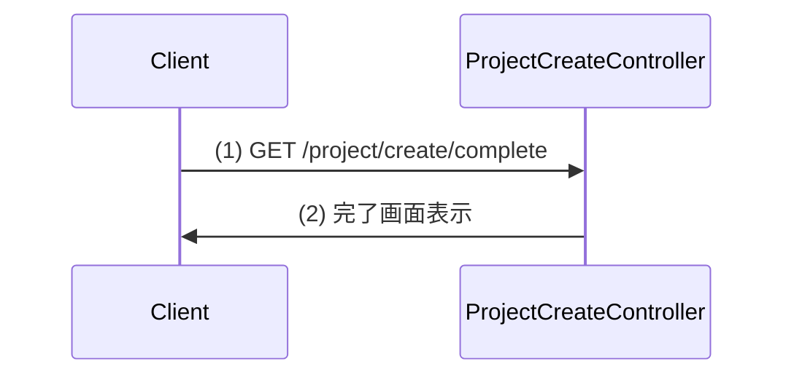

# プロジェクト登録画面の実装計画

## 1. 概要
このシステムは、プロジェクト管理のためのプロジェクト登録機能を提供します。ユーザーはプロジェクト情報（事業部、部門、プロジェクト名、種別、分類など）を入力し、新しいプロジェクトを登録することができます。

## 2. クラス図

## 3. シーケンス図

### プロジェクト登録初期表示イベント

### プロジェクト登録確認イベント

### プロジェクト登録戻るイベント

### プロジェクト登録実行イベント

### プロジェクト登録完了イベント

## 4. 実装計画

### プロジェクト登録初期表示イベント:

#### ステップ 1: プロジェクト登録用のFormクラスの作成
- **編集対象ファイル:** `src/main/java/com/example/web/project/form/ProjectCreateForm.java` (新規作成)
- **目的:** シーケンス図の入力フォームを実装。画面の入力項目のバリデーションと値の保持を行う
- **内容:**
  - `ProjectCreateForm`クラスを作成し、画面項目定義に従った各プロパティを宣言する
  - 各プロパティにバリデーションアノテーションを設定（@Required、@Domainなど）
  - `toProjectDto()`メソッドを実装してDTOへの変換を行う
  - 開始日と終了日の相関チェックメソッドを実装する
- **ポイント:**
  - 日付項目には`@DateTimeFormat(pattern = "yyyy/MM/dd")`を設定する
  - 各項目のバリデーションは設計書の必須項目に従って設定する
  - アーキテクチャガイドに従いJavaBeans規約に準拠した実装を行う
- **関連ファイル:** `src/main/java/com/example/web/project/dto/ProjectDto.java`

#### ステップ 2: プロジェクト登録用DTOクラスの作成
- **編集対象ファイル:** `src/main/java/com/example/web/project/dto/ProjectDto.java` (新規作成)
- **目的:** 画面とサービス層の間のデータ転送に使用するDTOを実装
- **内容:**
  - `ProjectDto`クラスを作成し、`Project`モデルに対応するプロパティを定義する
  - 各プロパティのgetter/setterメソッドを実装する
- **ポイント:**
  - アーキテクチャガイドに従いDTOクラスとして実装する
  - 画面項目定義の全ての項目を含める

#### ステップ 3: プロジェクト登録サービスクラスの作成
- **編集対象ファイル:** `src/main/java/com/example/web/project/service/ProjectService.java` (新規作成)
- **目的:** プロジェクト登録に関するビジネスロジックを実装
- **内容:**
  - `ProjectService`クラスを作成し、`@Service`アノテーションを付与
  - `getOrganizations(String divisionId)`メソッドを実装し、事業部IDに基づく部門一覧を取得
  - `createProject(ProjectDto projectDto)`メソッドを実装し、プロジェクト登録処理を行う
- **活用するクラス・メソッド:**
  - `com.example.web.project.mapper.ProjectMapper`
  - `com.example.web.project.model.Project`
- **ポイント:**
  - トランザクション管理のため`@Transactional`アノテーションを使用する
  - 新規プロジェクトIDの生成ロジックを実装する

#### ステップ 4: プロジェクトMapperインターフェースの作成
- **編集対象ファイル:** `src/main/java/com/example/web/project/mapper/ProjectMapper.java` (新規作成)
- **目的:** MyBatisを利用したデータベースアクセスを実装
- **内容:**
  - `ProjectMapper`インターフェースを作成し、`@Mapper`アノテーションを付与
  - `insertProject(Project project)`メソッドを定義
- **ポイント:**
  - MyBatis XMLマッパーファイルも作成する必要がある

#### ステップ 5: MyBatis XMLマッパーファイルの作成
- **編集対象ファイル:** `src/main/resources/com/example/web/project/mapper/ProjectMapper.xml` (新規作成)
- **目的:** SQLマッピングの実装
- **内容:**
  - `insertProject`のSQLを定義する
  - 必要に応じて他のSQLも定義する（組織情報取得のためのSQLなど）
- **ポイント:**
  - アーキテクチャガイドに従い、適切なカラム名を使用する

#### ステップ 6: プロジェクト登録コントローラーの作成
- **編集対象ファイル:** `src/main/java/com/example/web/project/controller/ProjectCreateController.java` (新規作成)
- **目的:** シーケンス図の(1)～(4)の実装。初期表示のコントローラーメソッドを実装
- **内容:**
  - `ProjectCreateController`クラスを作成し、`@Controller`、`@RequestMapping("project/create")`アノテーションを付与
  - `index()`メソッドを実装し、GETリクエストでの初期表示を処理する
  - `ProjectService#getOrganizations(null)`を呼び出し、事業部リストを取得する
  - 取得した事業部リストをモデルに追加し、プロジェクト登録画面のテンプレートを返す
- **活用するクラス・メソッド:**
  - `com.example.web.project.service.ProjectService#getOrganizations(String divisionId)`
- **ポイント:**
  - 初期表示時にはdivisionIdをnullとして事業部一覧を取得する

#### ステップ 7: Thymeleafテンプレートの作成（入力画面）
- **編集対象ファイル:** `src/main/resources/templates/project/create/index.html` (新規作成)
- **目的:** プロジェクト登録の入力画面を実装
- **内容:**
  - 画面項目定義に従ったHTMLフォームを作成
  - 事業部と部門のドロップダウンリストを実装
  - PJ種別のドロップダウンリストとPJ分類のラジオボタンを実装
  - 必須項目にはマークを付ける
  - 確認ボタンによるフォーム送信を実装
- **活用するクラス・メソッド:**
  - `com.example.web.common.CodeViewHelper#getValues(String codeId, String pattern)`
  - `com.example.web.common.CodeViewHelper#getName(String codeId, String value)`
- **ポイント:**
  - Thymeleafの検証エラー表示を適切に実装する
  - 事業部選択時にAjaxで部門リストを更新する仕組みを実装する

### プロジェクト登録確認イベント:

#### ステップ 8: コントローラーに確認メソッドを追加
- **編集対象ファイル:** `src/main/java/com/example/web/project/controller/ProjectCreateController.java`
- **編集対象のメソッド:** `createConfirm()`（新規）
- **目的:** シーケンス図の(1)～(6)の実装。入力値の検証と確認画面表示を実装
- **内容:**
  - `createConfirm()`メソッドを追加し、`@PostMapping("confirm")`、`@TransactionTokenCheck(type = TransactionTokenType.BEGIN)`アノテーションを付与
  - フォームバリデーションを実行し、エラーがある場合は入力画面に戻る
  - エラーがない場合は、`ProjectService#getOrganizations(divisionId)`を呼び出し、選択された事業部に基づく部門リストを取得
  - モデルに必要な情報を追加し、確認画面のテンプレートを返す
- **活用するクラス・メソッド:**
  - `com.example.web.project.service.ProjectService#getOrganizations(String divisionId)`
- **ポイント:**
  - `@OnRejectError(path = "project/create/index")`を使用してバリデーションエラー時の遷移先を指定

#### ステップ 9: Thymeleafテンプレートの作成（確認画面）
- **編集対象ファイル:** `src/main/resources/templates/project/create/confirm.html` (新規作成)
- **目的:** 入力内容の確認画面を実装
- **内容:**
  - 入力された全項目の確認表示を実装
  - 戻るボタンと登録実行ボタンを実装
- **活用するクラス・メソッド:**
  - `com.example.web.common.CodeViewHelper#getName(String codeId, String value)`
- **ポイント:**
  - 値をテキストとして表示するが、フォーム送信時には隠しフィールドとして値を保持する

### プロジェクト登録戻るイベント:

#### ステップ 10: コントローラーに戻るメソッドを追加
- **編集対象ファイル:** `src/main/java/com/example/web/project/controller/ProjectCreateController.java`
- **編集対象のメソッド:** `back()`（新規）
- **目的:** シーケンス図の(1)～(4)の実装。確認画面から入力画面への戻り処理を実装
- **内容:**
  - `back()`メソッドを追加し、`@PostMapping("back")`アノテーションを付与
  - `ProjectService#getOrganizations(divisionId)`を呼び出し、選択された事業部に基づく部門リストを取得
  - モデルに必要な情報を追加し、入力画面のテンプレートを返す
- **活用するクラス・メソッド:**
  - `com.example.web.project.service.ProjectService#getOrganizations(String divisionId)`
- **ポイント:**
  - フォームの入力値を保持したまま戻る処理を実装する

### プロジェクト登録実行イベント:

#### ステップ 11: コントローラーに実行メソッドを追加
- **編集対象ファイル:** `src/main/java/com/example/web/project/controller/ProjectCreateController.java`
- **編集対象のメソッド:** `execute()`（新規）
- **目的:** シーケンス図の(1)～(8)の実装。プロジェクト登録処理の実行と完了画面へのリダイレクトを実装
- **内容:**
  - `execute()`メソッドを追加し、`@PostMapping("execute")`、`@TransactionTokenCheck`アノテーションを付与
  - フォームから`toProjectDto()`を呼び出してDTOを生成
  - `ProjectService#createProject(projectDto)`を呼び出して登録処理を実行
  - 完了画面へリダイレクト
- **活用するクラス・メソッド:**
  - `com.example.web.project.form.ProjectCreateForm#toProjectDto()`
  - `com.example.web.project.service.ProjectService#createProject(ProjectDto projectDto)`
- **ポイント:**
  - PRGパターンに従い、登録処理後にリダイレクトで完了画面に遷移する

### プロジェクト登録完了イベント:

#### ステップ 12: コントローラーに完了メソッドを追加
- **編集対象ファイル:** `src/main/java/com/example/web/project/controller/ProjectCreateController.java`
- **編集対象のメソッド:** `complete()`（新規）
- **目的:** シーケンス図の(1)～(2)の実装。完了画面表示を実装
- **内容:**
  - `complete()`メソッドを追加し、`@GetMapping("complete")`アノテーションを付与
  - 完了画面のテンプレートを返す
- **ポイント:**
  - 新規登録の完了メッセージを表示する

#### ステップ 13: Thymeleafテンプレートの作成（完了画面）
- **編集対象ファイル:** `src/main/resources/templates/project/create/complete.html` (新規作成)
- **目的:** 登録完了画面を実装
- **内容:**
  - 完了メッセージの表示を実装
  - トップページに戻るリンクを実装
- **ポイント:**
  - 単純な完了メッセージと、次の操作へのナビゲーションを提供する