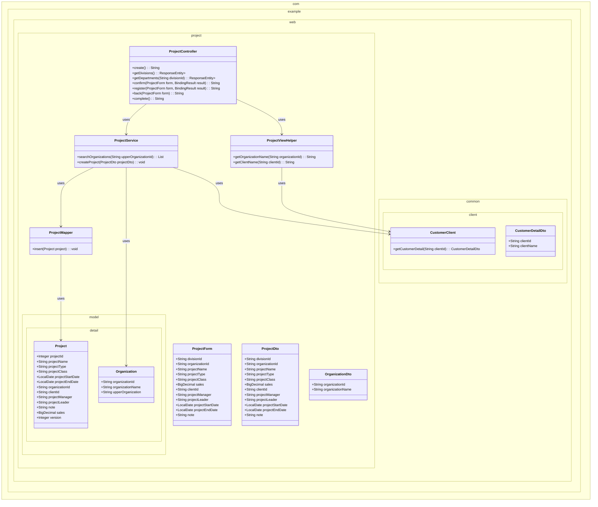
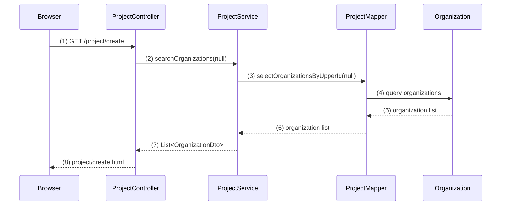
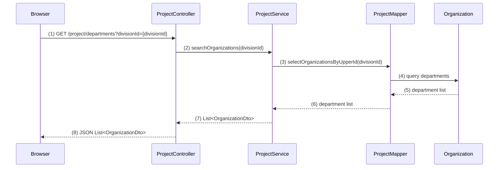
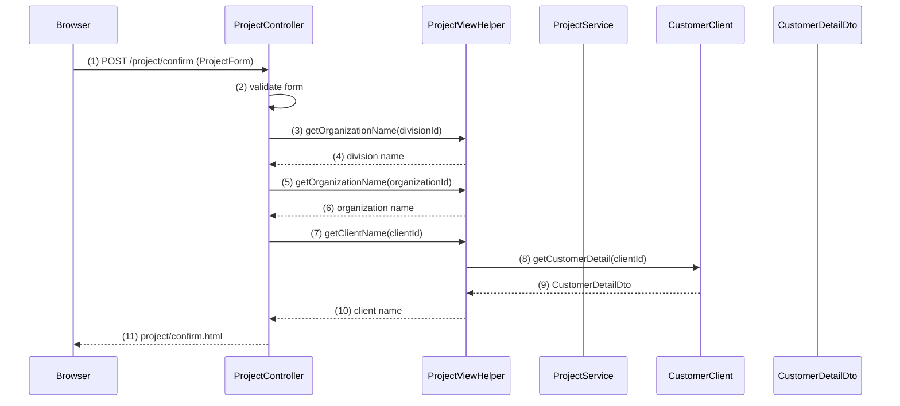
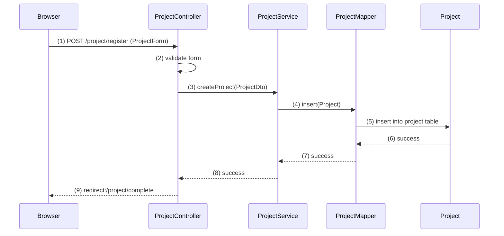
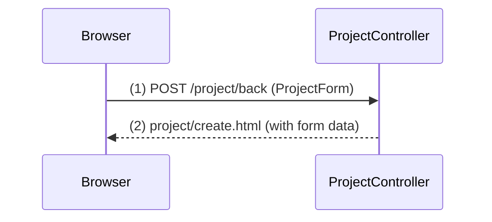
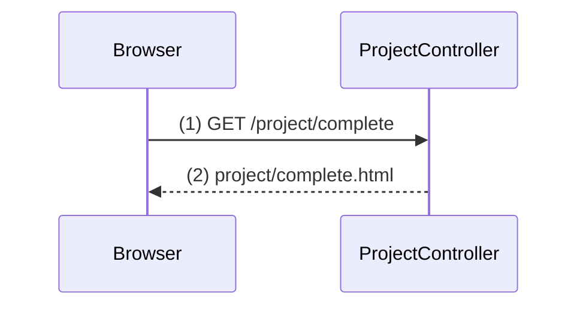

# プロジェクト登録機能実装計画

## 1. 概要

プロジェクト登録機能は、ユーザーがプロジェクト情報を入力・確認・登録する3画面構成のWebアプリケーションです。Spring Boot + Spring MVCを使用し、レイヤードアーキテクチャに従って実装します。

## 2. クラス図

## 3. シーケンス図

### 初期表示イベント

### 部門リスト取得イベント

### 確認イベント

### 登録イベント

### 戻るイベント

### 完了表示イベント

## WA10201 プロジェクト登録機能 Phase分割タスクリスト

## Phase 1: 基本画面表示とルーティング設定 - 詳細実装計画

- **完了条件**: 
  - プロジェクト登録画面（WA1020101）が正常に表示される
  - 確認画面（WA1020102）、完了画面（WA1020103）の画面遷移が動作する
  - 各画面の基本レイアウトとフォーム項目が表示される
  - 戻るボタン、確認ボタン、登録ボタンが配置され、画面遷移のみ実行される

### ステップ 1: フォームクラスの作成
- **編集対象ファイル:** `src/main/java/com/example/web/project/form/ProjectCreateForm.java` (新規作成)
- **目的:** 画面入力値を保持するフォームクラスを作成し、バインディングの基盤を整える
- **内容:** 
  - プロジェクト登録に必要なフィールドを定義
  - 各フィールドにgetterとsetterを実装
  - フィールド：divisionId, organizationId, projectName, projectType, projectClass, sales, clientId, projectManager, projectLeader, projectStartDate, projectEndDate, note
- **活用するクラス・メソッド:** 
  - `java.time.LocalDate` で日付項目を定義
  - `java.math.BigDecimal` で金額項目を定義
- **ポイント:** バリデーションアノテーションは後のPhaseで追加するため、まずは素のフィールド定義のみ

### ステップ 2: コントローラーの基本メソッド実装
- **編集対象ファイル:** `src/main/java/com/example/web/project/controller/ProjectController.java` (新規作成)
- **目的:** シーケンス図の初期表示、確認、登録、戻る、完了の各エンドポイントを実装
- **内容:** 
  - `@Controller`と`@RequestMapping("/project")`アノテーションを付与
  - `create()`メソッド：GET `/project/create` で登録画面表示
  - `confirm()`メソッド：POST `/project/create/confirm` で確認画面へ遷移
  - `register()`メソッド：POST `/project/create/register` で登録処理後完了画面へリダイレクト
  - `back()`メソッド：POST `/project/create/back` で登録画面へ戻る
  - `complete()`メソッド：GET `/project/create/complete` で完了画面表示
- **活用するクラス・メソッド:** 
  - `org.springframework.stereotype.Controller`
  - `org.springframework.web.bind.annotation.RequestMapping`
  - `org.springframework.web.bind.annotation.GetMapping`
  - `org.springframework.web.bind.annotation.PostMapping`
  - `org.springframework.ui.Model`
- **ポイント:** この段階では画面遷移のみで、実際の処理は空実装

### ステップ 3: HTMLファイルの修正
- **編集対象ファイル:** `src/main/resources/templates/project/create/index.html`
- **編集対象のメソッド:** 既存HTMLの修正
- **目的:** 遷移先を修正
- **内容:**
  - 確認ボタンを押したときの遷移先をproject/create/confirmに修正

### ステップ 4: 確認画面HTMLの修正
- **編集対象ファイル:** `src/main/resources/templates/project/create/confirm.html`
- **編集対象のメソッド:** 既存HTMLの修正  
- **目的:** 遷移先を修正
- **内容:**
  - 戻るボタンを押したときの遷移先をproject/create/backに修正
  - 登録ボタンを押したときの遷移先をproject/create/registerに修正

### ステップ 5: 完了画面HTMLの修正
- **編集対象ファイル:** `src/main/resources/templates/project/create/complete.html`
- **編集対象のメソッド:** 既存HTMLの修正
- **目的:** リンク先の修正
- **内容:**
  - 「次へ」ボタンのリンク先を/に修正

### Phase 2: 初期表示データ取得機能
- **完了条件**:
  - 事業部プルダウンに組織マスタから取得した事業部一覧が表示される
  - PJ種別プルダウンにコードマスタから取得した値が表示される
  - PJ分類ラジオボタンにコードマスタから取得した値が表示される
  - 日付項目にカレンダーウィジェットが正常に動作する

### Phase 3: 動的部門取得機能（Ajax）
- **完了条件**:
  - 事業部プルダウン選択時に、該当する部門一覧が非同期で取得される
  - 部門プルダウンが選択された事業部に応じて更新される
  - 事業部未選択時は部門プルダウンが空になる
  - ネットワークエラー時の適切なハンドリングが実装されている

### Phase 4: 顧客検索画面連携（モック）
- **完了条件**:
  - 顧客選択ボタン押下で顧客検索画面が別ウィンドウで開く
  - 顧客選択後に顧客名が登録画面に反映される（モックデータ使用）
  - 顧客選択せずに画面を閉じた場合の処理が適切に動作する
  - 顧客IDがhiddenフィールドに正しく設定される

### Phase 5: 単項目バリデーション機能
- **完了条件**:
  - 必須項目未入力時に適切なエラーメッセージが表示される
  - 各項目のドメイン制約（文字数、形式等）チェックが動作する
  - 日付形式の妥当性チェックが実装されている
  - 金額項目の数値チェックが実装されている
  - エラー時にフォーム値が保持される

### Phase 6: 相関バリデーション機能
- **完了条件**:
  - 開始日≦終了日の日付大小関係チェックが動作する
  - 複数項目にまたがるエラーが適切に表示される
  - バリデーションエラー時に確認画面への遷移が阻止される
  - エラーメッセージが項目に対応して表示される

### Phase 7: 確認画面データ表示機能
- **完了条件**:
  - 登録画面の入力値が確認画面に正しく表示される
  - 組織ID→組織名の変換表示が動作する
  - コード値→名称の変換表示が動作する
  - 金額の3桁カンマ区切り表示が実装されている
  - 日付のフォーマット変換（yyyy/MM/dd）が実装されている
  - 備考の改行表示が正しく動作する

### Phase 8: 確認画面からの戻り機能
- **完了条件**:
  - 確認画面の「戻る」ボタンで登録画面に戻れる
  - 戻り時に入力値が全て復元される
  - プルダウンの選択状態が正しく復元される
  - 顧客選択状態が正しく復元される

### Phase 9: 顧客管理システム連携（実装）
- **完了条件**:
  - 顧客管理システムAPIとの実際の連携が動作する
  - API通信エラー時の適切なハンドリングが実装されている
  - 顧客詳細取得APIから正しく顧客名が取得される
  - タイムアウト等の例外処理が適切に動作する

### Phase 10: データベース登録機能
- **完了条件**:
  - 確認画面からの登録処理でプロジェクトテーブルにデータが正常に保存される
  - プロジェクトIDの自動採番が動作する
  - バージョン番号が「1」で固定設定される
  - トランザクション制御が適切に動作する
  - 登録完了後に完了画面へ遷移する
