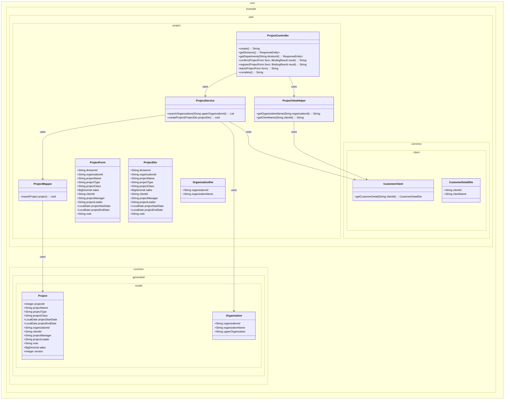

# プロジェクト登録機能実装計画

## 1. 概要

プロジェクト登録機能は、ユーザーがプロジェクト情報を入力・確認・登録する3画面構成のWebアプリケーションです。Spring Boot + Spring MVCを使用し、レイヤードアーキテクチャに従って実装します。

## 2. クラス図

## 3. シーケンス図

### 初期表示イベント

### 部門リスト取得イベント

### 確認イベント

### 登録イベント

### 戻るイベント

### 完了表示イベント

## WA10201 プロジェクト登録機能 Phase分割タスクリスト

## Phase 1: 基本画面表示とルーティング設定 - 詳細実装計画

- **完了条件**: 
  - プロジェクト登録画面（WA1020101）が正常に表示される
  - 確認画面（WA1020102）、完了画面（WA1020103）の画面遷移が動作する
  - 各画面の基本レイアウトとフォーム項目が表示される
  - 戻るボタン、確認ボタン、登録ボタンが配置され、画面遷移のみ実行される

### ステップ 1: フォームクラスの作成
- **編集対象ファイル:** `src/main/java/com/example/web/project/form/ProjectCreateForm.java` (新規作成)
- **目的:** 画面入力値を保持するフォームクラスを作成し、バインディングの基盤を整える
- **内容:** 
  - プロジェクト登録に必要なフィールドを定義
  - 各フィールドにgetterとsetterを実装
  - フィールド：divisionId, organizationId, projectName, projectType, projectClass, sales, clientId, projectManager, projectLeader, projectStartDate, projectEndDate, note
- **活用するクラス・メソッド:** 
  - `java.time.LocalDate` で日付項目を定義
  - `java.math.BigDecimal` で金額項目を定義
- **ポイント:** バリデーションアノテーションは後のPhaseで追加するため、まずは素のフィールド定義のみ

### ステップ 2: コントローラーの基本メソッド実装
- **編集対象ファイル:** `src/main/java/com/example/web/project/controller/ProjectController.java` (新規作成)
- **目的:** シーケンス図の初期表示、確認、登録、戻る、完了の各エンドポイントを実装
- **内容:** 
  - `@Controller`と`@RequestMapping("/project")`アノテーションを付与
  - `create()`メソッド：GET `/project/create` で登録画面表示
  - `confirm()`メソッド：POST `/project/create/confirm` で確認画面へ遷移
  - `register()`メソッド：POST `/project/create/register` で登録処理後完了画面へリダイレクト
  - `back()`メソッド：POST `/project/create/back` で登録画面へ戻る
  - `complete()`メソッド：GET `/project/create/complete` で完了画面表示
- **活用するクラス・メソッド:** 
  - `org.springframework.stereotype.Controller`
  - `org.springframework.web.bind.annotation.RequestMapping`
  - `org.springframework.web.bind.annotation.GetMapping`
  - `org.springframework.web.bind.annotation.PostMapping`
  - `org.springframework.ui.Model`
- **ポイント:** この段階では画面遷移のみで、実際の処理は空実装

### ステップ 3: HTMLファイルの修正
- **編集対象ファイル:** `src/main/resources/templates/project/create/index.html`
- **編集対象のメソッド:** 既存HTMLの修正
- **目的:** 遷移先を修正
- **内容:**
  - 確認ボタンを押したときの遷移先をproject/create/confirmに修正

### ステップ 4: 確認画面HTMLの修正
- **編集対象ファイル:** `src/main/resources/templates/project/create/confirm.html`
- **編集対象のメソッド:** 既存HTMLの修正  
- **目的:** 遷移先を修正
- **内容:**
  - 戻るボタンを押したときの遷移先をproject/create/backに修正
  - 登録ボタンを押したときの遷移先をproject/create/registerに修正

### ステップ 5: 完了画面HTMLの修正
- **編集対象ファイル:** `src/main/resources/templates/project/create/complete.html`
- **編集対象のメソッド:** 既存HTMLの修正
- **目的:** リンク先の修正
- **内容:**
  - 「次へ」ボタンのリンク先を/に修正

### Phase 2: 初期表示データ取得機能
- **完了条件**:
  - 事業部プルダウンに組織マスタから取得した事業部一覧が表示される
  - PJ種別プルダウンにコードマスタから取得した値が表示される
  - PJ分類ラジオボタンにコードマスタから取得した値が表示される
  - 日付項目にカレンダーウィジェットが正常に動作する

#### ステップ 1: 組織DTOクラスの作成
- **編集対象ファイル:** `src/main/java/com/example/web/project/dto/OrganizationDto.java` (新規作成)
- **目的:** 組織マスタのデータを画面表示用に受け渡すためのデータ転送オブジェクトを作成
- **内容:** 
  - 組織ID（organizationId）フィールドを定義
  - 組織名（organizationName）フィールドを定義
  - 各フィールドのgetterとsetterを実装
- **活用するクラス・メソッド:** 
  - 標準的なJavaクラス設計（POJO）
- **ポイント:** プルダウンのvalueとlabelに対応するフィールド構成

#### ステップ 2: 組織マッパーの作成
- **編集対象ファイル:** `src/main/java/com/example/web/project/mapper/OrganizationMapper.java` (新規作成)
- **目的:** 組織マスタテーブルからデータを取得するためのマッパーインターフェースを作成
- **内容:** 
  - `@Mapper`アノテーションを付与
  - `selectOrganizationsByUpperId(String upperOrganizationId)`メソッドを定義
  - 戻り値は`List<Organization>`型で設定
  - 引数のupperOrganizationIdがnullの場合は上位組織IDがNULLの組織（事業部）を取得
  - 引数が指定されている場合は該当する上位組織IDの組織（部門）を取得
- **活用するクラス・メソッド:** 
  - `org.apache.ibatis.annotations.Mapper`
  - `com.example.common.generated.model.Organization`
- **ポイント:** MyBatisのマッパーインターフェースとして実装

#### ステップ 3: 組織マッパーXMLの作成
- **編集対象ファイル:** `src/main/resources/com/example/web/project/mapper/OrganizationMapper.xml` (新規作成)
- **目的:** 組織マスタからデータを取得するSQLクエリを定義
- **内容:** 
  - 組織テーブルから組織IDと組織名を取得するクエリを記述
  - WHERE条件で上位組織IDによる絞り込みを実装
  - 動的SQLを使用してupperOrganizationIdがnullの場合は「IS NULL」、値がある場合は「= #{upperOrganizationId}」で条件分岐
  - ORDER BY句で組織名の昇順ソートを設定
- **活用するクラス・メソッド:** 
  - MyBatisの動的SQL（`<if test="...">`）
  - `com.example.common.generated.model.Organization`のカラムマッピング
- **ポイント:** 仕様書の「組織.上位組織ID = NULL」の条件を正確に実装

#### ステップ 4: プロジェクトサービスの作成
- **編集対象ファイル:** `src/main/java/com/example/web/project/service/ProjectService.java` (新規作成)
- **目的:** プロジェクト関連の業務ロジックを実装するサービスクラスを作成
- **内容:** 
  - `@Service`アノテーションを付与
  - `@Autowired`でOrganizationMapperを注入
  - `searchOrganizations(String upperOrganizationId)`メソッドを実装
  - メソッド内でOrganizationMapperの`selectOrganizationsByUpperId`を呼び出し
  - 取得したOrganizationのリストをOrganizationDtoのリストに変換して返却
- **活用するクラス・メソッド:** 
  - `org.springframework.stereotype.Service`
  - `org.springframework.beans.factory.annotation.Autowired`
  - `com.example.web.project.mapper.OrganizationMapper#selectOrganizationsByUpperId(String upperOrganizationId): List<Organization>`
  - `com.example.web.project.dto.OrganizationDto`
- **ポイント:** ModelからDTOへの変換処理を適切に実装

#### ステップ 5: プロジェクトコントローラーの初期表示メソッド強化
- **編集対象ファイル:** `src/main/java/com/example/web/project/controller/ProjectController.java`
- **編集対象のメソッド:** `ProjectController#create()`および新規メソッド追加
- **目的:** 初期表示時に事業部一覧を取得して`@ModelAttribute`で共通データとして提供する処理を実装
- **内容:** 
  - `@Autowired`でProjectServiceを注入
  - `@ModelAttribute("divisions")`アノテーションを付与した`getDivisions()`メソッドを新規作成
  - `getDivisions()`メソッド内でProjectServiceの`searchOrganizations(null)`を呼び出し
  - 取得した事業部一覧を戻り値として返却
  - `create()`メソッドは既存のまま変更せず、返却するテンプレートパスは`"project/create/index"`のまま
- **活用するクラス・メソッド:** 
  - `com.example.web.project.service.ProjectService#searchOrganizations(String upperOrganizationId): List<OrganizationDto>`
  - `org.springframework.web.bind.annotation.ModelAttribute`
- **ポイント:** `@ModelAttribute`により、このコントローラーの全てのリクエストハンドリングメソッドで事業部一覧が自動的にモデルに追加される。仕様書の「初期表示イベント」の組織検索処理を実装

#### ステップ 6: 登録画面HTMLの事業部プルダウン修正
- **編集対象ファイル:** `src/main/resources/templates/project/create/index.html`
- **編集対象のメソッド:** 事業部プルダウンのselect要素
- **目的:** 静的なoptionタグをThymeleafの動的な事業部一覧表示に変更
- **内容:** 
  - 事業部のselect要素にth:field="*{divisionId}"を追加
  - 静的なoptionタグを削除
  - `th:each="division : ${divisions}"`で事業部一覧をループ
  - 各optionのvalueには`th:value="${division.organizationId}"`を設定
  - 各optionのテキストには`th:text="${division.organizationName}"`を設定
  - 先頭に空白選択肢（ブランクオプション）を追加
- **活用するクラス・メソッド:** 
  - Thymeleafの`th:each`、`th:field`、`th:value`、`th:text`属性
- **ポイント:** 仕様書の「ブランクオプションを追加」の要件を実装

#### ステップ 7: 登録画面HTMLのPJ種別プルダウン修正
- **編集対象ファイル:** `src/main/resources/templates/project/create/index.html`
- **編集対象のメソッド:** PJ種別プルダウンのselect要素
- **目的:** 静的なoptionタグをCodeViewHelperを使用したコード値一覧表示に変更
- **内容:** 
  - PJ種別のselect要素にth:field="*{projectType}"を追加
  - 静的なoptionタグを削除
  - `th:each="codeValue : ${@codeViewHelper.getValues('C0200001','pattern1')}"`でコード値をループ
  - 各optionのvalueには`th:value="${codeValue}"`を設定
  - 各optionのテキストには`th:text="${@codeViewHelper.getName('C0200001',codeValue)}"`を設定
- **活用するクラス・メソッド:** 
  - `com.example.web.common.helper.CodeViewHelper#getValues(String codeId, String pattern): List<String>`
  - `com.example.web.common.helper.CodeViewHelper#getName(String codeId, String value): String`
- **ポイント:** 仕様書のコード値取得情報（コードID：C0200001、パターン：1）を正確に実装

#### ステップ 8: 登録画面HTMLのPJ分類ラジオボタン修正
- **編集対象ファイル:** `src/main/resources/templates/project/create/index.html`
- **編集対象のメソッド:** PJ分類ラジオボタンのinput要素群
- **目的:** 静的なラジオボタンをCodeViewHelperを使用したコード値一覧表示に変更
- **内容:** 
  - PJ分類のラジオボタン群を`th:each="codeValue : ${@codeViewHelper.getValues('C0300001','pattern1')}"`でループ化
  - 各input要素にth:field="*{projectClass}"を追加
  - 各input要素のvalueには`th:value="${codeValue}"`を設定
  - 各label要素のテキストには`th:text="${@codeViewHelper.getName('C0300001',codeValue)}"`を設定
  - `th:for="${#ids.prev('projectClass')}"`でlabelとinputの関連付けを設定
- **活用するクラス・メソッド:** 
  - `com.example.web.common.helper.CodeViewHelper#getValues(String codeId, String pattern): List<String>`
  - `com.example.web.common.helper.CodeViewHelper#getName(String codeId, String value): String`
  - Thymeleafの`#ids.prev`ヘルパー
- **ポイント:** 仕様書のコード値取得情報（コードID：C0300001、パターン：1）を正確に実装

#### ステップ 9: 日付項目のカレンダーウィジェット確認
- **編集対象ファイル:** `src/main/resources/templates/project/create/index.html`
- **編集対象のメソッド:** 開始日、終了日のinput要素
- **目的:** 日付入力項目が正しくカレンダーウィジェットとして動作することを確認
- **内容:** 
  - 開始日のinput要素にth:field="*{projectStartDate}"が設定されていることを確認
  - 終了日のinput要素にth:field="*{projectEndDate}"が設定されていることを確認
  - type="date"属性が設定されていることを確認
  - 必要に応じてBootstrapのDatepickerやその他のカレンダーライブラリの設定を追加
- **活用するクラス・メソッド:** 
  - HTML5のdate input type
  - Bootstrapのdatepickerライブラリ（もし使用する場合）
- **ポイント:** 仕様書の「表示変換:日付変換 yyyy/MM/dd」の要件に対応

# Phase 3: 動的部門取得機能（Ajax）の詳細実装計画

## 完了条件
- 事業部プルダウン選択時に、該当する部門一覧が非同期で取得される
- 部門プルダウンが選択された事業部に応じて更新される
- 事業部未選択時は部門プルダウンが空になる
- ネットワークエラー時の適切なハンドリングが実装されている

## 実装ステップ

### ステップ 1: 部門取得APIエンドポイントの実装
- **編集対象ファイル:** `src/main/java/com/example/web/project/controller/ProjectController.java`
- **編集対象のメソッド:** 新規メソッド追加
- **目的:** シーケンス図の「部門リスト取得イベント」のAjaxエンドポイントを実装し、フロントエンドからの非同期リクエストに対応する
- **内容:** 
  - `getDepartments(String divisionId)`メソッドを新規作成
  - `@GetMapping("/departments")`アノテーションを付与
  - `@RequestParam("divisionId")`で事業部IDを受け取る
  - `@ResponseBody`アノテーションを付与してJSONレスポンスを返却
  - メソッド内でProjectServiceの`searchOrganizations(divisionId)`を呼び出し
  - 取得した部門一覧をJSONとして返却
  - 戻り値の型は`ResponseEntity<List<OrganizationDto>>`とする
- **活用するクラス・メソッド:** 
  - `com.example.web.project.service.ProjectService#searchOrganizations(String upperOrganizationId): List<OrganizationDto>`
  - `org.springframework.http.ResponseEntity`
  - `org.springframework.web.bind.annotation.GetMapping`
  - `org.springframework.web.bind.annotation.RequestParam`
  - `org.springframework.web.bind.annotation.ResponseBody`
- **ポイント:** 仕様書の「部門リスト取得イベント」の検索条件「組織.上位組織ID = 事業部（入力値）」を実装。レスポンスはJSON形式で、フロントエンドのJavaScriptで処理しやすい形式にする

### ステップ 2: JavaScriptファイルの作成
- **編集対象ファイル:** `src/main/resources/static/js/project/create.js` (新規作成)
- **目的:** 事業部プルダウンの変更イベントを監視し、Ajax通信で部門一覧を取得してプルダウンを更新する処理を実装
- **内容:** 
  - DOMContentLoadedイベントでページ読み込み完了時の初期化処理を実装
  - 事業部プルダウン（id="divisionId"）のchangeイベントリスナーを設定
  - 事業部選択時にfetch APIを使用して`/project/departments`エンドポイントにGETリクエストを送信
  - レスポンスのJSONデータを受け取り、部門プルダウン（id="organizationId"）のoption要素を動的に生成
  - 事業部未選択時（空白選択）は部門プルダウンを空にする処理を実装
  - ネットワークエラー時のエラーハンドリング（console.errorでログ出力、ユーザーへのアラート表示）を実装
  - 通信中の状態表示（ローディング表示）を実装
- **活用するクラス・メソッド:** 
  - JavaScript標準のfetch API
  - DOM操作（querySelector、addEventListener、innerHTML）
  - JSON.parse（レスポンス処理）
- **ポイント:** 仕様書の「部門リスト取得イベント」の要件「ブランクオプションを追加」を忘れずに実装。通信エラー時はユーザーに分かりやすいメッセージを表示する

### ステップ 3: 登録画面HTMLにJavaScriptファイルの読み込み追加
- **編集対象ファイル:** `src/main/resources/templates/project/create/index.html`
- **編集対象のメソッド:** head要素内のscript要素
- **目的:** 作成したJavaScriptファイルを画面で読み込み、動的部門取得機能を有効化する
- **内容:** 
  - head要素内に``を追加
  - 既存のjQueryやBootstrapの読み込みより後に配置
  - defer属性を付与してDOMの構築完了後にスクリプトを実行するよう設定
- **活用するクラス・メソッド:** 
  - Thymeleafの`th:src`属性
  - HTML5のdefer属性
- **ポイント:** スクリプトの読み込み順序に注意。jQueryなどの依存ライブラリが先に読み込まれていることを確認

### ステップ 4: 部門プルダウンの初期状態設定
- **編集対象ファイル:** `src/main/resources/templates/project/create/index.html`
- **編集対象のメソッド:** 部門プルダウンのselect要素
- **目的:** 初期表示時は部門プルダウンを空の状態にし、事業部選択後にのみ部門一覧が表示されるようにする
- **内容:** 
  - 部門プルダウンのselect要素にid="organizationId"を設定（JavaScriptから参照するため）
  - 初期状態では空白オプション（「選択してください」）のみを表示
  - th:field="*{organizationId}"属性は維持
  - disabled属性を初期状態で設定し、事業部選択後にJavaScriptで有効化
- **活用するクラス・メソッド:** 
  - HTML標準のselect要素
  - Thymeleafのth:field属性
- **ポイント:** 仕様書の要件に従い、事業部未選択時は部門プルダウンが空になるよう実装

### ステップ 5: 事業部プルダウンのID設定
- **編集対象ファイル:** `src/main/resources/templates/project/create/index.html`
- **編集対象のメソッド:** 事業部プルダウンのselect要素
- **目的:** JavaScriptから事業部プルダウンを参照できるようにIDを設定する
- **内容:** 
  - 事業部プルダウンのselect要素にid="divisionId"を設定
  - 既存のth:field="*{divisionId}"とname属性は維持
  - クラス名やその他の属性は変更しない
- **活用するクラス・メソッド:** 
  - HTML標準のid属性
- **ポイント:** 既存の動作を崩さないよう、追加のみでIDを設定

既存のHTMLを確認しました。顧客検索機能は既にモーダル形式で実装されており、Bootstrap 5のモーダル機能を使用しています。この既存実装を活用する形で計画を修正します。

# Phase 4: 顧客検索モーダル連携機能 - 詳細実装計画（修正版）

## 完了条件
- 顧客選択ボタン押下で顧客検索モーダルが開く
- 検索キーワードと業種で顧客を検索できる（モックデータ使用）
- 顧客選択後に顧客名が登録画面に反映される
- 顧客IDがhiddenフィールドに正しく設定される
- 検索結果0件時の適切な表示がされる

HTMLファイルを確認しました。実装済みの内容を踏まえて、Phase 5の実装計画を修正します。

# Phase 5: 単項目バリデーション機能 - 詳細実装計画（修正版）

- **完了条件**: 
  - 必須項目未入力時に適切なエラーメッセージが表示される
  - 各項目のドメイン制約（文字数、形式等）チェックが動作する
  - 日付形式の妥当性チェックが実装されている
  - 金額項目の数値チェックが実装されている
  - エラー時にフォーム値が保持される
  - バリデーションエラー時の画面表示が適切に行われる

## 実装ステップ

### ステップ 1: フォームクラスへのバリデーションアノテーション追加
- **編集対象ファイル:** `src/main/java/com/example/web/project/form/ProjectCreateForm.java`
- **編集対象のメソッド:** 既存フィールドへのアノテーション追加
- **目的:** 仕様書の画面項目定義に基づき、各フィールドに適切なバリデーションルールを設定し、Spring Validationフレームワークによる自動検証を可能にする
- **内容:** 
  - `divisionId`フィールドに`@Required`アノテーションを追加
  - `organizationId`フィールドに`@Required`アノテーションを追加
  - `projectName`フィールドに`@Required`および`@Domain("projectName")`アノテーションを追加
  - `projectType`フィールドに`@Required`および`@Domain("projectType")`アノテーションを追加
  - `projectClass`フィールドに`@Required`および`@Domain("projectClass")`アノテーションを追加
  - `sales`フィールドに`@Domain("sales")`アノテーションを追加（必須ではないため@Requiredは不要）
  - `clientId`フィールドに`@Required`および`@Domain("clientId")`アノテーションを追加
  - `projectManager`フィールドに`@Required`および`@Domain("projectManager")`アノテーションを追加
  - `projectLeader`フィールドに`@Required`および`@Domain("projectLeader")`アノテーションを追加
  - `projectStartDate`フィールドに`@Required`および`@DateTimeFormat(pattern = "uuuu-MM-dd")`アノテーションを追加
  - `projectEndDate`フィールドに`@Required`および`@DateTimeFormat(pattern = "uuuu-MM-dd")`アノテーションを追加
  - `note`フィールドに`@Domain("note")`アノテーションを追加（必須ではないため@Requiredは不要）
- **活用するクラス・メソッド:** 
  - `com.example.common.nablarch.validation.Required`
  - `com.example.common.nablarch.validation.Domain`
  - `org.springframework.format.annotation.DateTimeFormat`
- **ポイント:** 仕様書の画面項目定義で「必須:○」となっている項目のみ`@Required`を付与。ドメイン名は仕様書の「ドメイン名」列に記載されている値を使用

### ステップ 2: コントローラーの確認メソッドにバリデーション機能追加
- **編集対象ファイル:** `src/main/java/com/example/web/project/controller/ProjectController.java`
- **編集対象のメソッド:** `ProjectController#confirm()`
- **目的:** シーケンス図の「確認イベント」で実装されるバリデーション処理を追加し、仕様書のバリデーション処理要件を満たす
- **内容:** 
  - `confirm()`メソッドの引数に`@Validated ProjectCreateForm form`と`BindingResult bindingResult`を追加
  - メソッドに`@OnRejectError(path = "project/create/index")`アノテーションを追加
  - メソッド内でバリデーションエラーの有無を確認する処理は不要（Spring Validationが自動実行）
  - バリデーションエラーがある場合は`@OnRejectError`により自動的に登録画面に戻る
  - バリデーション成功時のみ確認画面（`"project/create/confirm"`）を返却
- **活用するクラス・メソッド:** 
  - `org.springframework.validation.annotation.Validated`
  - `org.springframework.validation.BindingResult`
  - `com.example.common.web.nablarch.OnRejectError`
- **ポイント:** 仕様書の「2.6.4. 確認イベント > (1) バリデーション処理」の要件「一箇所でもエラーが発生した場合、後続の処理は実施しない」を`@OnRejectError`で実現

### Phase 6: 相関バリデーション機能
- **完了条件**:
  - 開始日≦終了日の日付大小関係チェックが動作する
  - 複数項目にまたがるエラーが適切に表示される
  - バリデーションエラー時に確認画面への遷移が阻止される
  - エラーメッセージが項目に対応して表示される

### Phase 7: 確認画面データ表示機能
- **完了条件**:
  - 登録画面の入力値が確認画面に正しく表示される
  - 組織ID→組織名の変換表示が動作する
  - コード値→名称の変換表示が動作する
  - 金額の3桁カンマ区切り表示が実装されている
  - 日付のフォーマット変換（yyyy/MM/dd）が実装されている
  - 備考の改行表示が正しく動作する

### Phase 8: 確認画面からの戻り機能
- **完了条件**:
  - 確認画面の「戻る」ボタンで登録画面に戻れる
  - 戻り時に入力値が全て復元される
  - プルダウンの選択状態が正しく復元される
  - 顧客選択状態が正しく復元される

### Phase 9: 顧客管理システム連携（実装）
- **完了条件**:
  - 顧客管理システムAPIとの実際の連携が動作する
  - API通信エラー時の適切なハンドリングが実装されている
  - 顧客詳細取得APIから正しく顧客名が取得される
  - タイムアウト等の例外処理が適切に動作する

### Phase 10: データベース登録機能
- **完了条件**:
  - 確認画面からの登録処理でプロジェクトテーブルにデータが正常に保存される
  - プロジェクトIDの自動採番が動作する
  - バージョン番号が「1」で固定設定される
  - トランザクション制御が適切に動作する
  - 登録完了後に完了画面へ遷移する
