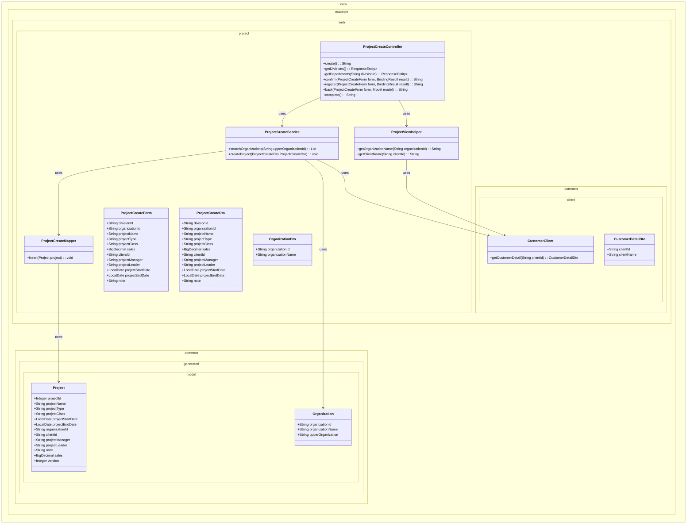
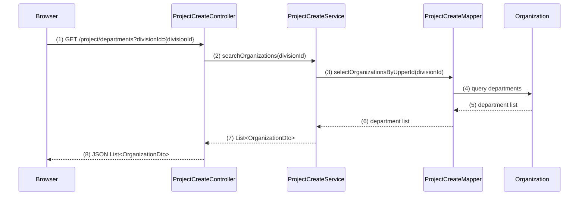
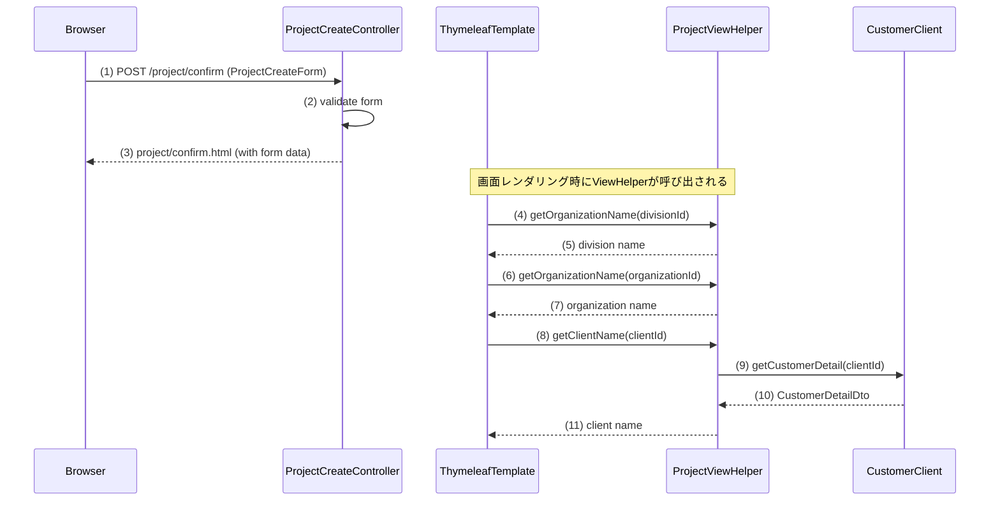
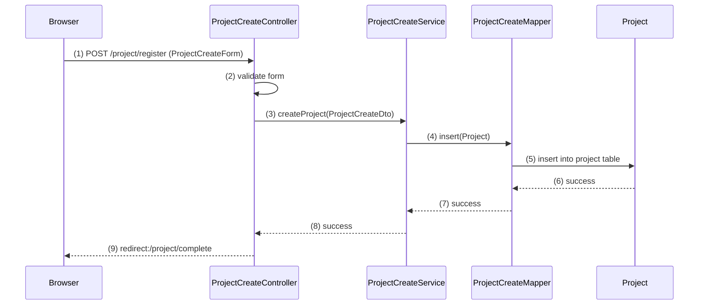
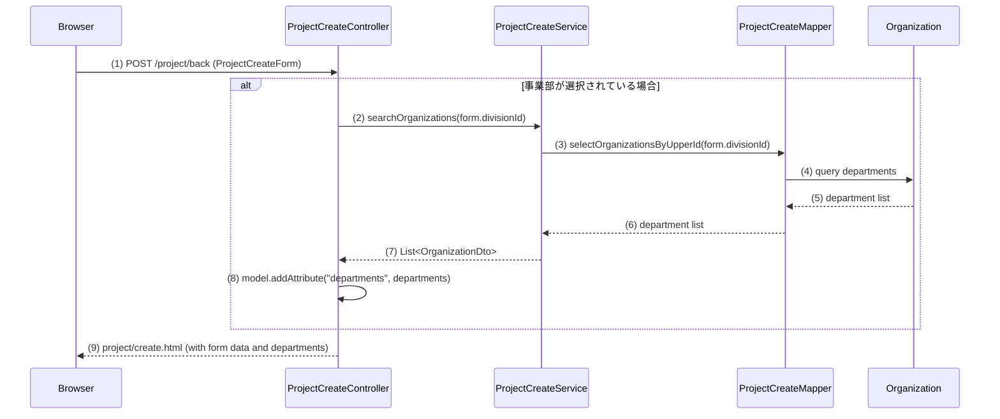
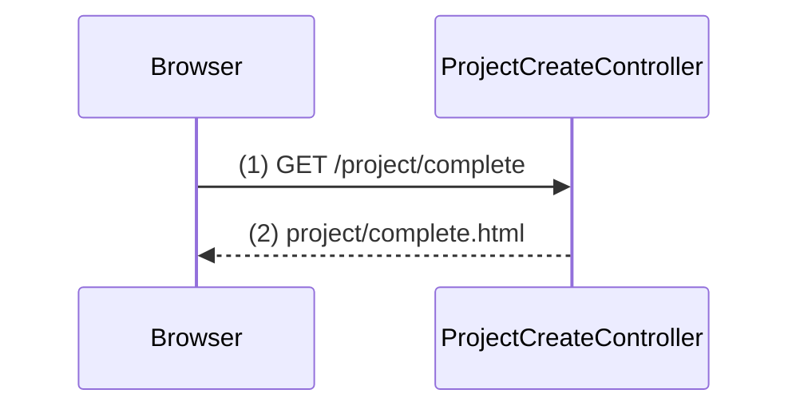

# プロジェクト登録機能実装計画

## 1. 概要

プロジェクト登録機能は、ユーザーがプロジェクト情報を入力・確認・登録する3画面構成のWebアプリケーションです。Spring Boot + Spring MVCを使用し、レイヤードアーキテクチャに従って実装します。

## 2. クラス図



## 3. シーケンス図

### 初期表示イベント
```mermaid
sequenceDiagram
    participant Browser
    participant ProjectCreateController
    participant ProjectCreateService
    participant ProjectCreateMapper
    participant Organization

    %% ① 初期表示リクエスト
    Browser ->> ProjectCreateController: (1) GET /project/create

    %% ② 画面表示
    ProjectCreateController -->> Browser: (8) project/create.html
    
    %% ③ @ModelAttributeによる共通データ取得（事業部一覧）
    ThymeleafTemplate ->> ProjectCreateController: getDivisions()
    ProjectCreateController ->> ProjectCreateService: (2) searchOrganizations(null)
    ProjectCreateService ->> ProjectCreateMapper: (3) selectOrganizationsByUpperId(null)
    ProjectCreateMapper ->> Organization: (4) query organizations
    Organization -->> ProjectCreateMapper: (5) organization list
    ProjectCreateMapper -->> ProjectCreateService: (6) organization list
    ProjectCreateService -->> ProjectCreateController: (7) List<OrganizationDto>
    ProjectCreateController: getDivisions() -->> ThymeleafTemplate
```

### 部門リスト取得イベント


### 確認イベント


### 登録イベント


### 戻るイベント


### 完了表示イベント


## WA10201 プロジェクト登録機能 GOAL分割タスクリスト

## GOAL 1: 基本画面表示とルーティング設定 - 詳細実装計画

- **完了条件**: 
  - プロジェクト登録画面（WA1020101）が正常に表示される
  - 確認画面（WA1020102）、完了画面（WA1020103）の画面遷移が動作する
  - 各画面の基本レイアウトとフォーム項目が表示される
  - 戻るボタン、確認ボタン、登録ボタンが配置され、画面遷移のみ実行される

### GOAL 2: 初期表示データ取得機能
- **完了条件**:
  - @ModelAttributeによって事業部プルダウンに組織マスタから取得した事業部一覧が表示される
  - PJ種別プルダウンにコードマスタから取得した値が表示される
  - PJ分類ラジオボタンにコードマスタから取得した値が表示される
  - 日付項目にカレンダーウィジェットが正常に動作する

# GOAL 3: 動的部門取得機能（Ajax）の詳細実装計画

## 完了条件
- 事業部プルダウン選択時に、該当する部門一覧が非同期で取得される
- 部門プルダウンが選択された事業部に応じて更新される
- 事業部未選択時は部門プルダウンが空になる
- ネットワークエラー時の適切なハンドリングが実装されている

# GOAL 4: 顧客検索モーダル連携機能 - 詳細実装計画（修正版）

## 完了条件
- 顧客選択ボタン押下で顧客検索モーダルが開く
- 検索キーワードと業種で顧客を検索できる（モックデータ使用）
- 顧客選択後に顧客名が登録画面に反映される
- 顧客IDがhiddenフィールドに正しく設定される
- 検索結果0件時の適切な表示がされる


# GOAL 5: 単項目バリデーション機能 - 詳細実装計画（修正版）

- **完了条件**: 
  - 必須項目未入力時に適切なエラーメッセージが表示される
  - 各項目のドメイン制約（文字数、形式等）チェックが動作する
  - 日付形式の妥当性チェックが実装されている
  - 金額項目の数値チェックが実装されている
  - エラー時にフォーム値が保持される
  - バリデーションエラー時の画面表示が適切に行われる


# GOAL 6: 相関バリデーション機能 - 詳細実装計画

## 完了条件
- 開始日≦終了日の日付大小関係チェックが動作する
- 複数項目にまたがるエラーが適切に表示される
- バリデーションエラー時に確認画面への遷移が阻止される
- エラーメッセージが項目に対応して表示される

# GOAL 7: 確認画面データ表示機能 - 詳細実装計画（修正版）

## 完了条件
- 登録画面の入力値が確認画面に正しく表示される
- 組織ID→組織名の変換表示が動作する
- コード値→名称の変換表示が動作する
- 金額の3桁カンマ区切り表示が実装されている
- 日付のフォーマット変換（yyyy/MM/dd）が実装されている
- 備考の改行表示が正しく動作する


## GOAL 8: 確認画面からの戻り機能 - 詳細実装計画

### 完了条件
- 確認画面の「戻る」ボタンで登録画面に戻れる
- 戻り時に入力値が全て復元される
- プルダウンの選択状態（事業部・部門）が正しく復元される
- 顧客選択状態が正しく復元される
- 日付項目の値が正しく復元される
- 備考欄のテキストエリアの値が正しく復元される


## GOAL 10: データベース登録機能

### 完了条件
- 確認画面からの登録処理でプロジェクトテーブルにデータが正常に保存される
- プロジェクトIDの自動採番が動作する
- バージョン番号が「1」で固定設定される
- トランザクション制御が適切に動作する
- 登録完了後に完了画面へ遷移する
- バリデーションエラー時は適切な画面遷移とエラー表示が行われる
- 登録完了後に完了画面へ遷移する
- バリデーションエラー時は適切な画面遷移とエラー表示が行われる
