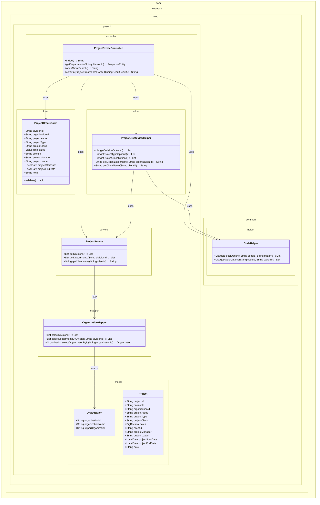
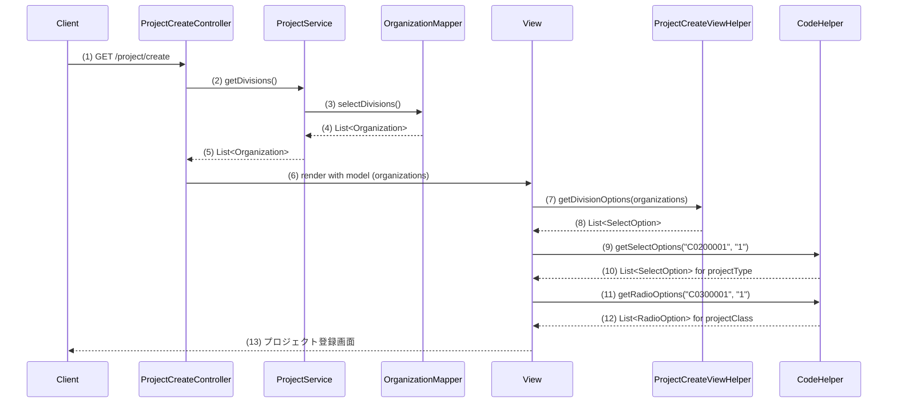
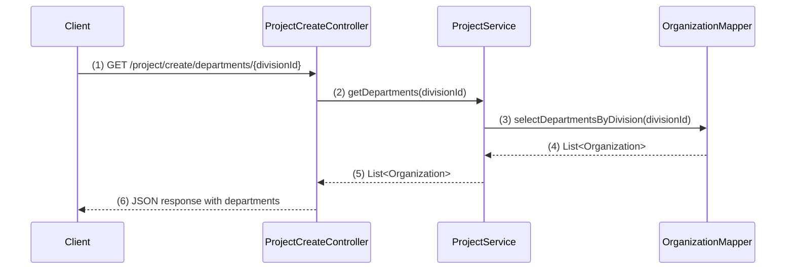
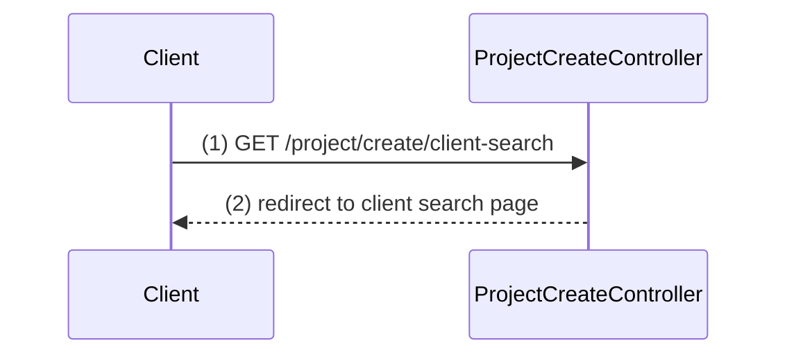
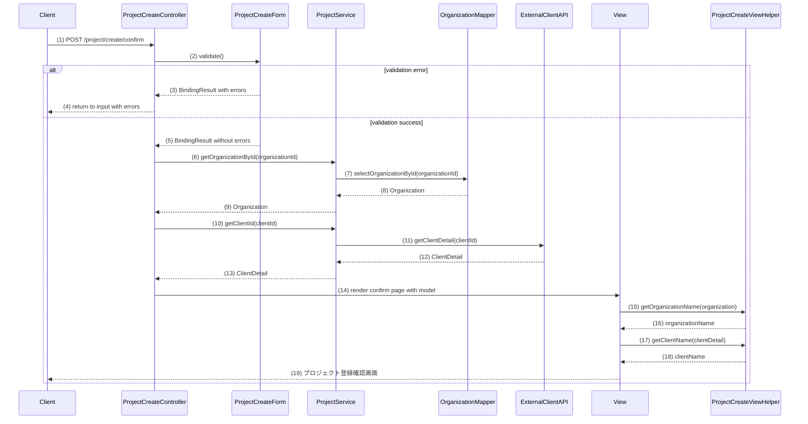

# プロジェクト登録機能実装計画

## 1. 概要
プロジェクト登録機能は、プロジェクト管理システムにおいて新規プロジェクトを登録するための機能です。ユーザーは事業部・部門の選択、プロジェクト名や種別、分類などの基本情報を入力し、顧客情報やプロジェクト期間を設定して登録を行います。入力内容は確認画面で確認してから登録される仕組みです。

## 2. クラス図

## 3. シーケンス図

### 初期表示イベント

### 部門リスト取得イベント（非同期）

### 顧客検索イベント

### 確認イベント

## 4. 実装計画

### 初期表示イベント

#### ステップ 1: Organization Mapperの実装
- **編集対象ファイル:** `web/src/main/java/com/example/web/project/mapper/OrganizationMapper.java`（新規作成）
- **目的:** 初期表示イベントのシーケンス図の(3)〜(4)を実装。組織データを取得するマッパーを実装する
- **内容:**
  - `OrganizationMapper`インターフェイスを作成する
  - 上位組織IDがNULLの組織（事業部）を取得する`selectDivisions()`メソッドを定義する
  - `selectDepartmentsByDivision(String divisionId)`メソッドを定義する（部門リスト取得用）
  - `selectOrganizationById(String organizationId)`メソッドを定義する（組織名取得用）
- **活用するクラス・メソッド:**
  - MyBatisのアノテーションを使用（`@Select`など）
- **ポイント:**
  - SQL文は適切なWHERE条件を設定し、必要なカラムのみを取得する
- **関連ファイル:** `com.example.web.project.model.Organization`

#### ステップ 2: Organization Mapper XMLの実装
- **編集対象ファイル:** `web/src/main/resources/com/example/web/project/mapper/OrganizationMapper.xml`（新規作成）
- **目的:** MapperインターフェースのSQLを実装する
- **内容:**
  - `selectDivisions()`、`selectDepartmentsByDivision()`、`selectOrganizationById()`のSQLを実装する
- **ポイント:**
  - XMLの命名空間が正しく設定されていることを確認する
- **関連ファイル:** `OrganizationMapper.java`

#### ステップ 3: ProjectServiceの実装
- **編集対象ファイル:** `web/src/main/java/com/example/web/project/service/ProjectService.java`（新規作成）
- **目的:** 初期表示イベントのシーケンス図の(2)〜(5)を実装。OrganizationMapperを利用して事業部一覧を取得するサービスを実装する
- **内容:**
  - `ProjectService`クラスを作成する
  - `getDivisions()`メソッドを実装し、OrganizationMapperを使って事業部一覧を取得する
  - `getDepartments(String divisionId)`メソッドを実装する（部門リスト取得用）
  - `getOrganizationName(String organizationId)`メソッドを実装する（組織名取得用）
  - `getClientName(String clientId)`メソッドを実装する（外部APIでの顧客名取得用）
- **活用するクラス・メソッド:**
  - `com.example.web.project.mapper.OrganizationMapper#selectDivisions()`
  - `com.example.web.project.mapper.OrganizationMapper#selectDepartmentsByDivision(String)`
  - `com.example.web.project.mapper.OrganizationMapper#selectOrganizationById(String)`
- **ポイント:**
  - 必要に応じてキャッシュを検討する
- **関連ファイル:** `OrganizationMapper.java`

#### ステップ 4: ProjectCreateFormの実装
- **編集対象ファイル:** `web/src/main/java/com/example/web/project/form/ProjectCreateForm.java`（新規作成）
- **目的:** プロジェクト登録画面の入力項目を保持するフォームクラスを実装する
- **内容:**
  - 画面項目定義に従って、フォームクラスのフィールドを実装する
  - 必要なバリデーション用アノテーションを追加する
  - 日付関係のカスタムバリデーションメソッドを実装する
- **ポイント:**
  - 日付の大小関係チェックなど、複合的なバリデーションは独自メソッドで実装する
- **関連ファイル:** なし

#### ステップ 5: ProjectCreateViewHelperの実装
- **編集対象ファイル:** `web/src/main/java/com/example/web/project/helper/ProjectCreateViewHelper.java`（新規作成）
- **目的:** 初期表示イベントのシーケンス図の(7)〜(8)を実装。View内で利用される表示用の補助メソッドを提供する
- **内容:**
  - `ProjectCreateViewHelper`クラスを作成する
  - `getDivisionOptions(List<Organization> organizations)`メソッドを実装し、事業部のSelectOptionリストを作成する
  - `getProjectTypeOptions()`、`getProjectClassOptions()`メソッドを実装する
  - `getOrganizationName(Organization organization)`、`getClientName(ClientDetail clientDetail)`メソッドを実装する
  - Thymeleafのユーティリティとして利用されるようにアノテーションを設定する
- **活用するクラス・メソッド:**
  - `com.example.web.common.helper.CodeHelper#getSelectOptions(String, String)`
  - `com.example.web.common.helper.CodeHelper#getRadioOptions(String, String)`
- **ポイント:**
  - `@Component`アノテーションを付与し、Thymeleafから呼び出し可能な形にする
  - データ変換や整形処理に特化し、ビジネスロジックはServiceに任せる
- **関連ファイル:** `CodeHelper.java`

#### ステップ 6: ProjectCreateControllerの実装
- **編集対象ファイル:** `web/src/main/java/com/example/web/project/controller/ProjectCreateController.java`（新規作成）
- **目的:** 初期表示イベントのシーケンス図の(1)〜(6)を実装。画面の初期表示処理を実装する
- **内容:**
  - `ProjectCreateController`クラスを作成する
  - `@Controller`アノテーションとURLマッピングを設定する
  - `index()`メソッドを実装し、初期表示処理を行う
  - モデルに必要なデータ（事業部一覧など）を設定する
  - ViewHelperはモデルに設定せず、Thymeleafから直接呼び出せるようにする
- **活用するクラス・メソッド:**
  - `com.example.web.project.service.ProjectService#getDivisions()`
- **ポイント:**
  - モデルには加工前のデータを設定し、表示用の加工はViewHelperに任せる
  - 画面項目の初期値を適切に設定する
- **関連ファイル:** `ProjectService.java`

### 部門リスト取得イベント（非同期）

#### ステップ 7: コントローラに部門リスト取得メソッドを追加
- **編集対象ファイル:** `web/src/main/java/com/example/web/project/controller/ProjectCreateController.java`
- **編集対象のメソッド:** `getDepartments()`（新規作成）
- **目的:** 部門リスト取得イベントのシーケンス図の(1)〜(6)を実装。選択された事業部に基づいて部門リストを非同期取得する
- **内容:**
  - `@GetMapping("/project/create/departments/{divisionId}")`でURLマッピングを設定する
  - `@PathVariable`で事業部IDを受け取る
  - `ProjectService`を使って部門リストを取得する
  - 部門リストをJSON形式で返却する
- **活用するクラス・メソッド:**
  - `com.example.web.project.service.ProjectService#getDepartments(String)`
  - `org.springframework.http.ResponseEntity`
- **ポイント:**
  - クライアントサイドJavaScriptから呼び出される非同期APIとして実装する
- **関連ファイル:** `ProjectService.java`

### 顧客検索イベント

#### ステップ 8: コントローラに顧客検索メソッドを追加
- **編集対象ファイル:** `web/src/main/java/com/example/web/project/controller/ProjectCreateController.java`
- **編集対象のメソッド:** `openClientSearch()`（新規作成）
- **目的:** 顧客検索イベントのシーケンス図の(1)〜(2)を実装。顧客検索画面へ遷移する
- **内容:**
  - `@GetMapping("/project/create/client-search")`でURLマッピングを設定する
  - 顧客検索画面へのリダイレクトURLを返す
- **ポイント:**
  - ポップアップとして開くためのHTML/JavaScriptも実装する必要がある
- **関連ファイル:** なし

### 確認イベント

#### ステップ 9: コントローラに確認処理メソッドを追加（修正版）
- **編集対象ファイル:** `web/src/main/java/com/example/web/project/controller/ProjectCreateController.java`
- **編集対象のメソッド:** `confirm()`（新規作成）
- **目的:** 確認イベントのシーケンス図の(1)〜(14)を実装。入力内容のバリデーションと確認画面への遷移を行う
- **内容:**
  - `@PostMapping("/project/create/confirm")`でURLマッピングを設定する
  - フォームのバリデーションを実行する
  - エラーがある場合は入力画面に戻る
  - 問題なければ、組織情報と顧客情報を取得してモデルに設定する
  - 確認画面を表示する
- **活用するクラス・メソッド:**
  - `com.example.web.project.service.ProjectService#getOrganizationById(String)`
  - `com.example.web.project.service.ProjectService#getClientDetail(String)`
- **ポイント:**
  - バリデーションエラー時は入力値を保持して入力画面に戻す
  - モデルには加工前のデータを設定し、表示用の加工はViewHelperに任せる
  - 確認画面のテンプレートパスを正しく指定する
- **関連ファイル:** `ProjectService.java`、`ProjectCreateForm.java`

#### ステップ 10: 画面テンプレートの実装（修正版）
- **編集対象ファイル:** `web\src\main\resources\templates\project\create\index.html`（編集）
- **目的:** プロジェクト登録画面のHTMLテンプレートを実装する
- **内容:**
  - 既存の画面レイアウトにThymeleafテンプレートを追加する
  - 各入力フィールドをProjectCreateFormにバインドする
  - ViewHelperを呼び出して表示用のデータを取得する
  - 事業部プルダウン選択時に部門リストを非同期で取得するJavaScriptを実装する
  - 顧客検索ボタンのポップアップ処理を実装する
- **活用するクラス・メソッド:**
  - `com.example.web.project.helper.ProjectCreateViewHelper#getDivisionOptions(List<Organization>)`
  - `com.example.web.project.helper.ProjectCreateViewHelper#getProjectTypeOptions()`
  - `com.example.web.project.helper.ProjectCreateViewHelper#getProjectClassOptions()`
  - `com.example.web.common.helper.CodeHelper#getSelectOptions(String, String)`
  - `com.example.web.common.helper.CodeHelper#getRadioOptions(String, String)`
- **ポイント:**
  - Thymeleafから`@beanName.methodName()`の形式でViewHelperのメソッドを呼び出す
  - バリデーションエラーメッセージの表示処理を適切に実装する
  - ラジオボタンやプルダウンの選択肢を動的に表示する
- **関連ファイル:** `ProjectCreateViewHelper.java`, `CodeHelper.java`

#### ステップ 11: 確認画面テンプレートの実装（修正版）
- **編集対象ファイル:** `web\src\main\resources\templates\project\create\confirm.html`（編集）
- **目的:** プロジェクト登録確認画面のHTMLテンプレートを実装する
- **内容:**
  - 既存の画面レイアウトにThymeleafテンプレートを追加する
  - ViewHelperを呼び出して表示用のデータを取得・加工する
- **活用するクラス・メソッド:**
  - `com.example.web.project.helper.ProjectCreateViewHelper#getOrganizationName(Organization)`
  - `com.example.web.project.helper.ProjectCreateViewHelper#getClientName(ClientDetail)`
- **ポイント:**
  - Thymeleafから`@beanName.methodName()`の形式でViewHelperのメソッドを呼び出す
  - 入力値をhiddenフィールドに保持して次の処理に引き継ぐ
- **関連ファイル:** `ProjectCreateViewHelper.java`

#### ステップ 12: JavaScript実装
- **編集対象ファイル:** `web/src/main/resources/static/js/project/create.js`（新規作成）
- **目的:** 画面の動的な挙動を実装する
- **内容:**
  - 事業部選択時の部門リスト取得処理を実装する
  - 顧客検索画面のポップアップ処理を実装する
  - バリデーションエラー表示のための処理を実装する
- **活用するクラス・メソッド:**
  - jQuery AJAXメソッド
- **ポイント:**
  - エラーハンドリングを適切に実装する
- **関連ファイル:** なし