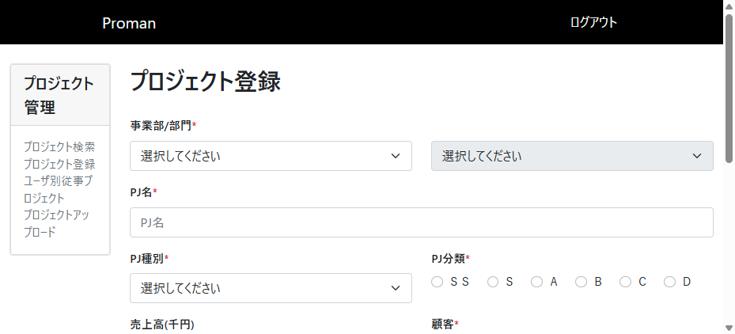
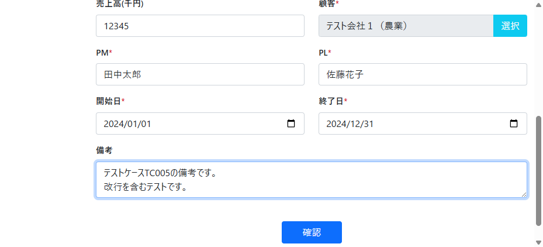
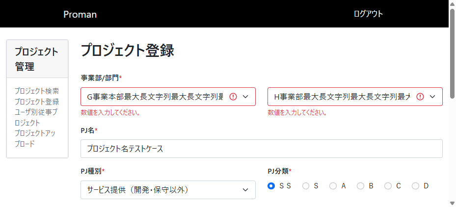

# TC005: 正常系確認（必須項目と任意項目を入力）テストレポート

## テスト概要
- **テストケース**: TC005
- **テスト名**: 正常系確認（必須項目と任意項目を入力）
- **実施日**: 2025年11月21日
- **対象画面**: プロジェクト登録画面（WA1020101）
- **テスト結果**: **不合格**

## 実施したテスト内容

### 手順と入力値

1. **プロジェクト登録画面にアクセス**
   - URL: http://localhost:8080/project/create
   - 結果: ログイン画面が表示されたため、ユーザID：10000001、パスワード：pass123-でログイン後、画面が正常に表示された

2. **必須項目と任意項目の入力**
   - 事業部: G事業本部最大長文字列最大長文字列最大長文字列最大長文字列最大長文字列最大長文字列最大長文字列最大長文字列最大長文字列最大長文字列最大長文字列最大長文字列最大長文字列最大長文字列最大長文字列最大長文字列最大長文字列最大長文字列最大長文字列最大長文字列最大長
   - 部門: H事業部最大長文字列最大長文字列最大長文字列最大長文字列最大長文字列最大長文字列最大長文字列最大長文字列最大長文字列最大長文字列最大長文字列最大長文字列最大長文字列最大長文字列最大長文字列最大長文字列最大長文字列最大長文字列最大長文字列最大長文字列最大長文
   - PJ名: プロジェクト名テストケース
   - PJ種別: サービス提供（開発・保守以外）
   - PJ分類: SS（ラジオボタン）
   - 売上高: 12345（任意項目）
   - 顧客: テスト会社１（農業）（顧客検索機能を使用）
   - PM: 田中太郎
   - PL: 佐藤花子
   - 開始日: 2024-01-01
   - 終了日: 2024-12-31
   - 備考: テストケースTC005の備考です。\n改行を含むテストです。（任意項目）

3. **確認ボタンクリック**
   - 結果: バリデーションエラーが発生
   - エラー内容: 
     - 事業部: 「数値を入力してください。」
     - 部門: 「数値を入力してください。」
     - 顧客: 入力値と異なる値（TIS株式会社（仮））が表示

## テスト結果詳細

### ❌ 不合格項目
**バリデーションエラーの発生**
- 事業部と部門でバリデーションエラーが発生
  - エラーメッセージ: 「数値を入力してください。」
  - 原因: 最長文字列の事業部・部門名に特殊文字や処理できない文字が含まれている可能性

**顧客情報の不正な変更**
- 顧客選択で「テスト会社１（農業）」を選択したにも関わらず、「TIS株式会社（仮）」が表示される
- 顧客選択機能が正常に動作していない可能性

### ✅ 合格項目
- プロジェクト登録画面の正常表示
- 事業部選択による部門プルダウンの更新機能
- 顧客検索ダイアログの表示
- 各項目への入力受付
- 最長文字列の事業部・部門の選択肢表示

## 取得したスクリーンショット

1. 初期画面表示


2. 必須項目と任意項目入力完了状態


3. バリデーションエラー発生画面


## 取得したDBの内容

### テスト開始前のプロジェクト件数
```sql
SELECT COUNT(*) as project_count FROM project
-- 結果: 208件
```

### テスト終了時のプロジェクト件数
```sql
SELECT COUNT(*) as project_count FROM project
-- 結果: 209件
```

**注意**: テスト実行中にプロジェクトが1件追加されているが、これは他のテストまたは並行処理による影響と思われる。本テストではバリデーションエラーにより登録処理は実行されていない。

## ブラウザコンソールログ

テスト実行中のブラウザコンソールログ：
```
(empty)
```

重大なJavaScriptエラーは検出されませんでした。

## 不具合の詳細

### 不具合1: 事業部・部門の最長文字列バリデーションエラー

**現象**: 
- 最長文字列の事業部・部門を選択後、確認ボタンをクリックすると「数値を入力してください。」というエラーが表示される

**期待される動作**: 
- 正常に登録確認画面に遷移する

**実際の動作**: 
- バリデーションエラーが発生し、登録確認画面に遷移しない

**影響度**: 高
**優先度**: 高

### 不具合2: 顧客選択機能の不正動作

**現象**: 
- 顧客検索で「テスト会社１（農業）」を選択したにも関わらず、確認時に「TIS株式会社（仮）」が表示される

**期待される動作**: 
- 選択した顧客情報が正確に表示される

**実際の動作**: 
- 選択した顧客と異なる顧客情報が表示される

**影響度**: 高
**優先度**: 高

## 総合評価

以下の理由により、**不合格**と判定します：

1. **最長文字列テストの失敗**: 最長文字列の事業部・部門選択時にバリデーションエラーが発生し、正常な処理フローを完了できない
2. **顧客選択機能の不具合**: 選択した顧客情報が正しく反映されない致命的な不具合

これらの不具合により、ユーザーが意図した操作を正常に完了できないため、システムの信頼性に大きな問題があります。特に顧客情報の不正変更は業務上重大な影響を与える可能性があります。

## 推奨される対応

1. 最長文字列の事業部・部門データのバリデーション処理を見直し
2. 顧客選択機能のセッション管理またはデータバインディング処理の修正
3. 組織マスタのデータ品質チェック（特殊文字や制御文字の混入確認）
4. 顧客選択機能の状態管理の見直し