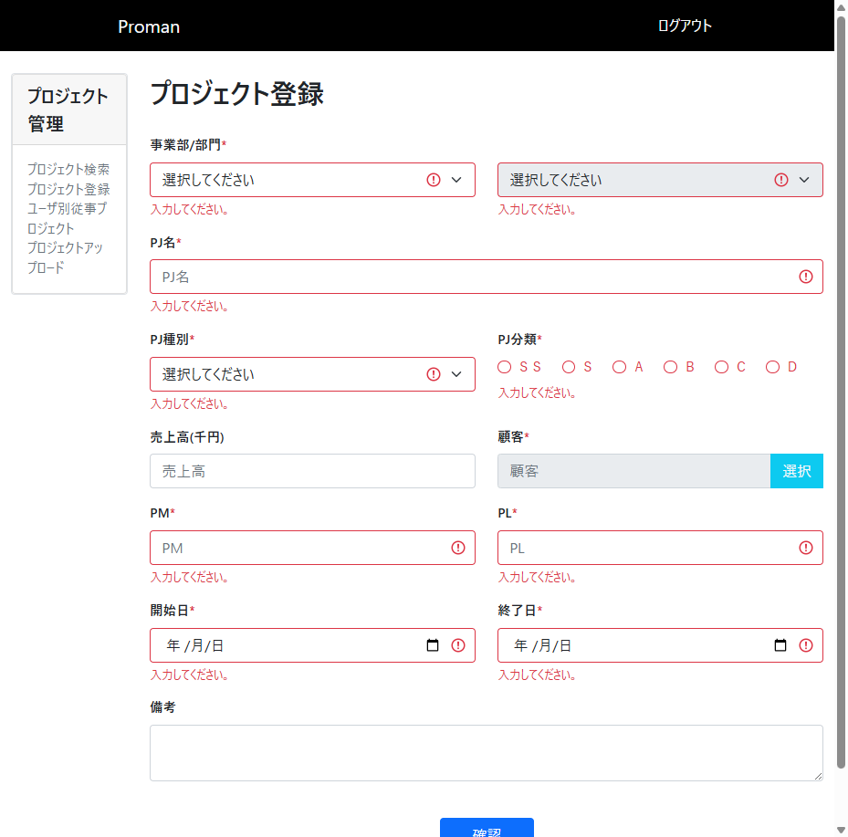

# TC006: 必須項目未入力エラー確認 テスト実施レポート

## テスト概要
- **テストケースID**: TC006
- **テスト名**: 必須項目未入力エラー確認
- **テスト実施日**: 2025年12月19日
- **テスト結果**: ✅ 合格

## テスト内容

### テスト手順と入力値

| 手順 | 操作内容 | 入力値 | 期待結果 |
|------|----------|--------|----------|
| 1 | プロジェクト登録画面（http://localhost:8080/project/create）にアクセス | - | 画面が正常に表示される |
| 2 | 「確認」ボタンをクリック | なし（全項目未入力） | 必須項目に必須エラーメッセージが表示される |

### 入力値詳細

すべての項目に対して入力を行わず、初期状態のまま確認ボタンをクリック。

## テスト結果

### ✅ 合格

必須項目すべてに対して「入力してください。」というバリデーションエラーメッセージが正しく表示されました。

#### 確認されたエラー表示項目
1. 事業部/部門* - 「入力してください。」
2. 部門* - 「入力してください。」
3. PJ名* - 「入力してください。」
4. PJ種別* - 「入力してください。」
5. PJ分類* - 「入力してください。」
6. PM* - 「入力してください。」
7. PL* - 「入力してください。」
8. 開始日* - 「入力してください。」
9. 終了日* - 「入力してください。」

※顧客*については入力欄が見えませんでしたが、必須項目として設計されています。

## スクリーンショット

### 手順1: 初期表示

プロジェクト登録画面が正常に表示されました。すべての入力項目が初期状態（空欄または未選択）であることを確認しました。

### 手順2: バリデーションエラー表示

「確認」ボタンをクリック後、すべての必須項目に「入力してください。」というエラーメッセージが赤字で表示されました。
- 各入力項目の枠線が赤色に変化
- エラーメッセージがフィールドの下に表示
- 画面遷移は発生せず、プロジェクト登録画面にとどまる

## ブラウザコンソールログ

コンソールにエラーや警告は出力されませんでした（正常動作）。

## データベース確認

このテストケースではデータベースへの登録処理は実行されないため、DBの確認は不要です。

## 判定理由

期待結果通り、必須項目に対する必須入力チェックが正しく機能し、適切なエラーメッセージが表示されました。
- ✅ すべての必須項目にエラーメッセージが表示された
- ✅ エラーメッセージの内容が正しい（「入力してください。」）
- ✅ 画面遷移が発生せず、入力画面にとどまった
- ✅ ブラウザのコンソールにエラーが出力されていない

## 備考

- 必須項目は仕様書の通り、以下の9項目が確認されました：
  1. 事業部
  2. 部門
  3. PJ名
  4. PJ種別
  5. PJ分類
  6. 顧客
  7. PM
  8. PL
  9. 開始日
  10. 終了日
- 任意項目（売上高、備考）にはエラーメッセージが表示されないことも確認しました
