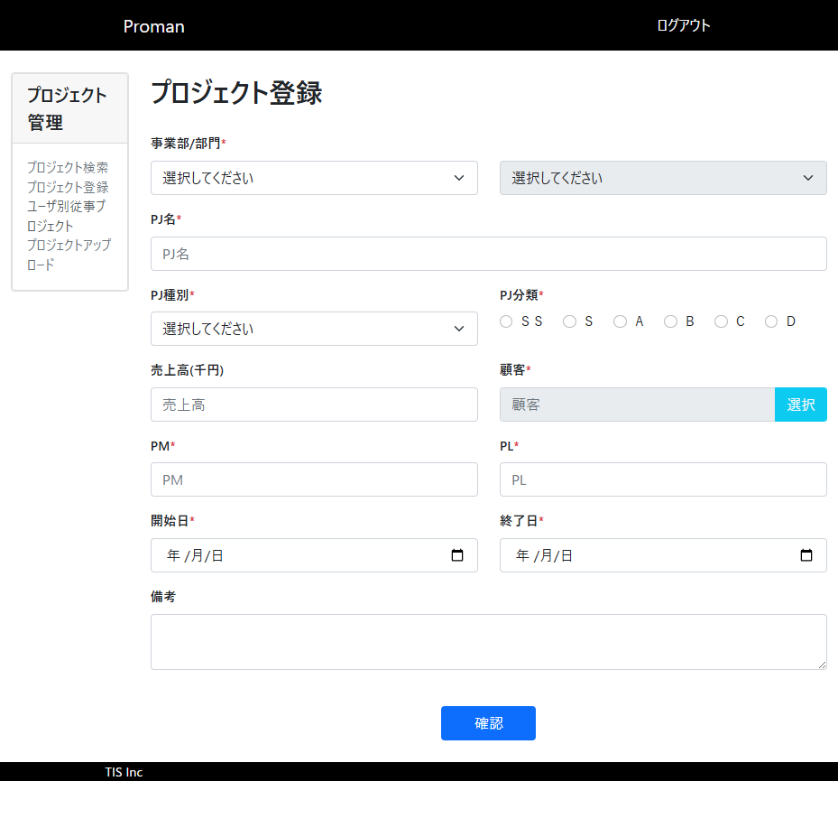
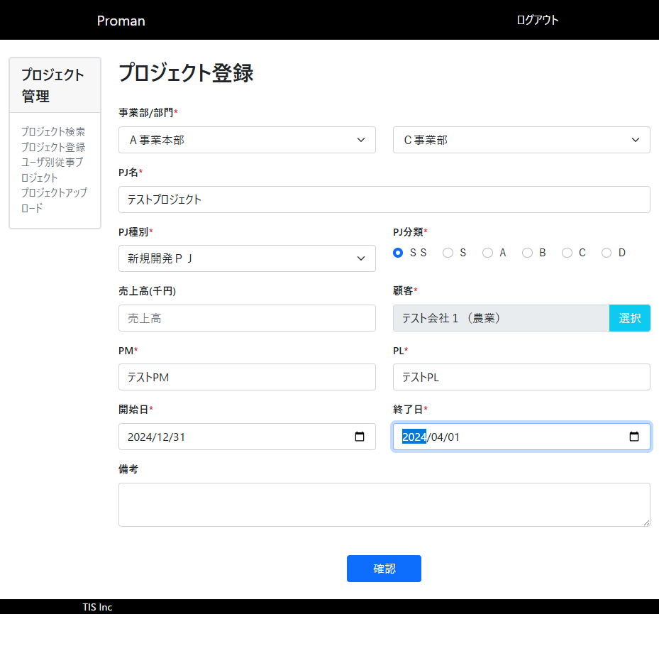
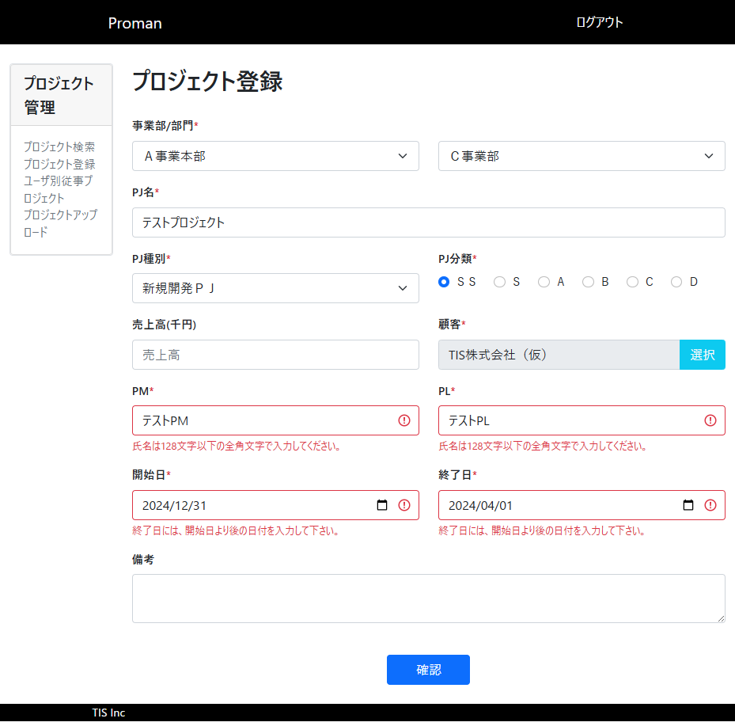

# TC009: 日付大小関係エラー確認 テストエビデンス

## テスト実施日時
2025年12月19日

## テスト対象
- WA1020101(プロジェクト登録画面)

## テストケース概要
開始日と終了日の大小関係が逆になっている場合に、適切なエラーメッセージが表示されることを確認する。

## テスト手順と結果

### 手順1: プロジェクト登録画面にアクセス
- **操作内容**: プロジェクト登録画面（http://localhost:8080/project/create）にアクセス
- **期待結果**: 画面が正常に表示される
- **実際の結果**: ✅ 成功 - ログイン画面が表示され、ユーザID: 10000001、パスワード: pass123- でログイン後、プロジェクト登録画面が表示された



### 手順2: 必須項目をすべて入力
- **操作内容**: 必須項目に正常値を入力
- **入力値**:
  - 事業部: Ａ事業本部
  - 部門: Ｃ事業部
  - PJ名: テストプロジェクト
  - PJ種別: 新規開発ＰＪ
  - PJ分類: ＳＳ
  - 顧客: テスト会社１（農業）
  - PM: テストPM
  - PL: テストPL
- **期待結果**: 正常に入力できる
- **実際の結果**: ✅ 成功 - 全ての必須項目に値を入力できた

### 手順3: 開始日を入力
- **操作内容**: 開始日を入力
- **入力値**: 2024/12/31
- **期待結果**: 正常に入力できる
- **実際の結果**: ✅ 成功 - 開始日に「2024-12-31」を入力した

### 手順4: 終了日を入力
- **操作内容**: 終了日を入力
- **入力値**: 2024/04/01
- **期待結果**: 正常に入力できる
- **実際の結果**: ✅ 成功 - 終了日に「2024-04-01」を入力した（開始日より前の日付）



### 手順5: 「確認」ボタンをクリック
- **操作内容**: 「確認」ボタンをクリック
- **期待結果**: 日付大小関係エラーメッセージが表示される
- **実際の結果**: ✅ 成功 - 以下のエラーメッセージが表示された
  - 開始日フィールド: 「終了日には、開始日より後の日付を入力して下さい。」
  - 終了日フィールド: 「終了日には、開始日より後の日付を入力して下さい。」



## 追加で検出されたバリデーションエラー

テスト実施中に、PM/PLフィールドにも以下のバリデーションエラーが表示された：
- PM: 「氏名は128文字以下の全角文字で入力してください。」
- PL: 「氏名は128文字以下の全角文字で入力してください。」

これは、「テストPM」「テストPL」が半角カタカナを含んでいるため、全角文字のバリデーションでエラーとなったものと推測される。

## データベース確認結果

バリデーションエラーが発生したため、データベースへの登録は行われていない。

## ブラウザコンソールログ

```
[VERBOSE] [DOM] Input elements should have autocomplete attributes (suggested: "current-password"): (More info: https://goo.gl/9p2vKq) %o @ http://localhost:8080/login:0
[WARNING] The specified value "2024/12/31" does not conform to the required format, "yyyy-MM-dd". @ :7127
```

## テスト結果

**✅ 合格**

日付の大小関係が逆の場合、期待通りエラーメッセージが表示されることを確認した。
エラーメッセージの内容：「終了日には、開始日より後の日付を入力して下さい。」

## 備考

- 開始日: 2024/12/31（2024年12月31日）
- 終了日: 2024/04/01（2024年4月1日）
- 開始日が終了日より後であるため、日付大小関係エラーが正しく検出された
- エラーメッセージは開始日と終了日の両方のフィールドに表示されている
- バリデーションエラーが発生したため、確認画面への遷移はブロックされ、入力画面にとどまる仕様となっている
