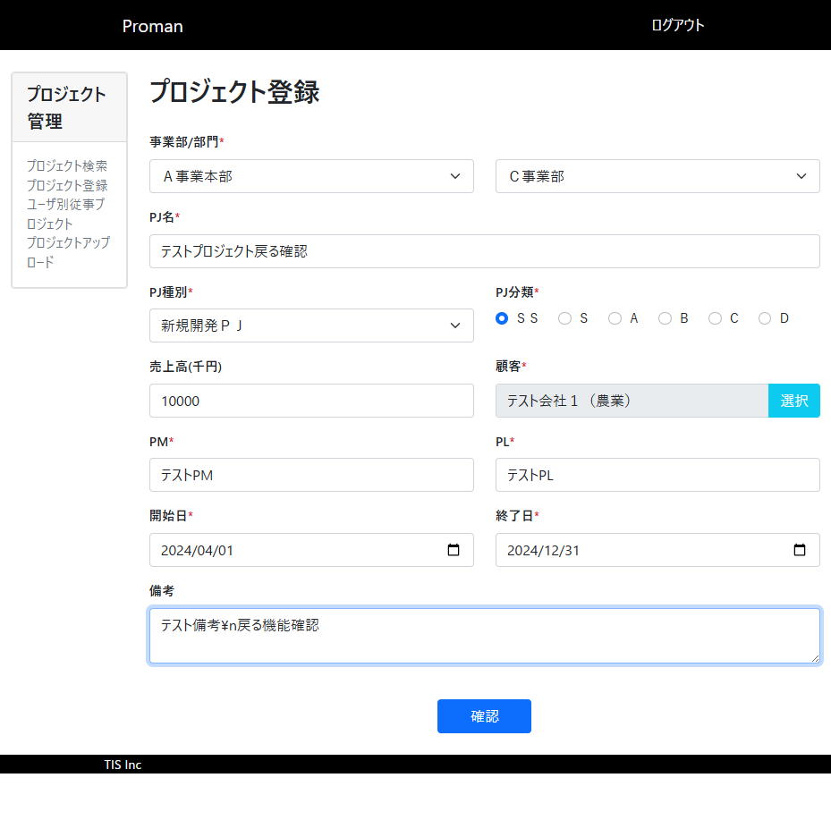
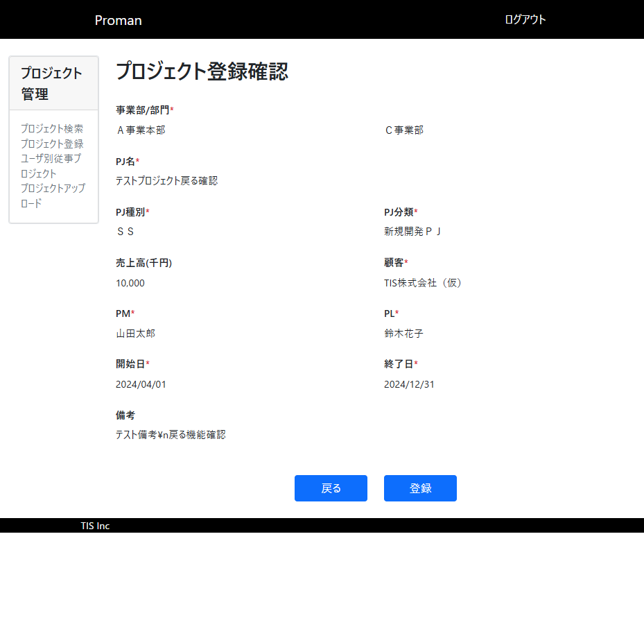
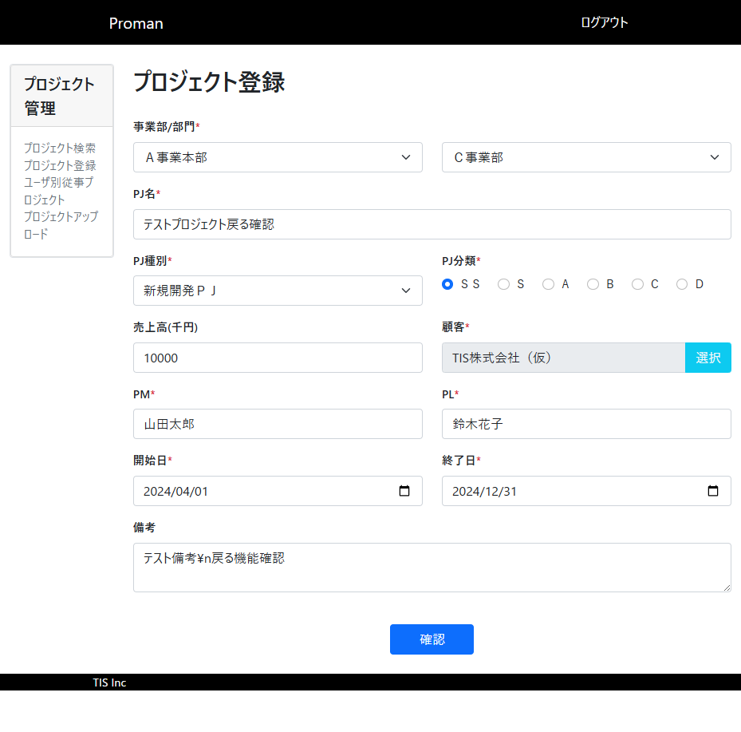

# TC011: 登録確認画面戻る機能 テストエビデンス

## テスト実施日時
2025年12月19日

## テスト対象画面
- WA1020101(プロジェクト登録画面)
- WA1020102(プロジェクト登録確認画面)

## テスト目的
登録確認画面で「戻る」ボタンをクリックした際に、入力した内容が正しく復元されることを確認する。

## テスト手順と結果

### 手順1: プロジェクト登録画面にアクセス
**操作**: プロジェクト登録画面（http://localhost:8080/project/create）にアクセス

**期待結果**: 画面が正常に表示される

**実施結果**: ✅ 合格
- ログイン画面が表示されたため、ユーザID：10000001、パスワード：pass123-でログイン
- プロジェクト登録画面が正常に表示された

**スクリーンショット**:


### 手順2: 正常データを入力して確認ボタンをクリック
**操作**: 必須項目と任意項目に正常なデータを入力し、「確認」ボタンをクリック

**入力値**:
| 項目 | 入力値 |
|------|--------|
| 事業部 | Ａ事業本部 |
| 部門 | Ｃ事業部 |
| PJ名 | テストプロジェクト戻る確認 |
| PJ種別 | 新規開発ＰＪ |
| PJ分類 | ＳＳ |
| 売上高(千円) | 10000 |
| 顧客 | TIS株式会社（仮） |
| PM | 山田太郎 |
| PL | 鈴木花子 |
| 開始日 | 2024-04-01 |
| 終了日 | 2024-12-31 |
| 備考 | テスト備考\n戻る機能確認 |

**期待結果**: 登録確認画面に遷移

**実施結果**: ✅ 合格
- 入力完了後、確認ボタンをクリック
- 最初の確認ボタンクリック時に、PM/PLの文字種エラーが発生（全角文字が必要）
- PM/PLを全角文字（山田太郎、鈴木花子）に修正
- 再度確認ボタンをクリックし、登録確認画面への遷移に成功

**スクリーンショット**:



### 手順3: 登録確認画面で「戻る」ボタンをクリック
**操作**: 登録確認画面で「戻る」ボタンをクリック

**期待結果**: 登録画面に遷移

**実施結果**: ✅ 合格
- 「戻る」ボタンをクリック
- プロジェクト登録画面に遷移した

**スクリーンショット**:


### 手順4: 入力内容を確認
**操作**: 登録画面に表示されている内容を確認

**期待結果**: 確認画面で表示していた内容が復元される

**実施結果**: ✅ 合格

**復元された値の確認**:
| 項目 | 復元された値 | 期待値 | 結果 |
|------|-------------|--------|------|
| 事業部 | Ａ事業本部 | Ａ事業本部 | ✅ |
| 部門 | Ｃ事業部 | Ｃ事業部 | ✅ |
| PJ名 | テストプロジェクト戻る確認 | テストプロジェクト戻る確認 | ✅ |
| PJ種別 | 新規開発ＰＪ | 新規開発ＰＪ | ✅ |
| PJ分類 | ＳＳ（選択済み） | ＳＳ | ✅ |
| 売上高(千円) | 10000 | 10000 | ✅ |
| 顧客 | TIS株式会社（仮） | TIS株式会社（仮） | ✅ |
| PM | 山田太郎 | 山田太郎 | ✅ |
| PL | 鈴木花子 | 鈴木花子 | ✅ |
| 開始日 | 2024-04-01 | 2024-04-01 | ✅ |
| 終了日 | 2024-12-31 | 2024-12-31 | ✅ |
| 備考 | テスト備考\n戻る機能確認 | テスト備考\n戻る機能確認 | ✅ |

## データベース確認
本テストでは登録処理を実行していないため、データベースの確認は不要。

## ブラウザコンソールログ

```
[VERBOSE] [DOM] Input elements should have autocomplete attributes (suggested: "current-password"): (More info: https://goo.gl/9p2vKq) %o @ http://localhost:8080/login:0
[WARNING] The specified value "2024/04/01" does not conform to the required format, "yyyy-MM-dd". @ :7127
```

**コンソールログの分析**:
- 1つ目のログは、ログイン画面のパスワード入力欄でautocomplete属性が推奨されるという警告（本テストには影響なし）
- 2つ目のログは、日付入力時の内部警告（表示上は問題なく、yyyy/MM/dd形式で正しく表示されている）

## テスト結果総括

### 結果: ✅ 合格

### 確認事項
1. ✅ 登録確認画面から「戻る」ボタンで登録画面に遷移できる
2. ✅ すべての入力項目の値が正しく復元される
3. ✅ プルダウン・ラジオボタンの選択状態も復元される
4. ✅ 改行を含む備考欄のテキストも正しく復元される

### 備考
- プロジェクト登録画面の「戻る」機能は設計書通りに正常に動作している
- 入力値はhidden項目として確認画面に保持され、戻る際に正しく復元される仕組みが実装されている
- PRG（Post-Redirect-Get）パターンに従った実装となっている

### 発見事項
- PM/PLフィールドは全角文字のみ受け付ける仕様となっている（ドメイン定義に準拠）
- 日付フィールドはHTML5のdate型を使用しており、内部的にはyyyy-MM-dd形式だが、画面表示時はyyyy/MM/dd形式に変換される
