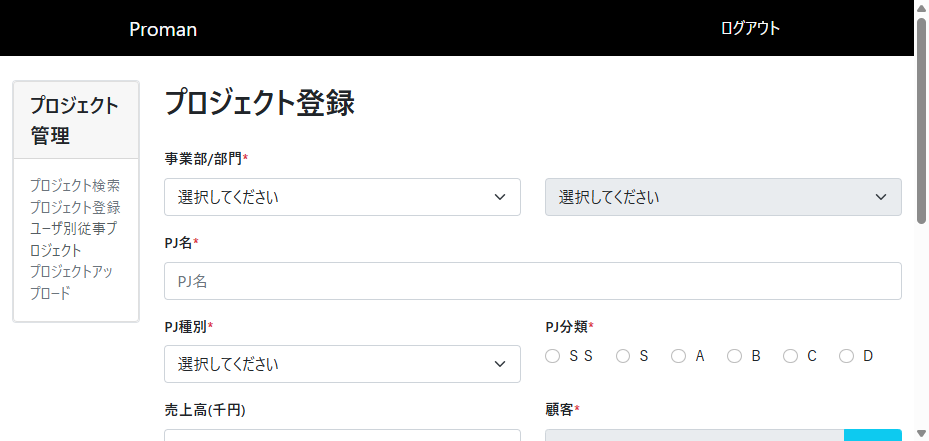
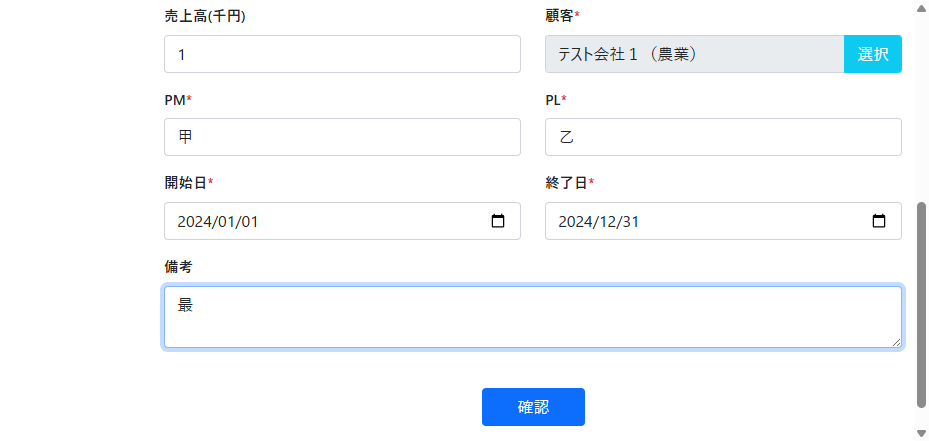
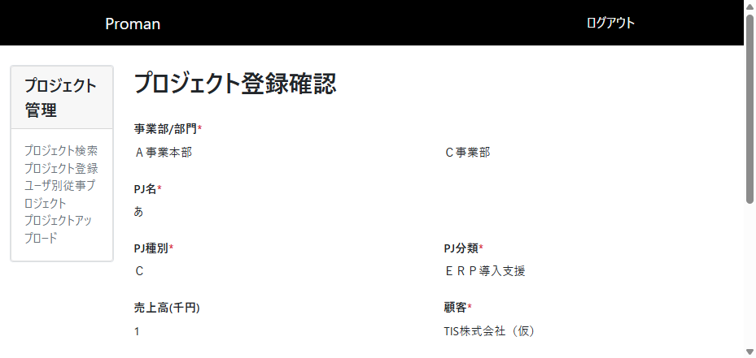
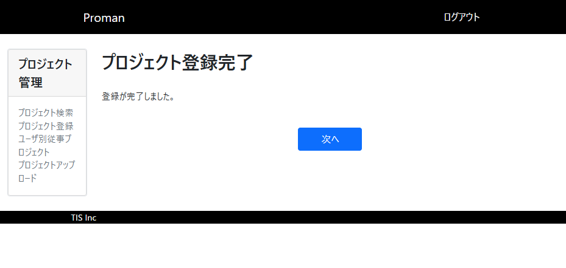

# TC013: 最小文字列確認テストレポート

## テスト概要
- **テストケース**: TC013
- **テスト名**: 最小文字列確認
- **実施日**: 2025年11月21日
- **対象画面**: プロジェクト登録画面（WA1020101）
- **テスト結果**: **不合格**

## 実施したテスト内容

### 手順と入力値

1. **プロジェクト登録画面にアクセス**
   - URL: http://localhost:8080/project/create
   - 結果: ログイン画面が表示されたため、ユーザID：10000001、パスワード：pass123-でログイン
   - ログイン後、プロジェクト登録画面が正常に表示された

2. **必須項目と任意項目に最小文字数の文字列を入力**
   - 事業部: Ａ事業本部（最短の選択肢）
   - 部門: Ｃ事業部（最短の選択肢）
   - PJ名: あ（1文字・最小）
   - PJ種別: 運用（最短の選択肢）
   - PJ分類: Ａ（ラジオボタン・最短）
   - 売上高: 1（最小値）
   - 顧客: テスト会社１（農業）（顧客検索機能を使用）
   - PM: 甲（1文字・最小）
   - PL: 乙（1文字・最小）
   - 開始日: 2024-01-01
   - 終了日: 2024-12-31
   - 備考: 最（1文字・最小）

3. **確認ボタンクリック**
   - 結果: 登録確認画面に遷移

4. **登録確認画面での表示確認**
   - 各項目が正しく表示されているかを確認
   - **不具合発見**: PJ種別とPJ分類の表示が入力値と異なる

5. **登録ボタンクリック**
   - 結果: 登録完了画面に遷移
   - メッセージ: "登録が完了しました。"

6. **データベース確認**
   - プロジェクトテーブルの件数: 208件 → 210件
   - 登録されたデータ確認済み

7. **「次へ」ボタンクリック**
   - 結果: トップページに遷移

## テスト結果詳細

### ✅ 合格項目
- プロジェクト登録画面の正常表示
- 最小文字数での入力受付（各項目1文字での登録）
- 事業部選択による部門プルダウンの更新機能
- 顧客検索機能の動作
- 登録確認画面への遷移
- 登録処理の実行
- データベースへのデータ登録
- 登録完了画面の表示
- トップページへの遷移
- 最小文字数での文字列処理の正常動作

### ❌ 不合格項目
**確認画面でのPJ種別とPJ分類の表示誤り**
- 入力値: PJ種別「運用」、PJ分類「Ａ」
- 確認画面表示: PJ種別「Ｃ」、PJ分類「ＥＲＰ導入支援」
- 期待値との相違があるため、確認画面での表示項目に誤りがある

## 取得したスクリーンショット

1. 初期画面表示


2. 最小文字数入力完了状態


3. 登録確認画面（不具合確認）


4. 登録完了画面


## 取得したDBの内容

### 登録前のプロジェクト件数
```sql
SELECT COUNT(*) as project_count FROM project
-- 結果: 208件
```

### 登録後のプロジェクト件数
```sql
SELECT COUNT(*) as project_count FROM project
-- 結果: 210件
```

### 登録されたデータ
```sql
SELECT * FROM project WHERE project_name = 'あ' ORDER BY project_id DESC LIMIT 1
```

| 項目 | 値 |
|------|-----|
| project_id | 209 |
| project_name | あ |
| project_type | 05 |
| project_class | 03 |
| project_start_date | 2023-12-31T15:00:00.000Z |
| project_end_date | 2024-12-30T15:00:00.000Z |
| organization_id | 3 |
| client_id | 1 |
| project_manager | 甲 |
| project_leader | 乙 |
| note | 最 |
| sales | null |
| version_no | 1 |

## ブラウザコンソールログ

テスト実行中に以下のメッセージが発生：
```
[VERBOSE] [DOM] Input elements should have autocomplete attributes (suggested: "current-password"): (More info: https://goo.gl/9p2vKq) @ http://localhost:8080/login:0
```

重大なエラーは検出されませんでした。

## 不具合の詳細

### 不具合1: 確認画面でのPJ種別とPJ分類の表示誤り

**現象**: 
- 登録確認画面において、PJ種別とPJ分類の値が入力値と異なって表示されている

**入力値**: 
- PJ種別: 「運用」
- PJ分類: 「Ａ」

**確認画面での表示**: 
- PJ種別: 「Ｃ」
- PJ分類: 「ＥＲＰ導入支援」

**影響度**: 中
**優先度**: 高

この不具合により、ユーザーが確認画面で入力内容を正しく確認できない可能性があります。

## 最小文字数テストの評価

### 対象項目の最小文字数検証結果
- **PJ名**: 1文字「あ」→ 正常登録
- **PM**: 1文字「甲」→ 正常登録  
- **PL**: 1文字「乙」→ 正常登録
- **備考**: 1文字「最」→ 正常登録
- **売上高**: 最小値「1」→ 正常登録

すべての文字列項目で最小文字数（1文字）での入力・登録が正常に動作することを確認しました。

## 総合評価

最小文字数での登録機能は正常に動作していますが、確認画面での表示項目に誤りがあるため、**不合格**と判定します。

この不具合は確認画面の表示ロジックまたはデータバインディングに問題がある可能性が高く、データの整合性に関わる重要な問題として修正が必要です。