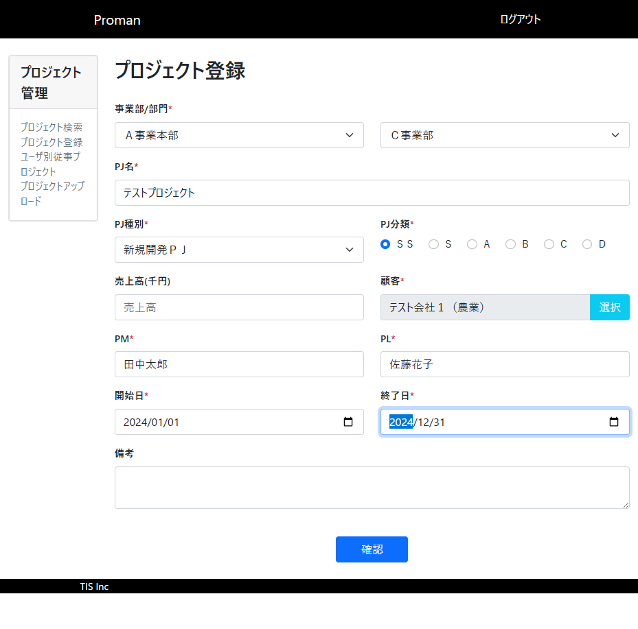
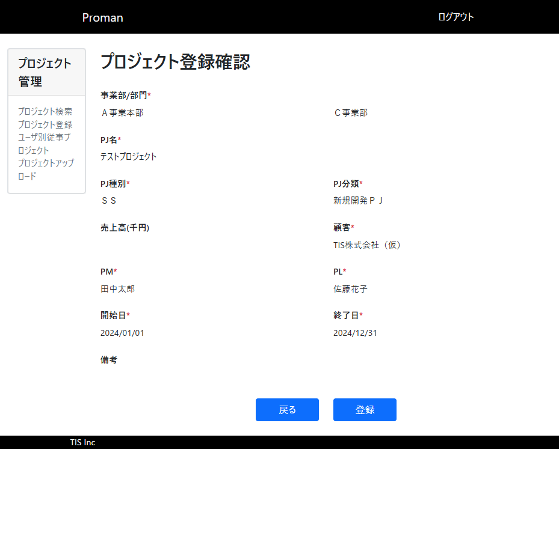
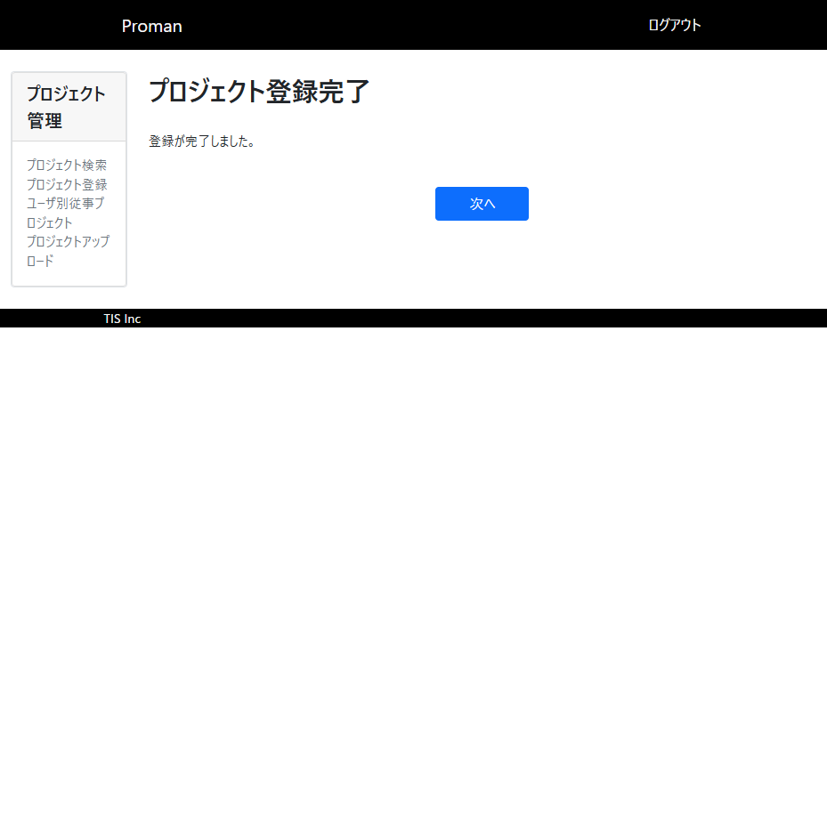
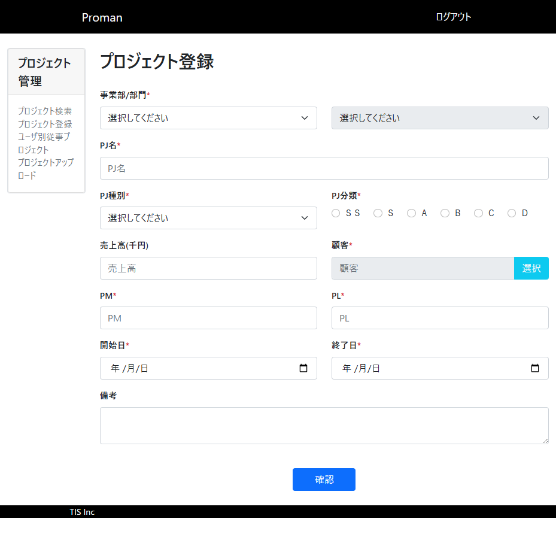

# TC004: 正常系確認（必須項目のみ入力）テストレポート

## テスト概要
- **テストケース**: TC004
- **テスト名**: 正常系確認（必須項目のみ入力）
- **実施日**: 2025年10月22日
- **対象画面**: プロジェクト登録画面（WA1020101）
- **テスト結果**: **不合格**

## 実施したテスト内容

### 手順と入力値

1. **プロジェクト登録画面にアクセス**
   - URL: http://localhost:8080/project/create
   - 結果: 画面が正常に表示された

2. **必須項目の入力**
   - 事業部: Ａ事業本部
   - 部門: Ｃ事業部
   - PJ名: テストプロジェクト
   - PJ種別: 新規開発ＰＪ
   - PJ分類: ＳＳ（ラジオボタン）
   - 顧客: テスト会社１（農業）（顧客検索機能を使用）
   - PM: 田中太郎
   - PL: 佐藤花子
   - 開始日: 2024-01-01
   - 終了日: 2024-12-31

3. **確認ボタンクリック**
   - 結果: 登録確認画面に遷移

4. **登録ボタンクリック**
   - 結果: 登録完了画面に遷移
   - メッセージ: "登録が完了しました。"

5. **データベース確認**
   - プロジェクトテーブルの件数: 203件 → 204件
   - 登録されたデータ確認済み

6. **「次へ」ボタンクリック**
   - 結果: トップページに遷移

7. **フォーム初期化確認**
   - 結果: プロジェクト登録画面にアクセスして、すべての入力項目がクリアされていることを確認

## テスト結果詳細

### ✅ 合格項目
- プロジェクト登録画面の正常表示
- 事業部選択による部門プルダウンの更新機能
- 顧客検索機能の動作
- 必須項目の入力受付
- 登録確認画面への遷移
- 登録処理の実行
- データベースへのデータ登録
- 登録完了画面の表示
- トップページへの遷移
- フォームの初期化

### ❌ 不合格項目
**確認画面での表示項目の誤り**
- PJ種別とPJ分類の表示が逆になっている
  - 期待値: PJ種別に「新規開発ＰＪ」、PJ分類に「ＳＳ」
  - 実際値: PJ種別に「ＳＳ」、PJ分類に「新規開発ＰＪ」

## 取得したスクリーンショット

1. 初期画面表示


2. 必須項目入力完了状態


3. 登録確認画面（不具合確認）


4. 登録完了画面


5. フォーム初期化後の画面


## 取得したDBの内容

### 登録前のプロジェクト件数
```sql
SELECT COUNT(*) as project_count FROM project
-- 結果: 203件
```

### 登録後のプロジェクト件数
```sql
SELECT COUNT(*) as project_count FROM project
-- 結果: 204件
```

### 登録されたデータ
```sql
SELECT * FROM project WHERE project_name = 'テストプロジェクト' ORDER BY project_id DESC LIMIT 1
```

| 項目 | 値 |
|------|-----|
| project_id | 203 |
| project_name | テストプロジェクト |
| project_type | 01 |
| project_class | 01 |
| project_start_date | 2023-12-31T15:00:00.000Z |
| project_end_date | 2024-12-30T15:00:00.000Z |
| organization_id | 3 |
| client_id | 1 |
| project_manager | 田中太郎 |
| project_leader | 佐藤花子 |
| note | null |
| sales | null |
| version_no | 1 |

## ブラウザコンソールログ

テスト実行中に以下の警告メッセージが発生：
```
[WARNING] The specified value "2024/01/01" does not conform to the required format, "yyyy-MM-dd".
```

その他の重大なエラーは検出されませんでした。

## 不具合の詳細

### 不具合1: 確認画面でのPJ種別とPJ分類の表示誤り

**現象**: 
- 登録確認画面において、PJ種別とPJ分類の値が入れ替わって表示されている

**期待される動作**: 
- PJ種別: 「新規開発ＰＪ」
- PJ分類: 「ＳＳ」

**実際の動作**: 
- PJ種別: 「ＳＳ」
- PJ分類: 「新規開発ＰＪ」

**影響度**: 中
**優先度**: 高

この不具合により、ユーザーが確認画面で入力内容を正しく確認できない可能性があります。

## 総合評価

基本的な登録機能は正常に動作しているが、確認画面での表示項目に誤りがあるため、**不合格**と判定します。

この不具合は確認画面の表示ロジックまたはデータバインディングに問題がある可能性が高く、修正が必要です。